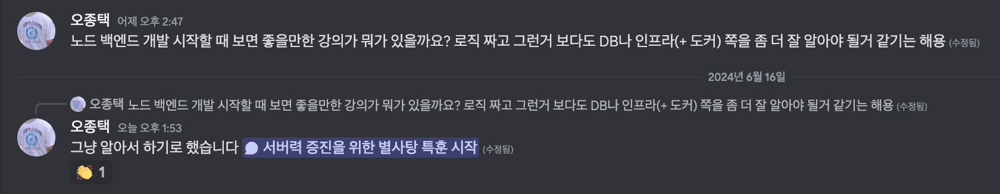

오늘 블로그 요약

## 1. 개발자의 포트폴리오 다각화란

최근 커피챗 겸 강의 제작 관련하여 조언도 구해볼 겸 병진님과 처음으로 저녁 식사를 했다. 여러 이야기가 오갔는데 그 중 한 갈래가 `프론트 원툴` vs `모든 개발 분야 다루기` 였다.

내 관심사는 언제나 시장에서의 주체적인 방식의 생존이다. 조금 뒤로 물러나서 커리어를 바라보면 결국 포트폴리오의 다각화 문제로 수렴한다. 전자가 무작정 추구할만한 방향이라고는 생각지 않는다. 애초에 프론트엔드 개발을 쭉 해오며, 충분히 훌륭한 커리어를 쌓고 있다고 생각한 지인이 스스로를 "나는 비싼 기름 먹는 특수 공구" 라고 표현했을 때부터 곰곰 생각했던 주제였다.

포트폴리오를 다각화 할 필요성이 있다는 궁극적인 방향성에 대해서는 이견이 없지만 그것을 실행하는 측면에서의 전략은 다양할 수 있다. 내가 선호하는 전략은 **1) 한 우물을 깊게 판 뒤 2) 거기서 얻어진 전문성을 다른 분야로 전이시켜 러닝 커브를 낮춘다** 쪽이다. 이는 물론 개인의 성향에 따라 다르겠지만, 현재까지는 이 방식이 내게 가장 적합하다 여기고 있다.

나는 비전공자로서 프론트엔드 개발을 시작했다. 컴퓨터 공학적 베이스와 서버 개발 쪽에 비어있는 지식들을 어떻게 채워야(누군가는 굳이? 싶기도 하겠지만) 할까? 나는 모든 것들을 '겸사겸사' 하고 싶다.

예컨대 컴퓨터 공학 베이스가 부족하다고 해서 대학원을 가지는 않을 것이다. 그게 올바르지 않아서가 아니라 내 입장에선 유연하지 못하고 비효율적이라 생각하기 때문이다. 스터디 하나 끝내는 과정도 지난하고 힘든데 하물며 학위야... 내 변덕에 너무 비싼 대가를 치르게 될 것만 같아 불안하다.

사실 프론트엔드를 정말 '충분히' 공부하다 보면 자연스레 `컴퓨터 사이언스` 라는 친구들에 결국 닿게 된다. 최근 이슈가 되고 있는 `컴파일러`도 그렇고, 애초에 React의 반응성 매커니즘이 결국 `스케줄러` 위에서 굴러간다. `next/image`가 어떻게 최적화 된 이미지를 제공할 수 있는지를 따라가다 보면 `HTTP 헤더`나, `캐싱`, `CPU`나 `RAM` 같은 컴퓨터 구조에 대해서도 자연스레 관심을 가질 수 있게 된다.

업무를 열심히 하다가 거기서 생긴 의문들을 놓아주지 않고 '겸사겸사' '충분히' 공부하다 보면 도달하게 되는 그 인체공학적인 흐름들... 난 그런 것들이 좋다.

## 2. 상처 입었다고 마냥 고개를 돌리고 살 순 없음

얘기가 좀 돌았다. 다시 돌아와보자면 아무튼 그런 관계로 최근 백엔드 개발에 관심을 갖게 되었다. 사실 난 백엔드 개발에 좋지 않은 추억이 있다. 첫 회사에서 처음으로 맡았던 개발이 흥미롭게도 `Node.js`로 어드민 API를 만드는 일이었다.

> "종택님 노드 백엔드 관심 있댔죠?"
>
> "네...? 아 네..."
>
> "그럼 해보세요 ㅎㅎ"

난 SQL도 DB 모델링도 뭣도 몰랐고 간신히 React 조금 깔짝일 줄 아는 수준이었는데 갑자기 그날부터 1주일 시간 줄테니 공부해오고 알아서 백엔드 개발을 시작해야 했다. 요구 받은 기술 스택의 목록은 이러했다.

- Node.js + TypeScript

- GraphQL + Prisma + Apollo Server

- MySQL + Yoyo Migrations + Terraform

- Jest

- AWS Lambda + API Gateway

- DB 모델링 (만들어져 있는 테이블 0개)

지금 되돌아보면 이해가 안 되는 일 투성이였다. 간신히 PR 하나 올리고 손을 발발 떨며 리뷰를 기다려야 했고, 전직원들 앞에서 공개적으로 망신을 주는 일도 다반사. 위축되고 마음과 악화되는 건강 속에서도 목표를 맞추기 위해 말도 못할 과로의 과로도 해보았으나 결국 프로젝트는 공중분해 되었다. 그 이후 백엔드 개발에 대한 흥미는 사라졌다.

하지만 그것도 2021년 초의 이야기이고, 지금은 2024년이다. 훌쩍 자란 지금의 나는 그때와는 다르다. 내가 원하는 만큼 물어볼 수 있는 좋은 도구의 능력을 누릴 수 있는 시대가 되기도 했다. 여전히 두렵기는 마찬가지였어서 뭔가 쉽게 알려주는 콘텐츠를 찾아보고 싶었다.

> 노드 백엔드 개발 시작할 때 보면 좋을만한 강의가 뭐가 있을까요? 로직 짜고 그런거 보다도 DB나 인프라(+ 도커) 쪽을 좀 더 잘 알아야 될거 같기는 해용

답변을 기다리다 문득, 그냥 [GPT](https://chatgpt.com/share/0d319dee-9192-468b-aba3-4c78585bfc2d)에게 물어보면 어떨까? 라는 생각이 들었다. 이 연차 먹고 로직을 못짜진 않겠지. 항상 막히는 건 DB와 그것을 모델링 하는 쪽에서였다. 그래서 물어봤다.

> 노드 백엔드 개발을 시작해보고 싶어. 하지만 항상 db 모델링에서 좌절하고 포기한 적이 많아.

이 질문을 시작으로 **1) 꽤나 고도화 된 투두리스트의 DB 모델링은 어떠해야 하는지 2) MySQL과 PostgreSQL 간의 차이는 어떠한지 3) 둘의 러닝커브에 차이가 크다고 생각하는지** 등을 물어보았다. 그러다 `스토리지 엔진` 이라는 단어를 처음 접하게 되었다. DB가 해주는 일에 대해 깊게 생각해본 적이 없었는데, 어깨너머로 접한 얕은 지식으로도 `트랜잭션`, `동시성`, `인덱스` 등을 잘 다뤄야 할거 같기도 하고 주변 서버 개발자 분들이 DB를 잘 알아야 한다는 취지로 이야기를 했던 기억이 나 좀 더 파내려가보기로 했다.

MySQL이 그냥 통째로 DB인 것은 아니었고, 내부에서 다시 여러가지 스토리지 엔진을 사용할 수 있다는 사실을 알게 되었다. 기본적인 읽고 쓰기 기능을 구현한 최소 버전의 스토리지 엔진 예제 코드를 보다가, SICP(완독 못함) 책에서 언급된 `뮤텍스`나 `세마포어` 같은 개념들이 트랜잭션과 동시성에 대한 개념이라는 것을 알게 되었다.

책 읽을 때는 이걸 도대체 어디다 쓴다는 건지 도통 이해가 안됐는데, 쓸모를 보고 나니 드디어 이해가 되었다.

## 3. 다시 만난 레이어드 아키텍처

이 지점부터 본격적으로 재미를 붙이기 시작했던 것 같다. 다만 백엔드 API를 개발하려던 건데 여기서 더 들어가는 건 좀 과한거 같아서 일단 한번 끊었다.

DB에 요청이 들어왔을 때부터 스토리지 엔진까지 어떻게 돌아가는지에 대한 지도를 달라고 GPT에게 질문했다. 같은 방식으로 사용자가 API를 호출했을 때부터 스토리지 엔진까지 이르는 경로 또한 설명을 요청했다. 그러다보니 어렴풋하게 알고 있던 `레이어드 아키텍처`를 다시 만날 수 있었고, 아래와 같은 질문들을 던졌다.

> 다시 과정을 설명해준 목차로 돌아와보고 싶어. 라우팅까지는 이해했는데 그 이후의 컨트롤러 - 서비스 레이어 - 레포지토리 까지의 과정이 잘 이해되지 않아. 서비스 레이어와 리포지토리 레이어의 차이가 뭐야?

> 컨트롤러는 라우터와 서비스 레이어 사이에서 유효성 검사만 하는거야?

> 서비스 레이어의 존재 이유는 단지 레포지토리 레이어를 컨트롤러에 노출하지 않기 위함이야?

질문 끝에 내가 정리한 결론(틀릴 수 있음)은 다음과 같다.

- 백엔드 API 개발은 1) 사용자의 요청을 받아 2) 적당히 처리한 후 3) DB에 담아둔 적절한 데이터를 4) 잘 조작하여 프론트로 던져주는 로직을 짜는 일이다.

- 사용자의 요청을 받는 것은 `라우터`, 이 요청의 유효성과 입출력(ex. HTTP)을 처리하는 부분은 `컨트롤러`로 나누어 두면 좋다.

- 비즈니스의 핵심 요소들, 이를테면 엔티티, 유즈케이스 등을 중심에 두고 다루는 영역은 `서비스 레이어`로 분류한다.

- 데이터를 읽고 쓰는 영속성 관련 계층은 `레포지토리 레이어`로 분리하여 관리한다.

유레카!

옛날에는 이 분류가 너무 추상적이게만 느껴졌었다. 귀에 걸면 귀걸이, 코에 걸면 코걸이 같은 느낌이라고 해야 하나... 뭐가 컨트롤러로 가야하고 서비스로 가야 하는지 알 수 없으니 코드를 작성할 때 어려움이 있었던 것 같다. 하지만 그간 프론트엔드 개발을 하며 비즈니스 로직을 처리하는 방식이 아쉬워서 `OOP`나 `DDD`에 대해 시나브로 공부해왔던 것들이 이러한 레이어 분리를 이해하는 데 많은 도움을 주었다.

머리가 맑아진듯한 느낌으로 당장 코드를 작성하러 가고 싶었지만 작성할 코드가 너무 많을 거 같았다. 굳이 시행착오를 겪기도 귀찮은 기분이 들기도 했다. 예를 들면 각 컨트롤러에서 `CatController.create` 라고 썼으면, `CatService.create` 라는 함수를 만들어야 하고, 그 함수 안에서 `CatRepository.create` 라는 함수를 만들어야 한다.

이게 맞나? 그렇게 `Nest.js` 공식 문서까지 흘러 들어가게 되었다.

## 4. Nest.js는 Node.js 버전 Spring이라던데

`Nest.js`가 나온지 얼마 되지 않았을 때 한번 써보려고 했었는데, 그때는 뭔가 너무 복잡하고 어려워 보여서 포기했던 기억이 있다. 거 그냥 `express` 깔고 서버 띄우면 되는건데... 그런데 이제는 이런 저런 세팅과 라이브러리 다 대신 준비해주고 비즈니스 로직에만 집중할 수 있도록 해주는 프레임워크의 존재가 꽤나 유용해 보였다. 지금 운영하고 있는 사이드 프로젝트의 API 서버가 자바 + 스프링으로 되어 있어서 알아두면 코드 읽는데 도움이 좀 되려나 싶기도 했다.

하지만 여전히 허들은 남아 있었으니, 바로 `데코레이터`와 `IoC(제어의 역전)` 개념이었다. 이 두 개념이 무엇인지, 어떻게 작동하는지를 이해해야만 Nest.js를 제대로 사용할 수 있을 것 같았다. 그래서 공식 문서를 읽어보기로 했다.

사실 데코레이터 자체에 대한 이해가 없었던 것은 아니고 1) Nest.js에서 제공되는 데코레이터에는 어떤 것들(ex. `@Injectable`, `@Controller`, `@Module`, `@Response`, `@Get` 등)이 있으며 어떻게 동작하는지 2) 이 데코레이터들이 IoC와 어떻게 연결되어 있는지에 대한 이해가 필요했다. 난 당연히 빌드 타임에 데코레이터들이 처리되는 부분이 있을거라 생각했는데 다 런타임에 동작한다는 걸 알고 꽤나 신기했다.

2번을 이해하기 위해 Nest.js 내부의 실제 구현도 살짝 들춰봤다. `Next.js`를 열심히 들추고 다니던 습관이 큰 도움이 되었다. 사실 이 부분도 작년 말 쯤 `DI(Dependency Injection)`에 관심이 생겨서 `infersify`랑 `reflect-metadata`를 찾아보았고, 그 김에 `Proxy`와 `Reflection`이 어떻게 동작하는지 공부했던 기억이 있어 이해에 도움을 받을 수 있었다.

앞에서 레이어드 아키텍처 관련해서 파악했던 내용들을 Nest.js의 구조와 연결지으며 다시 한번 정리하니 이해가 더 잘 되었고, 그간의 노력과 시간이 이렇게 연결되어 가는 것을 보니 뿌듯한 기분이 들었다. 음, 나 이제 강의 없이도 혼자 잘 공부해나갈 수 있는 근력이 생겼군. 약간은 개발자가 됐을지도?

## 5. 마치며

생각해보니 결국 API는 한 개도 만들지 못했다. 그래도 이렇게 공부를 하고 나니 막연히 가지고 있던 두려움을 조금은 떨쳐낼 수 있었다. 그리고 언제든지 이 깨달음들을 바탕으로 필요하다면 언제든지 해낼 수 있을 것 같은 자신감이 생겼다.

돌아보면 그동안 참 많은 일들이 있었다. 좋은 일도, 잊고 싶을 만큼 힘든 일도 있었다. 이렇게 문득 뒤를 돌아 볼 때마다 '테세우스의 배'를 생각한다. 사람은 시간을 겪으며 조금씩 변해가겠지만 그 또한 '나'다. 내가 본래 어떤 존재였는지, 어떤 일을 겪었던 사람인지, 그 순간의 스냅샷이라고 할 수 있는 것들엔 너무 매몰되지 않아도 괜찮다. 스스로를 믿고 '그냥 알아서 하기로 했습니다' 라는 태도로 조금 더 과감히 나아가 보자. 이젠 충분히 그럴 수 있는 힘이 생겼으니까.
