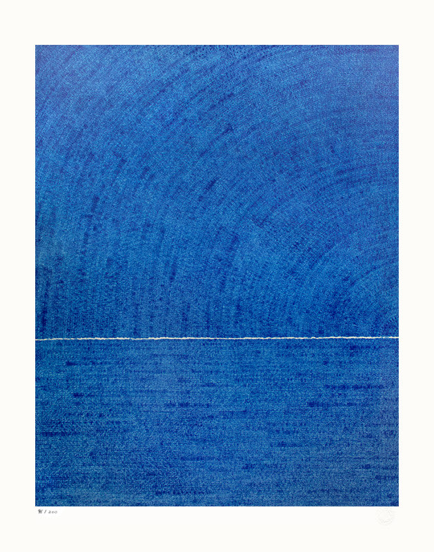
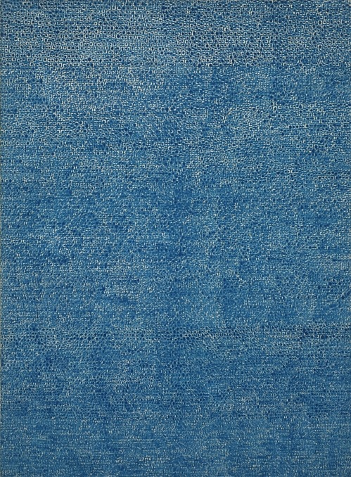
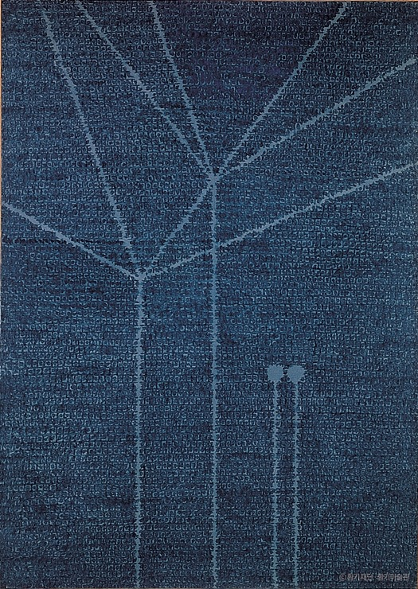
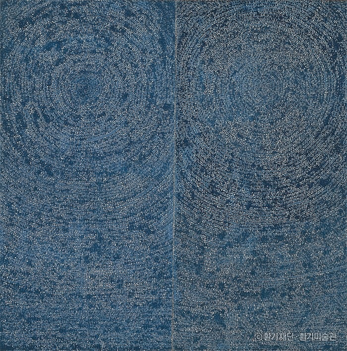
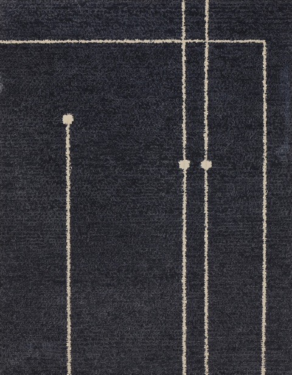
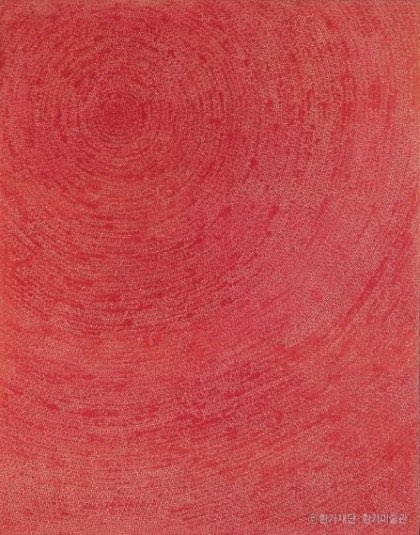
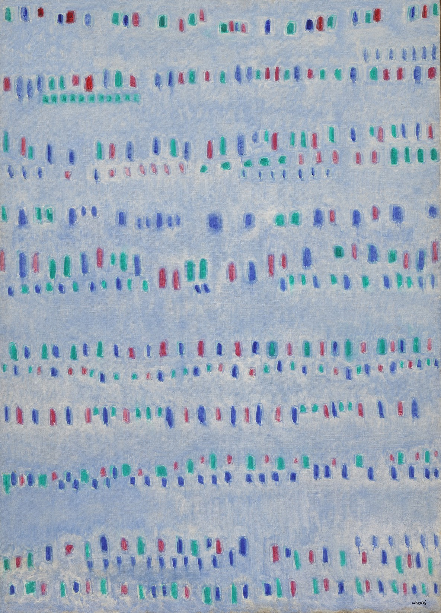
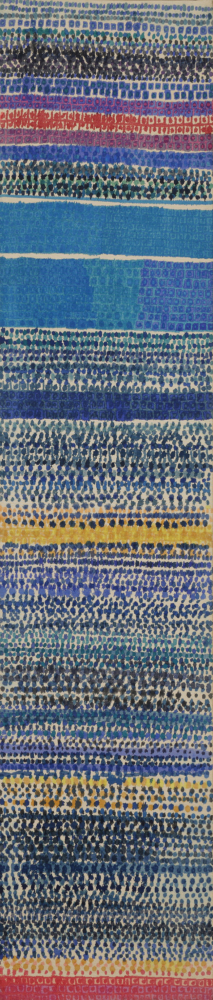
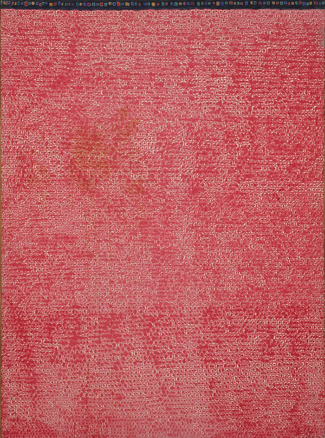
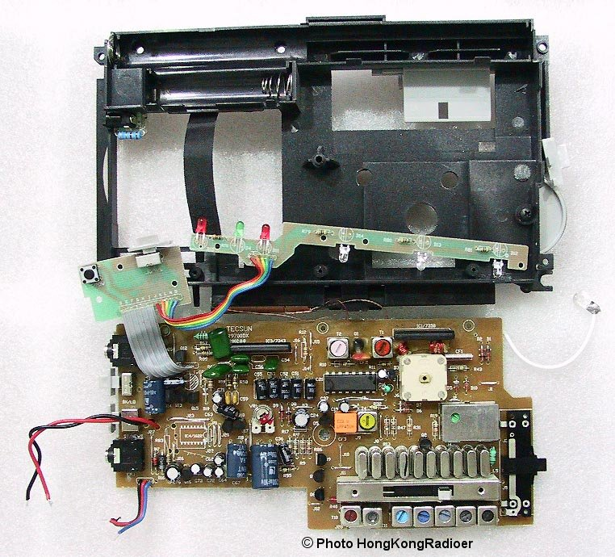

## 1. 점, 선, 면

작년 겨울 환기미술관에서 김환기의 말년 작품들을 봤다. 그전까지 추상미술에 별다른 감흥이 없었는데, 그날은 조금 달랐다.

김환기는 말년에 점화를 열심히 그렸다. 점을 끝까지 밀면 선과 면이 된다는 생각에 몰두했다고 한다.

> 점화點畵가 성공할 것 같다. 미술은 하나의 질서다. (65.01.02)

> 선과 점을 좀 더 밀고 가보자. (65.01.24)

> 선인가? 점인가? 선보다는 점이 개성적인 것 같다. (68.01.02)

> 날으는 점, 점들이 모여 형태를 상징하는 그런 것들을 시도하다.
> 이런 걸 계속해보자. (68.01.23)

  <figure>
    
  </figure>
  <figure>
    
  </figure>
  <figure>
    
  </figure>
  <figure>
    
  </figure>
  <figure>
    
  </figure>
  <figure>
    
  </figure>
  <figure>
    
  </figure>
  <figure>
    
  </figure>
  <figure>
    
  </figure>

그림은 끝까지 점으로만 이루어져 있다. 그런데 우리의 눈에는 어느 순간 더 이상 점이 보이지 않게 된다.

점은 어디서부터 선이 되고, 선은 어디서부터 면이 되는 걸까. 각각의 점은 어느 순간부터 음악이 되고, 물결이 되고, 풍경이 되는 걸까. 다시 그 풍경이 그리움이나 외로움처럼 느껴지는 순간은 어디에서 시작될까.

이 맥락에서 조금 엉뚱한 전개로 들릴 수 있겠지만, 나는 당시 전문성과 추상화에 대해 생각하고 있었다. 전문가들은 문제를 어떻게 보는 걸까. 어떻게 다른 사람과 같은 상황을 보고도 순식간에 올바른 판단을 할까.

흔히 전문가에게는 오랜 시간 축적된 패턴이 있다고 한다. 반복해서 문제를 풀다 보면 여러 개의 세부 정보가 하나의 덩어리로 압축된다. 초보자에게는 별개의 열 가지 개별 요소가 전문가에게는 하나로 보인다. 제한된 단기기억으로 더 많은 것을 다룰 수 있게 된다. 이것을 청킹이라고도 하고, 전문성의 중요한 메커니즘으로 설명하기도 한다.

대략 무슨 뜻인지는 알 것 같았다. 하지만 한동안은 여러 사실을 문자 그대로 암기하고 있을 뿐이라는 느낌을 떨치지 못했다.

그러다 김환기의 점들을 보면서 조금 다른 식으로 이해하게 됐다. 전문가는 점을 보지 않는 사람이 아니라, 점을 보면서 동시에 선과 면을 보는 사람일지도 모른다. 개발하면서 우리가 매일 마주치는 것도 비슷하다.

코드 한 줄 한 줄은 구체적인 동작을 만든다. 그런 코드들이 쌓이다 보면 어느 순간 하나의 역할이 생긴다. 역할들이 모이면 모듈이 되고, 모듈들이 서로 관계를 맺으면 더 큰 구조가 생긴다.

반대 방향도 존재한다. 전체 시스템을 어떻게 이해하느냐에 따라 한 줄의 코드가 어디에 있어야 하는지가 달라진다. 그 줄이 단지 동작을 수행하는 코드가 아니라, 전체 그림 안에서 어떤 역할을 맡기 위해 그 자리에 존재하게 된다.

번들러를 이해하고 있다면 엔트리 포인트와 모듈 그래프와 그래프의 순회와 산출물의 생성을 각각 별개의 코드 덩어리로만 보지 않는다. 서로 다른 코드가 하나의 흐름 안에서 어떤 역할을 맡고 있는지 본다.

그래서 나는 일상적으로 작성하는 코드와 우리가 흔히 ‘추상화’라고 부르는 것을 서로 다른 일처럼 취급하는 사고방식 자체가 이상하다고 생각하게 됐다.

처음부터 Vite나 Yarn이나 Unix가 존재했던 것은 아니다. 작은 문제를 해결하기 위한 코드가 있었을 것이다. 비슷한 문제가 반복되고, 서로 연결되고, 무엇이 일반적이고 무엇이 특수한지 조금씩 드러났을 것이다. 그 과정에서 문제를 설명하는 더 좋은 개념이 생기고, 그 개념을 중심으로 기존의 코드가 다시 배치되었을 것이다. 김환기의 그림에서 점들이 쌓여 선과 면이 되고, 새로 생긴 면을 통해 다시 각각의 점을 바라보는 과정과 동일한 구조인 셈이다.

좋은 추상화는 코드의 표면을 이리저리 분리하고 합친다고 만들어지는 것이 아니다. 눈앞의 카오스를 오래 들여다보고 이것이 무엇을 하려던 것인지, 누가 사용하는지, 무엇이 계속 변하고 무엇은 그렇지 않은지를 이해하려는 과정에서 생긴다.

이해가 깊어지면 이전에는 제각각이었던 것들이 하나의 덩어리로 보이기 시작한다. 그러면 다시 이전에는 보이지 않던 문제가 보인다. 아마 전문성이란 이런 왕복에 가까운 것이 아닐까.

이런 생각들을 아주 많이, 많이 거듭했다.

## 2. 세계를 몇 번이고 분해하고 조립하는

호기심 많은 아이들이 라디오나 가전제품을 분해하며 발명의 꿈을 키웠다는 이야기를 들으며 자랐다. 용기가 부족했던 나는 그런 영웅담을 동경하기만 했다.

요즘은 그 이야기를 조금 다르게 생각한다. 어떤 대상을 끝까지 분해해 보는 경험과, 다시 조립해 원래대로 작동하게 만드는 경험 사이에는 큰 차이가 있다. 분해하면 무엇으로 이루어져 있는지를 알 수 있다. 하지만 다시 만들어보려면 각 부품이 왜 거기에 있었는지 알아야 한다.

의사에게 사람의 몸이 때때로 피와 뼈와 살, 장기와 신경계로 보일지도 모른다는 이야기를 들은 적이 있다. 실제로 그런지는 모르겠다. 하지만 세계를 오래 다룬 사람에게 세계가 이전과 다른 단위로 보일 수 있다는 것은 충분히 상상할 수 있다.

사람도 마찬가지로 내려가 볼 수 있다. 사람은 왜 울고 웃고, 가만히 있지 못하고 무언가를 원하는 걸까. 그에게 이루고 싶은 꿈이 있기 때문이라고 말할 수도 있고, 책임과 의무가 있기 때문이라고 말할 수도 있다. 더 아래로 내려가면 그의 신경계에서 일어나는 전기적이고 화학적인 변화로 설명할 수도 있다.

나는 한동안 마지막 설명에 끌렸다. 낮은 층위까지 내려가 메커니즘을 이해하면 이전에는 운명이나 성격처럼 보였던 것도 어느 정도 조작 가능한 문제가 된다. 학습과 훈련을 통해 사람이 바뀌는 과정 역시 물리적인 변화와 분리되어 있지 않다.

전문성이 패턴의 축적이라면, 그것 역시 어느 날 갑자기 머릿속에 추상적인 지혜가 생기는 일이 아니다. 반복해서 문제를 풀고 실패하고 수정하는 동안 어떤 인지 경로는 자주 사용되고, 여러 정보가 하나의 단위로 묶이고, 이전보다 적은 비용으로 더 많은 것을 볼 수 있게 되는 변화일 것이다.

이 관점은 꽤 매력적이다. 인간을 탈신비화하면 인간은 적극적으로 훈련할 수 있는 대상이 된다. 어떤 조건에서 학습이 일어나고, 어떤 어려움이 필요하며, 무엇이 반복되어야 하는지를 더 구체적으로 생각할 수 있다.

하지만 아래로 계속 내려가다 보면 이상한 순간이 온다. 김환기의 그림이 수많은 점이라는 사실을 안다고 해서 그 그림을 전부 설명했다고 할 수 있을까. 그리움이라는 감정이 신경계의 물리적인 변화를 통해 구현된다는 사실이 그리움을 사라지게 하지는 않는다. 낮은 층위에서 일어난 일이 높은 층위에서는 전혀 다른 이름과 의미를 갖는다. 점을 아무리 확대해도 그 안에서는 풍경을 찾을 수 없다. 하지만 그 점들이 없다면 풍경도 없다.

아직 정확히 어떻게 표현해야할지는 잘 모르겠지만... 이 왕복 운동의 메커니즘을 정확히 이해하는게 굉장히 중요하다는 일종의 직감과 동시에 제대로 표현할 수 없겠다고 느끼는 이상한 기분에 자주 사로잡히곤 한다.

개발 분야의 순간들을 생각해봐도 그렇다. 코드는 결국 문자열이고, 문자는 결국 기계가 수행할 명령으로 내려간다. 하지만 우리는 코드 한 줄을 보면서 언제나 그것만 보는 것은 아니다. 어떤 코드는 인증의 일부이고, 어떤 코드는 편집기의 상태를 다루고, 어떤 코드는 빌드 시스템이 모듈 사이의 관계를 알아내기 위해 존재한다. 충분히 이해하고 나면 코드는 더 이상 줄들의 집합으로 보이지 않는다.

제품에는 나름의 원형(archetype)이 있다. “이건 결국 CRUD다”, “이건 에디터다”라고 말할 수 있다. 그 안에는 몇 개의 중요한 모듈이 있고, 데이터와 이벤트가 흐르는 길이 있다. 무엇이 일반적인 문제이고 무엇이 이 제품에서만 생기는 특수한 문제인지도 조금씩 구별된다.

그때부터 코드를 작성하거나 수정하는 일의 성격이 조금 달라진다. 그저 보기 싫은 코드를 옮기는 것이 아니라 전체에 대한 이해를 조금 더 일관되게 만드는 일이 된다. 그리고 전체에 대한 이해가 다시 좋아지면 한 줄의 코드도 더 잘 보인다.

나는 좋은 개발자가 거대한 추상화만 생각하는 사람이라고 생각하지 않는다. 오히려 반대에 가깝다. 높은 곳에 올라갔다가 다시 내려올 수 있어야 한다. 전체 그림을 이야기하면서도 그 그림이 어떤 작은 약속들 위에 서 있는지 알아야 한다. 반대로 작은 코드를 만지면서도 그것이 어떤 전체를 만들고 있는지 잊지 않아야 한다.

## 3. 목수의 삶

인생에 객관적이고 절대적으로 추구해야 할 의미가 있는지는 잘 모르겠다. 아무것도 정해져 있지 않다면 무엇이어도 괜찮다고 말할 수 있다. 그런데 무엇이어도 괜찮다는 자유만으로 살아가는 것도 쉽지 않다. 사람은 결국 무언가를 선택하고, 의미를 부여하고, 때로는 그 선택을 번복한 뒤 다시 무엇인가를 선택하며 살아간다. 내가 중요하다고 생각하는 것들도 언젠가는 달라질 것이다.

지금은 한 가지 삶의 모습에 마음이 간다. ‘장인’이라는 오래되고 이 시대에는 낡은 무언가로 느껴지는 단어를 자주 떠올리게 된다. 비록 왜 이런 생각이 드는지 언어로 정갈하게 표현할 수는 없지만 내가 몸으로 감각하고 있는 무언가에 또한 일말의 진실이 숨어 있을거라 생각한다. 이 글에도 전혀 다른 이질적인 것들을 뒤섞어 다루고 있지만, 언젠가 이 또한 다 밝혀낼 수 있지 않을까.

그렇다면 시대가 허락하는 한 목수처럼 살고 싶다. 정확히 못과 망치를 다루는 일을 수련하는 삶. 추상화라는 벽 아래에서는 충실하고 올바르게 못을 박는 사람. 왜 이 못을 여기에 박는지 알고, 이 작은 일이 전체 결과에 어떻게 돌아오는지 아는 사람. 추상화라는 벽 위에서는 자신이 약속하고 있는 것이 어떤 하위 레이어의 약속에 의존하는지 알고, 그 약속이 함부로 깨지지 않도록 살피는 사람.

점을 보면서 선과 면을 보고, 선과 면을 보면서 다시 점으로 내려올 수 있는 사람. 모든 추상화에는 언젠가 누수가 생긴다는 사실을 받아들이면서도, 그렇기 때문에 다시 아래로 내려가 손을 더럽힐 수 있는 사람. 그런 목수의 삶을 살고 싶다. 시대가 많이 흐르더라도 어디에선가는 못과 망치에 대한 고민을 해온 누군가를 필요로 할 것으로 믿는다.
