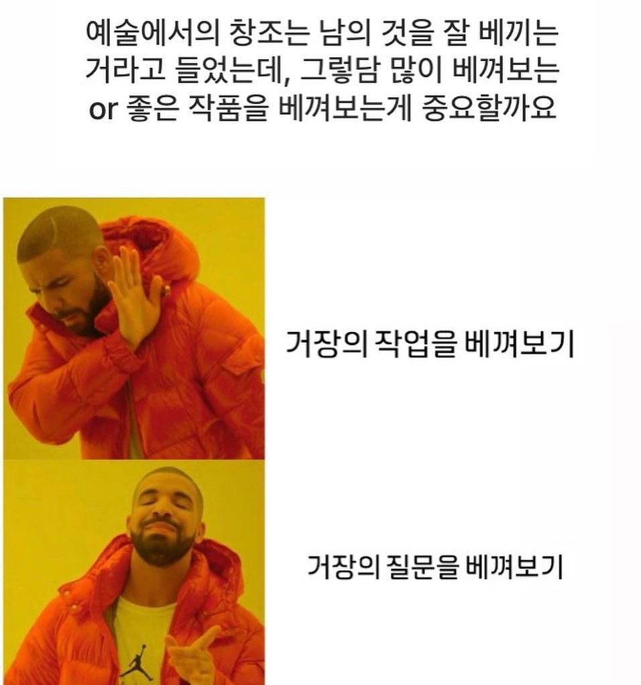

글을 다 쓰고 나서 내가 내린 '멘토링'에 대한 정의는 이러하다.

> 📖 멘토링이란 긍정적인 방향으로 멘티의 변화를 이끌어내는 기술의 총체를 의미한다. 따라서 멘토링은 심리 상담의 성격을 띌 수 밖에 없다.

## 1. 멘토링에 대해 생각해나가는 과정

어려운 주제다. 멘토링이란. 이걸로 커리어를 시작했지만, 제대로 공부해 본 적도 없고 어떻게 공부를 해야 할지도 모르겠는 분야라는 생각이 든다. 일단은 그간의 경험과 자문자답 속에서 더듬더듬 답을 찾아나가는 과정 속에 있다.

지금의 내 결론은 이렇다. 멘토링은 결국 긍정적인 방향으로 멘티의 변화를 이끌어내는 것이어야 한다. 변화가 있기 위해서는 컴포트 존을 벗어나는 도전이 필요하며, 필연적으로 두려움과 고통을 수반하는 일이다. 멘토는 이 두려움과 고통을 줄이거나 단계를 나누어 변화가 일으키는 충격량(=물체에 작용하는 힘과 힘이 가해지는 시간의 곱)을 줄여주어야 한다. 두려움과 고통에 대한 내성은 사람마다 다르다. 한 사람에게 성공했던 멘토링 방법론이라고 하여 모두에게 일괄 적용해서는 안되는 이유다.

즉, 멘토링은 심리 상담일 수 밖에 없다. 지금은 아니지만 결국 심리 관련한 교육을 받아야 할 필요성을 느낄 것 같다. 내 개인적인 관심사이기도 하지만 내가 언젠간 좋은 리더가 되고 싶어서, 조금 더 솔직히는 채용 시장에서 더 주도적인 형태로 생존하고 싶어서이기도 하다. 멘토링과 리더십은 무관하지 않다. 조직이 성과를 내기 위해서는 좋은 리더십을 발휘하는 리더가 필요하다. 전 CTO 분께서 해주신 "엔지니어의 레벨을 나눌 때 '이 사람한테 몇 명까지 쌓을 수 있을지'를 기준으로 생각한다" 라는 말씀이 상당히 인상 깊었다. 연차가 쌓이고 내가 코드를 직접 작성하는 것보다 내가 담당하는 팀에 속한 N명의 엔지니어들의 역량을 곱하기 해줄 수 있게 되면 좋겠다.

## 2. 조금 더 보급 가능한 멘토링의 가능성에 대해

한편으로는 요즘 들어 특히 문제 해결에 초점을 맞춘 '강의'의 필요성을 많이 느낀다. 신입 개발자 채용 시장이 얼어 붙었다는 건 누구나 아는 사실이고 그 자체로는 이미 닳고 닳아서 언급하지 않아도 되는 수준이다. 그렇다면 온전한 형태로 커리어를 시작할 수 있도록 돕는 일은 어떻게 가능할 것이며, 그것에 대해서는 누가 어떤 답을 주고 있는가? 몇 가지 좋은 솔루션들이 생각나기는 하지만 다소 프라이빗 하고, 비용이 높다. 그 외의 보편적인 수준에서는 마땅한게 있는지 잘 모르겠다.

문제를 해결하려면 마땅히 올바른 방향의 문제 정의가 선행해야 한다. 문제가 올바르게 세팅되지 않았다면 그 문제를 푸는 건 크게 의미가 없다. 적절한 솔루션도 중요하다. 각 단계를 합리적으로 수행하기 위해서는 풀고자 하는 문제가 속한 분야에 대한 전문성(하드 스킬) 뿐만 아니라 '문제 풀이' 과정 그 자체에 대한 숙련이 동반되어야 한다. 후자에 대해서는 "왜 이 문제가 중요한 것인지? 이 문제를 풀면 뭐가 얼마나 좋아지는 것인지?" 같은 메타적인 질문을 적절히 던지는 요령 등을 예시로 들 수 있겠다. 이 부분은 의도적인 훈련을 통해 단기간에 큰 폭의 개선(하드 스킬과 비교했을 때)이 가능하다고 생각한다.

흔한 질문들을 생각해보자. "제 이력서에서 이 부분을 넣어야(혹은 빼야) 할까요?" 그 질문 이전에 '이력서'가 무엇인지 생각해볼 수 있다. 이력서는 채용 프로세스의 첫 단계이며, 면접에 불러 직접 질문하고 싶도록 궁금증을 유발하는 것이어야 한다. 하지만 조금 더 본질적으로는 나의 쓸모를 채용 담당자에게 설득하는 문서라고 생각해야 한다. 따라서 질문은 이렇게 바뀌어야 한다. "제 이력서가 흥미로워 보이나요?"

신입 이력서에는 (절대적인 의미의) 성과가 담기기 힘들다. 성과가 아닌 것을 억지로 성과로 포장하려고 하면 부자연스럽고 질문이 들어왔을 때 스스로도 머쓱할 수 밖에 없다. 대단한 기술을 사용했을리도 없다. 그런 기술들을 높은 수준으로 사용할 수 있다면 이미 신입이라고 볼 수 없을 것이다. '준비된 신입'은 규격 외로 봐야 한다. 내 기준에 신입 개발자를 뽑을 때 가장 중요한 덕목이 있다면 "예측 가능성"이다. 그리고 이 예측 가능성은 '좋은 태도와 커뮤니케이션 스킬'에서 온다고 생각한다. 다시 이것들은 자기 자신에 대한 객관화, 즉 메타인지에서 오는 것이 아닐까 추측해본다.

담기지 말아야 할 것이 그러하다면 대신 무엇을 담아야 할까. 사실 그것까지는 모르겠다. 하지만 무엇을 담을 것인가를 생각할 때 결국 '내 자신'에서 출발해야 한다는 믿음이 있다. 이력서를 적절히 추상하면 채용 담당자에게 '나'를 설득하는 문서이다. 채용 담당자는 옆자리에서 일도 하고, 농담도 하고, 밥을 같이 먹고, 함께 고군분투 하며 성장해나가야 할 동료를 뽑아야 하는 입장이다. '이 사람이 내 옆자리에서 같이 일하면 어떨까?' 라는 질문에 답을 주려면 우선 '나는 어떤 사람인가' 하는 질문에서 출발하여, 단순히 React, Next.js 같은 기술로 함축되지 않을, 여러 컨텍스트를 건네주어야 하지 않을까. 이력서를 읽는 사람으로 하여금 그 장면들을 상상할 수 있도록. 어떤 내용을 넣고 빼야 할까에 대해 적어도 글의 재료 측면에서는 자기 자신보다 잘 아는 사람이 있을 수는 없을 것이다.

잠시 이력서에 대한 이야기로 우회해보았는데, 결국 이런 과정들을 자문하면서 문제를 해결하기 위한 핵심적인 지점으로 나아가는 '방향성'이 중요하다. 왜 하는지도 모르고 무작적 포트폴리오를 쌓거나 강의를 들으며 어떤 기술을 습득하는 것은 정말이지 큰 의미가 없다. 이유를 알고 움직이는 자기 주도적인 사람. 그런 사람들에게서 느껴지는 힘이 있다. 당장은 어렵겠지만 내가 누군가를 멘토링 한다면 그런 힘을 길러주고 싶다. 그리고 강의를 만든다면 변화를 일으킬 수 있도록 능동적인 참여가 가능하도록 설계하는 데 많은 공을 들일 것이다.

언젠가 이러한 고민을 담은 멘토링을 기능적으로 구현한 사이트를 만들고 이 채널을 통해서 수강생을 만나보는 것도 좋겠다는 생각이 든다. 멘토링은 대체로 스케일러블 하지 않다. 위에서 말했듯 개인적인 지점이 필수적이기 때문이다. 하지만 결국 핵심은 능동적인 참여와 그 참여의 과정 속에서 멘티 스스로가 이유를 찾아내고 변화를 이끌어내는 것이다.

## 3. 현상 대신 질문을 모방하기

자신의 것을 만들고자 하는 누구나 모방에서 출발하지만 사실 모방 자체는 중요하지 않다. 그 모방의 대상이 어떤 문제 의식 속에서 출발했는지 생각하는 과정이 중요하다. 정말이지 멘토는 중요하지 않다. 멘토가 던지는 질문과 그 질문으로 인하여 창발되는 문제 의식이 중요하다. 정말이지 오직 그것만이 중요하다.

Instagram @contemporary_arts_meme
