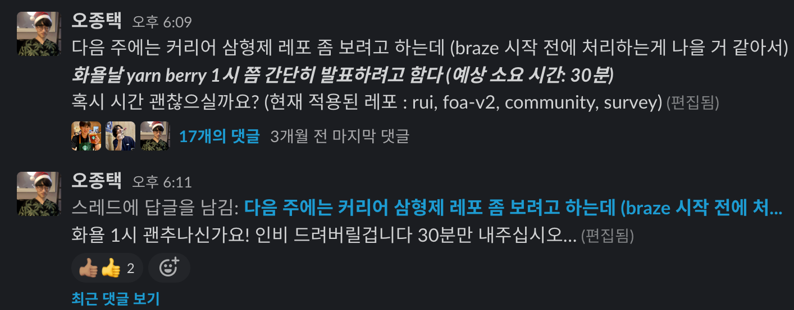

## 2023년이 끝났다. 남은 것은?

개인 회고에서 적었지만 2023년은 힘들었지만 내가 엔지니어로서 큰 도약을 할 수 있게 해준 해였다. 2022년은 굵직하게만 따졌을 때 1) 리멤버로의 이직 2) UTS(유저 타겟팅 시스템)라는 UI 기반 쿼리 빌더를 만들었던 것과 3) Yarn Berry 마이그레이션 했던 것으로 요약할 수 있었다면, 2023년은 그것들로 부터 얻은 자신감으로 더 많은 것들을 해낼 수 있었던 한 해였던 것 같다. 지난 해 회고에서 기술적인 부분에 대해서는 다루지 못했던 아쉬움이 있었어서, 굵직한 키워드들을 중심으로 리멤버 이직 후 올해까지의 기술적인 깨달음을 정리해보고자 한다.

### 1. UTS(User Targeting System)

UTS는 내게 특별히 각별한 프로젝트였다. 멘토 일을 하다가 풀타임 프론트엔드 개발자로 이직한 이후 처음으로 맡은 프로젝트였기도 하고, 일반적인 CRUD 웹 사이트가 아니라 내부 DB에서 SQL 없이 복잡한 조건으로 유저를 검색하는 데 사용하는 인터널 제품이었기에 어떻게 설계하고 만들어나가야 할 지에 대한 고민을 굉장히 많이 했던 기억이 있었기 때문이다.

블로그 쓸 시간을 많이 내지 못하기도 했고, 이걸 어떻게 회사 기술 블로그로 적는게 좋을지에 대한 고민을 하다가 결국 시간이 많이 흘러버려 더 늦기 전에 이렇게라도 정리해 본다.

프로젝트를 간단히만 설명하자면... 사내에서 푸시 메시지를 발송해야 하거나 특정 사업 등에서 원하는 조건의 유저를 DB에서 추출해서 활용해야 하는 경우가 있다. SQL을 활용하면 검색이 가능하긴 하지만 개인정보 보호 등의 이슈, 추출 이후 푸시 / 이메일 등 후속 액션이 필요하다는 점, 조건이 약간 복잡해지는 것만으로도 쿼리문을 작성하는 것이 굉장히 어려워지는 등의 문제가 있다. 그래서 이를 위한 UI 기반 쿼리 빌더를 만들게 되었던 배경이 있다.

입사 1주일 차부터 프로젝트 회의에 들어가게 되면서 매우 정신이 없었다. 그 때 회의에서 오갔던 단어들을 떠올려 보면 `DSL(Domain Specific Language)`, `Lucene Query`, `Elastic Search Query` 등등등 내가 알지 못하는 단어들이 많았고, 이런 시스템이 어떤 형태로 만들어져야 하는지에 대한 감도 없어서 어디부터 어디까지 내가 관여해야 하는지 등 여러모로 막막했다. 모든 걸 다 만들 수 있다는 자신감이 없었을 때라 `react-awesome-query-builder`([링크](https://github.com/ukrbublik/react-awesome-query-builder)) 라는 걸 발견했고, 이걸 활용해서 만들어보자고 제안했다. PoC 차원에서 간단한 데모 페이지를 Vercel로 배포하여 회의에서 보여주고, 이를 기반으로 프로젝트를 진행하기로 결정했다.

이 라이브러리를 다루기 전까지는 라이브러리 내부를 제대로 뜯어본 적이 없었다. 그런데 "종택님 이거 구현 돼요?"에 답변을 하기 위해서는 라이브러리 내부를 살펴보고 옵션을 제공하는지, 커스텀 가능하긴 한지 등 여러가지를 알아봐야 했다.

패키지 구조를 파악하고 코어 로직과 MUI, Antd, Bootstrap 등의 UI 라이브러리가 어떻게 결합되는지 파악하고, UI 쿼리 빌더가 어떤 쿼리 스펙(Elastic Search, SQL, ...)으로 변환을 지원하는지 확인했다. 이 과정에서 이 라이브러리가 `Rule(필터)`, `Group(논리 연산자 그룹)`의 조합을 중심으로 내부적으로는 `immer`를 중심으로 UI Tree를 통하여 유저가 원하는 검색 조건을 관리하다가 최종적으로 검색하거나 저장할 때 목적 스펙으로 변환하는 구조임을 알게 되었다. 이 과정에서 타입 오류에 대한 작은 이슈([링크](https://github.com/ukrbublik/react-awesome-query-builder/issues/669))와 수정 PR을 올리기도 했다.

이렇게 여러 어려움을 헤치며 한달 쯤 만들다가... 결국 만들던 코드를 전부 폐기하는 참사가 벌어졌다. 원인은 해당 라이브러리가 엘라스틱 서치의 `Nested Query` 스펙을 지원하지 않음을 뒤늦게 알게 되었기 때문이다. 사실 어쩔 수 없었던 것이 애초에 이런 스펙이 존재하는지도 몰랐고, 이게 왜 필요한지도 몰랐기 때문이다. 당시에 ChatGPT라도 있었으면 좀 더 편하게 공부를 했을 텐데 그렇지를 못해서 서버 개발자분들을 계속 붙들고 설명을 들었다. 귀찮으셨을 텐데 그런 티 안내고 잘 설명해주셔서 감사했다.

아무튼 위에서 선택했던 라이브러리는 버리고 직접 새로 만들게 되었다. 동일하게 유저가 선택한 조건을 `Rule`과 `Group` 개념으로 조합하고, 내부는 `immer` 기반으로 UI Tree로 관리하고, 이를 `elastic-builder`를 사용하여 쿼리를 동적으로 생성하는 기능을 작성했다. 말은 폐기라고 했지만 그 지식들이 다 기반이 되었으니, 지금 돌아보면 내가 만들어야 하는 제품에 대한 이해도를 높이는 차원에서 반드시 필요했던 과정이었던 것 같다.

정확히 기억은 나지 않지만 3월 중순쯤 부터 본격적으로 개발 시작해서 4월 쯤 다시 처음부터 만들기 시작했고, 5월 QA 테스트를 거쳐 6월 쯤 정식 배포를 했던 것 같다. 글로는 스르륵 `만들었다`라고 적었지만... 사실 '내가 못 만들면 프로젝트가 엎어져...' 라는 걱정과 불안 속에서 거의 두달 동안을 밤낮 주말 없이 집에 틀어박혀(당시엔 전사 풀재택이었다) 코딩만 했다. 어제까지는 될 것 같다가도 오늘은 안 될 것 같고, 내일은 될 것 같다가도 다시 안 될 것 같고...ㅋㅋㅋ

아무튼 내가 입사하면서 생각했던 형태의 제품은 아니었지만,

- 처음부터 꽤 복잡도가 높은 제품을 혼자서 공식적으로는 인생 첫 프론트엔드 프로젝트로서 성공적으로 런칭했다는 점

- 런칭 이후 실제 사용하시는 분들로부터 지속적인 피드백을 받고 유지보수 및 기능 확장 과정을 밀도 있게 경험할 수 있었던 점

- 무엇보다도 이 때 만들었던 코드가 지금까지도 핵심적인 제품으로서 잘 쓰이고 있다는 점

등이 큰 보람으로 남았던 것 같다.

그리고 지금 채용 도메인 쪽으로 팀을 이동한 이후에 공교롭게도 논리 연산이 들어간 인재검색 기능을 담당하여 만들기도 했는데, 이 때의 경험이 많은 도움이 되어 UI가 아니라 코어 로직 중심으로 코드를 작성할 수 있었던 것 같다.

### 2. Yarn Berry 마이그레이션

How To에 대해서는 리멤버 기술 블로그에 작성한 [리멤버 웹 서비스 좌충우돌 Yarn Berry 도입기](https://blog.dramancompany.com/2023/02/%EB%A6%AC%EB%A9%A4%EB%B2%84-%EC%9B%B9-%EC%84%9C%EB%B9%84%EC%8A%A4-%EC%A2%8C%EC%B6%A9%EC%9A%B0%EB%8F%8C-yarn-berry-%EB%8F%84%EC%9E%85%EA%B8%B0/)에 상세히 기록해두었으니, 여기서는 후일담 느낌으로 에피소드를 적어두는 편이 좋겠다. 간단히 요약하자면 이 건은 UTS 런칭 이후 유지보수를 하면서 오퍼레이션 효율화 관련 여러 태스크를 하던 와중에 잠시 시간이 떴던 때를 활용하여 내가 그냥 밀어 붙인(ㅋㅋ) 프로젝트였다.

그렇다고 그냥 막 한 것은 아니었고... 당시 개인적으로 알고 지내던 토스 프론트엔드 개발자 분이 이 기술에 대해 추천을 해주셨던 것을 계기로 우리 회사 프로젝트에서 점점 심해지고 있던 빌드 속도 저하, 브랜치 전환 시 의존성에 차이가 있을 경우 매번 인스톨을 새로 해줘야 하는 문제, yarn v1의 freeze 소식 등을 모두 고려하여 시도해 보기로 했다. 그리고 많은 공수가 들지 않을 것으로 생각이 들기도 했어서 깃발 들고 다 치워버리겠다고 선언했다.

내가 뭔가 빼먹었는지는 모르겠지만 다른 회사에서 lockfile의 conflict를 한땀 한땀 풀었다는 공포스러운 일은 우리 케이스에서는 다행히도 발생하지 않았다. 대신 나는 `Docker`나 `AWS CodeBuild` 등의 기술들과 친하지 않았어서 변경된 스펙에 맞추어 배포 파이프라인을 수정하는 일과, Yarn PnP를 사용하게 되면서 빌드 과정에서 발생하는 몇몇 툴링의 문제(ex. StoryBook, eslint, husky, ...)들을 푸는게 더 어려웠다.

이 과정에서도 정말 많은 것들을 배울 수 있었다. 우스울 수도 있겠지만... `Yarn`이라는 패키지 매니저가 자바스크립트로 작성된 프로젝트라는 점이 새삼스럽게도 가장 놀라웠다. 그냥 막연히 '프로그램'이라고 생각하던 대상으로부터, 내가 마음만 먹으면 Github에 들어가 라이브러리가 어떻게 다운로드 받고 의존성을 resolve 하는지 확인할 수 있겠다는 생각을 하게 됐고, 그제서야 기존 패키지 매니저가 수많은 File I/O를 일으키고 `.pnp.cjs`가 인터페이스 링커로서 이를 어떻게 하고 어쩌구 등이 이해되기 시작했던 것 같다. 그리고 무수한 빌드 에러를 해결하면서 각 툴링들이

그리고 지금은 또 잘 안 건드려서 조금은 흐릿해진 것 같지만 `Dockerfile`을 직접 작성해보면서 `Docker`에 대해서도 조금은 이해할 수 있었던 것 같다. CodeBuild 내부에서 실행 로그를 확인하며 'Dockerfile 한줄 한줄 이미지가 생성된다'는 문장의 의미에 대해서도 캐싱 관점에서 고민해볼 수 있었고, 이 과정에서 기존에 잘못 작성되어 있었던 불필요한 라인들과 빌드 속도를 높일 수 있는 몇몇 캐싱 옵션들을 제안해볼 수 있었다.

한 가지 아쉬운 점이 있다면 이후 모노레포 논의가 이어졌는데 `Turborepo` 쪽 문서에 분명 Yarn Berry PnP 지원에 대해 명시적으로 로드맵으로 존재했었는데 어느 순간 슥 빠져버렸다는 점이다. [이슈](https://github.com/vercel/turbo/issues/693#issuecomment-1278886166)를 찾아보니 Vercel이 이리저리 짱구를 굴려본 결과 전부 지원하지 않는 것을 전략적으로 선택한 것으로 보였다. Vercel의 제품을 좋아하기도 하고 Turporepo에서 지원하는 캐싱 기능들이 DX 측면에서 편리할 것 같아 기대를 하고 있었기에 아쉬움이 컸다.

그래서 pnpm을 써야 하니 berry로 세팅해놓은 걸 걷어내냐 마냐 설왕설래가 있었는데, 결과적으로 모노레포 논의가 엎어지고 역으로 Turborepo + pnpm으로 세팅했던 프로젝트의 존속이 불투명 해지면서 지금 시점에서는 오히려 남은 레포지토리 한 두개에 대한 마이그레이션을 진행해야 할 판이다. 실제 1년이 지난 시점에서 되돌아 봤을 때 팀원들도 Berry + Zero-Install 조합에 대한 만족도가 높은 상황이라 전사적인 인프라 작업이 마무리 되고 나면 짬을 내서 다시 진행해보지 않을까 싶다.

### 3. 레거시 코드 리팩토링

나는 `3.`까지만 쳐두고 다음은 어떤 키워드를 적을지 고민하고 있었는데 코파일럿이 '레커시 코드 리팩토링'이라는 소제목을 기습적으로 추천해주었다. 너무 광범위 하긴 하지만 맞는 말이긴 해서 일단 이어가보면 좋을 것 같다.

2023년이 되고 인터널 제품을 다루는 팀(플랫폼, 사업가속화)에서 채용 도메인을 다루는 '채용 크루'라는 팀으로 이동하게 되었다. 조직 구조가 변경되던 시기에 희망하는 팀을 신청 받았는데, 마침 1년 동안 프론트엔드 개발자가 한 명인 팀에서 디자이너 없이 일하다 보니 좀 더 많은 사람과 다양한 경험을 해보고 싶었던 내적인 니즈가 함께 해결되었다.

이 팀은 주로 채용 담당자나 헤드헌터가 사용하는 인재검색 제품(리멤버 앱 사이드에서 제안을 발생시키는 바로 그...!)을 담당한다. 특징이라면 PoC에서 시작하여 몇 년간 다양한 비즈니스적인 요구사항(ex. 상품 개편)을 반영하며, 많은 개발자와 기획자와 디자이너의 손을 탔던 제품이라는 점이다.

코드 베이스에 유저 타입이나 권한별로 raw하게 많은 분기가 존재하고 사내 디자인 시스템이 존재하기 이전에 만들어졌던 제품이라 곳곳에 과거 스펙의 컴포넌트가 존재하는 등의 아쉬움이야 있지만, 자바스크립트에서 타입스크립트로 꾸준히 마이그레이션 하여 100% 달성을 목전에 두고 있다거나, 기존에 CRA로 세팅되었던 프로젝트를 Vite로 옮기는 등 꾸준히 많은 노력을 기울여 가꿔 나가고 있는 프로젝트이기도 하다.

다만 코드 레벨의 고도화 측면에서는 아쉬운 점이 많았다는 측면에서 내가 도전할만한 부분 또한 충분했다. 종종 "1년 동안 분리수거만 했다"고 투덜대기는 하지만, 이 과정에서 얻은 인사이트가 매우 많았다. 기술 부채를 어떻게 인식하고, 단계적으로 개선해나가는지, 계획을 넘어 실제 코드 레벨에서 어떤 식으로 개선해야 변경에 유연하면서도 사용하기 좋은 코드가 되는지에 대한 공부를 어느 정도 성숙한 제품에서의 실전을 통해 경험해 볼 수 있었다.

모든 내용들을 다루기는 어려우니 몇 가지만 적어보자면...

- 기술 부채 관리의 일환으로 레포지토리의 `issue` 탭을 문서화의 공간으로 적극 활용하는 법을 고안하여 적극 사용해보고 팀에 전파하여 잘 정착시켰다. 처음에는 프론트엔드 파트에서 발생하는 여러가지 기술적 이슈들을 `web-discussion`이라는 레포지토리에 모으도록 했으나, 사용하다보니 각 프로젝트별 기술 부채는 프로젝트 별 레포지토리에 정리하는게 맞겠다는 판단이 섰다. 각 기술 부채의 영향범위에 따라 P1 ~ P3까지의 우선순위를 나누고 마치 RFC를 작성하듯 상세히 기록해두었다. 이렇게 해두니 확실히 기술 부채가 가시화 되는 효과가 있었다. 신규 입사자 온보딩, 기술 부채 해결, 새로운 기능을 추가 시 병목 지점과 범위를 미리 예측하는 등 다양한 측면에서 도움이 되었다.

- 좋은 추상화에 대해 많은 고민을 했다. 특히 캡슐화의 측면에서 `IoC(Inversion of Control)`, `SOLID`에 대해 다시 생각해보는 계기가 되었다. 2021년도에 클린 아키텍처를 읽는 스터디가 있었으나 이 때는 이 용어들에 대해 다소 피상적으로 이해하고 넘어갔었는데, 이번에는 실제 코드 레벨에서 이를 적용해보면서 이해도를 높일 수 있었다. 근래 React 진영에서 사랑해 마지 않는 `CCP(Compound Component Pattern)`은 왜 훌륭한 추상화인지, 어째서 `Custom Hook`이 유일한 로직 추상화의 수단이 되어서는 안되는지, React 개발자들이 싫어하는 `Class`는 어떤 측면에서 좋은 추상화 도구가 될 수 있는지 등에 설계 측면에서 뚜렷하게 내 의견을 가질 수 있었다.

- 작업 과정으로서의 `추상화 벽`을 고려할 수 있게 되었다. 개발 스터디 주제였던 <쏙쏙 들어오는 함수형 코딩> 책에서 처음 접했던 개념인데, 최근 SOLID(특히 ISP와 DI)를 공부하며 각 컴포넌트와 로직이 인터페이스 기반으로 소통하는 것이 얼마나 강력한 도구가 되는지를 새삼 깨닫게 되었다. 상반기에는 기존에 작성한 코드를 건드리기 어렵다는 이유로 그냥 그 위에 로직을 작성했던 적이 많았는데, 하반기로 넘어오면서 내가 작성한 코드에 얻어 맞는 일이 더러 있었다. 결과적으로 1) 코드를 정리하며 기존 스펙 이해 및 코드를 수정하기 좋은 상태를 만들어 먼저 배포하고 2) 이후에 새로운 기능을 추가하는 방식으로 진행하되, 추상화 벽을 세우고 작업의 영향 범위를 제한하는 식의 업무 프로세스를 정립할 수 있었다.

이 과정에서 너무 DDD 어쩌구 하는 개념을 도입하지 않더라도 '도메인' 관련한 개념이 코드에서 잘 표현되어야 하겠다는 인사이트를 얻을 수 있었다. 예를 들면 채용 및 인재 검색 도메인에서 가장 중요한 기능이라면 결국 '검색'과 '제안'이고, 해당 개념들을 다루는 코드들을 UI에 종속시키지 않고 별도의 폴더에 모아, 클린 아키텍처에서 이야기 하는 `소리치는 아키텍처` 혹은 `SSOT(Single Source Of Truth)`로서 그 자체로 문서화 효과를 낼 수 있는 코드 베이스로서 만들어 나가야 하지 않을까 같은 생각이 그런 류의 고민이다.

아마 다음 팀 이동 때는 새로운 제품을 만들게 될 것 같은데, 위에서 언급했던 유저나 상품의 타입에 따른 권한 분기 등 도메인 관련한 횡단 관심사를 어떻게 잘 표현할 수 있을지에 대한 고민을 하면서 코드를 작성해보고 싶다.

### 4. 채용 면접 관련

이걸 기술적인 성장으로 봐야할지 고민이 되었으나, 엔지니어로서 좁은 의미의 기술(Hard Skill) 뿐만 아니라 소프트 스킬처럼 넓은 의미에서의 기술도 모두 포함하여 생각하여도 딱히 문제가 없을 것 같아서 적어보기로 했다.

이력서 검토나 기술 면접 등 채용 업무를 4월 부터 시작하여 개발과 병행하기 '너무 힘듬' 이슈로 12월에 동료분께 넘겨드리기까지 약 8개월 정도를 담당하였다. 이 기간 동안 채용 업무를 담당하면서 내가 얻은 것들은 다음과 같다.

- 채용 시장에서 우리 회사에 입사하고자 하는 분들의 기술적인 수준

- 채용 시장에서 나의 기술적인 위치

- 좋은 동료를 모시기 위해 먼저 우리 팀이 갖춰야 할 요소들에 대한 고민

- 좋은 동료를 모시기 위한 '효과적인 면접 프로세스 및 질문 기술'에 대한 고민

- 내 경력 바깥의 경험을 하셨던 분들의 역량을 파악하는 방법

- React, Next.js, JavaScript, Bundler, ... 등 프론트엔드 쪽 하드스킬에 대한 보다 깊은 이해

이 토픽 관련해서는 워낙 다양한 방향으로 파생되는 경험들이 있었기에 따로 정리하고 싶을 정도로 많은 배움과 깨달음이 있었다. 간단히라도 결론을 내자면 채용이란 '기다림'이 아닐까 생각했다. 우리 팀이 원하는 인재를 모시기 위해 자원이 허락하는 한 인내하는 과정이었다. 사실 면접이야 그냥 보면 되는데... 그 결과 이 사람을 '정말 붙일 것인지'에 대한 고민이 들게 되면 덜컥 겁이 났다. 덕분에 면접이 끝날 때마다 합/불합에 대한 고민으로 골머리가 썩고, 정말 여기저기에 '좋은 동료'에 대한 질문을 던지고 다녔던 것 같다. 그러다가 정말 간혹이지만, 정말 즐거운 면접을 몇 차례 경험하면서 그동안의 고민이 무의미하게 느껴지는 경험이 쌓이고 우리가 모셔야 할 동료 상을 명확히 할 수 있었다.

이 기간 동안 다섯 분의 동료를 새롭게 모셨다. 이제 총원 10명의 팀으로 자릿 수를 달리 하는 팀이 되었다. 이 과정에서 우리가 가지고 있는 팀 컬쳐를 지키고, 더 많은 인원이 한 팀으로써 나아가기 위해 <함께 자라기> 스터디를 제안하기도 하고, 채용 관점에서의 팀 소개 아티클([링크](https://blog.naver.com/rememberapp/223242030543)) 발행에 적극 참여하고, 1 on 1을 자진해 진행해보기도 하는 등 팀의 문화에 관해서도 고민해볼 수 있었다. 사실 이 과정에서 능력에 비해 욕심이 과했던 탓에 약간의 마찰을 빚기도 했던 것 같은데, 이건 개인적인 성숙의 계기로 삼아야 할 것 같다.

## 2024년 한판 붙자...

솔직히 2년 간 '정말 많이' 성장했는지, 적게 성장했는지는 잘 모르겠다. 너무 천천히 성장하고 싶지도, 그렇다고 모든 걸 내던지고 곱씹어 볼 시간과 여력도 없이 믹서기 속에서 갈리며 살고 싶지도 않다. 하지만 지금 나는 내가 가지고 있는 자원들을 최대한 활용하여 나아가고 있다. 이 점에 있어서는 스스로에게 만족하고 있다.

나의 20대는 불안과 걱정으로 가득차 있었다. 30대로 접어들고 개발을 시작하면서 모든 것들이 바뀌기 시작했다. 많은 사람과, 기회와, 행복을 마주하며 살아가고 있다. 앞으로 이뤄나가고 싶은 것들이 많다. 정말 그 목표에 닿기 위해서는 뻔한 말이지만 흔들림 없이 나만의 방향과 속도를 지켜내는 내면의 힘이 가장 중요한 것 같다. 이제는 정말 프론트엔드 개발자로서 1인분을 할 수 있을 것 같은 자신감을 얻은 한 해였던 것 같다.

하지만 여전히 더 많은 새로운 경험이 필요하다. 잘 해낼 수 있을까? 잘 할거라고 확신했던 일은 아무 것도 없었다. 마일스 데이비스는 이런 말을 했다고 한다.

> 재즈에서 틀린 음이라는 건 없다. 음들이 틀린 장소에 있을 뿐이지 연주하는 그 음이 틀린 게 아니라 그 다음에 오는 음이 그게 옳았냐 그르냐를 결정하는 것이다.

도전 자체는 어쩌면 아무 것도 아닐 수도 있다. 오히려 도전 이후 내가 어떻게 해나가느냐에 따라 그 의미가 결정되는 것일 수도 있다. 언제나처럼 성실하게 해나갈 것이고, 나만의 리듬에 따라 2024년에는 더 단단하고 큰 성장을 이루어내고 싶다.
