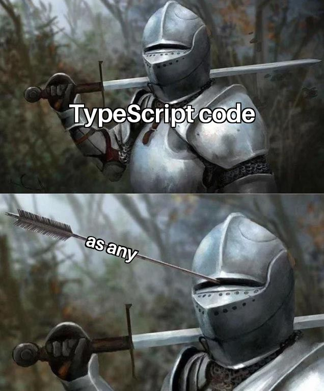
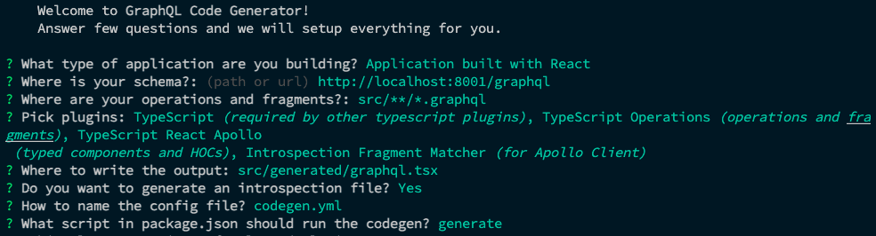
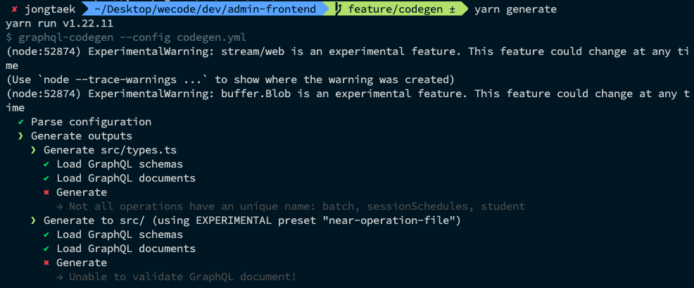
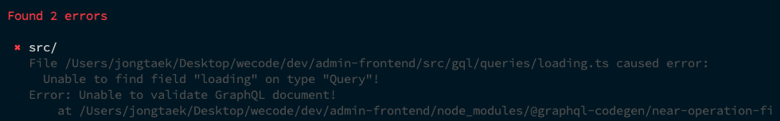
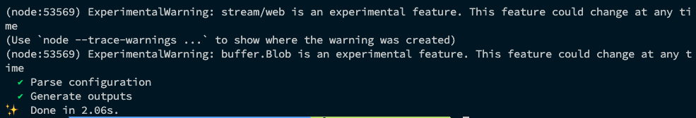
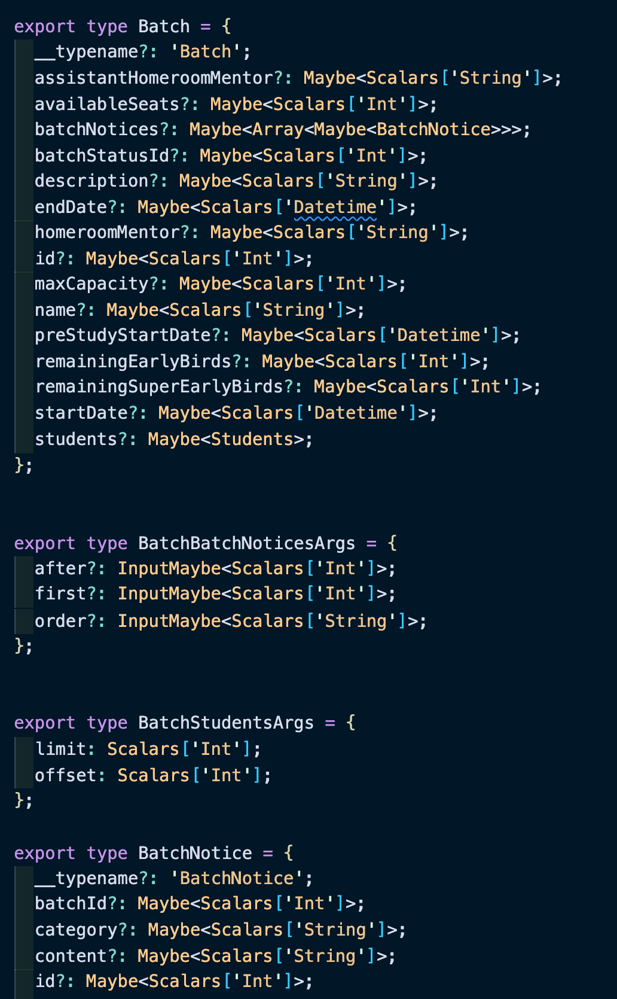

# 1) Motivation

## 1-1) 타입스크립트를 사용하는 이유

<div align="center"></div>

우리가 타입스크립트를 사용하는 것은 **런타임이 아닌 컴파일 타임에 정적 분석을 하여 보다 많은 타입 관련 에러들을 미리 찾아내어 안전한 서비스를 작성하기 위함**입니다.

VSCode 등의 IDE가 타입 추론을 기반으로 자동 완성 등의 편의 기능을 제공하거나, 타입 정의 자체가 일종의 문서화 기능을 하여 개발 생산성을 올려주는 것 또한 타입스크립트를 사용하는 이유 중 하나겠죠.

타입스크립트의 이러한 이점을 극대화 시키기 위해서는 최대한 많은 부분을 타입 시스템 내부로 편입시켜야 하고, 단순히 타입을 부여하는 것이 아니라 보다 엄격하게 사용할 필요가 있습니다.

이러한 엄격한 타입 시스템은 어떻게 유지할 수 있을까요? 일반적으로는 다음과 같은 방법이 있습니다.

- **직접 작성하는 로직**: 개발자 개인이 타입스크립트를 잘 이해하여 사용
- **외부 라이브러리**: Definitely Types(ex. `@types/`)에 등록된 타입 정보들이나, 라이브러리 자체에 내장되어 있는 타입들
- **외부 API**: 🤔 ???

## 1-2) 외부 API에서 호출해오는 데이터의 타입은 어떻게 관리해야 할까?

백엔드 API 호출을 통해 외부에서 가져오는 데이터의 경우는 어떤가요?

일반적인 경로로는 알 수 있는 방법이 없습니다. 그래서 백엔드에서 문서화 해준 API Docs를 보고 `type`과 `interface`를 손수 작성하고 유지해야 합니다.

다행히도 위코드 사내 API는 GraphQL로 구성되어 있기 때문에 GraphQL playground가 이러한 소통의 불편함을 상당 부분 상쇄해주고 있습니다.

하지만 여전히 손수 타입스크립트 타입을 타이핑 해줘야 한다는 사실에는 변함이 없습니다. 여러모로 아쉬움이 많이 남습니다. 타입을 직접 작성해주지 않는다면 API 호출을 통해 가져오는 데이터들은 전부 `any` 타입으로 추론될겁니다. 타입스크립트를 쓰는 이유가 상당 부분 반감됩니다.

<div align="center"></div>

분명 백엔드 API 단에서 schema 파일도 작성을 하고 있고, playground에서 type도 눈으로 확인할 수 있는데, 정말로 타입스크립트 사용하기 위해서 이런 내용들을 손으로 옮겨적는게 최선일까요?

초기에 조금만 고생하면 이후에는 덜하니까 괜찮을 것 같기도 하지만, 타입을 다 옮겨 적은 후 DB가 변경되어 컬럼명이 변한다면 어떨까요? 어떤 부분이 변했는지 보고, 연관된 타입 정보들을 고치고, 로직을 한번 더 수정해야 할겁니다.

후... 끝이 없네요. 좀 더 개발자다운 방법을 찾아보죠. 🧑🏻‍💻

## 1-3) graphql-code-generator

`graphql-code-generator`를 사용하면 이러한 어려움을 생각보다 간단히 해결할 수 있습니다.

핵심적인 컨셉은 다음과 같습니다.

- code generator가 GraphQL Endpoint에 접속하여 서버 측 스키마를 다운로드 받는다.

- 해당 스키마를 기반으로 타입스크립트 타입 코드를 자동으로 생성해준다.

- 자동으로 생성된 타입을 사용하여 실제 코드에 타입을 입힌다.

위와 같은 방식을 사용하면, 위에서 언급했던 서버와 클라이언트 간 타입 중복 타이핑으로 인한 문제점들을 깔끔하게 해소할 수 있습니다.

graphql-code-generator가 주는 생산성의 변화에 비하여 컨셉만 이해한다면 적용 방법은 생각보다 까다롭지 않습니다. (물론 처음 찾아볼 때는 어려워서 여기저기 물어보고 다녔지만 ㅎㅎ... thanks to GraphQL Korea 🙏)

<br>

# 2) How to Apply

## 2-1) Installation

기본적으로 설치해야 할 라이브러리는 다음과 같습니다. `graphql` 을 dependency로, `@graphql-codegen/cli` 를 dev-dependency로 설치합니다.

```bash
yarn add graphql
yarn add -D @graphql-codegen/cli
```

추가로 우리가 사용할 설정에 맞는 preset도 다운로드 받아줍니다.

```bash
## 생성된 Operation 코드를 합치지 않고 원본 소스코드 경로에 그대로 생성해주는 설정 Preset
yarn add @graphql-codegen/near-operation-file-preset
```

설치한 cli를 실행해 프로젝트를 초기화 해줍니다. 상황에 맞게 적절한 옵션을 선택해줍니다.

`Where is your schema` 단계에서는 기준 삼을 할 스키마가 반영되어 있는 API 주소를 적어주면 됩니다. 예제에서는 제 로컬 internal-api 서버를 기준으로 하겠습니다.

```bash
yarn graphql-codegen init
```

<div align="center"></div>

컴포넌트(view)와 데이터 의존성(query) 간의 Co-location(응집도를 위해 목적이 유사한 데이터들을 같은 위치에 놓는 것)을 위해 위에서 설치해준 `near-operation-file-preset`을 `codegen.yml` 파일에 적용해줍니다.

Co-location에 관해서는 그 필요성과 의미에 대해 잘 설명해 놓은 발표 영상을 [링크](https://www.youtube.com/watch?v=YP7d9ae_VzI) 걸어두는 것으로 설명을 대신 하겠습니다. 핵심은 컴포넌트의 데이터 의존성을 명확히 표현하기 위함입니다.

```yaml
overwrite: true
schema: "http://localhost:8001/graphql"
documents:
  - "src/**/*.{ts,graphql}"
  - "!src/**/*.generated.ts"
generates:
  src/types.ts:
    - typescript
  src/:
    preset: near-operation-file
    presetConfig:
      extension: .generated.ts
      baseTypesPath: baseTypes.ts
    plugins:
      - typescript-operations
      - typescript-react-apollo
```

## 2-2) Run Script

최소한의 세팅은 다 되었으니 이제 `yarn generate` 를 입력해 스크립트를 실행해보겠습니다. 이 명령어는 아까 cli 초기화 할 때 정의해줬습니다.

근데 에러가 발생했네요?

살펴보니 `batch`, `sessionSchedules`, `student` 라는 쿼리 이름이 중복되나보군요. 애초에 Apollo에서 쿼리 이름을 기반으로 캐싱을 하기 때문에 쿼리 이름은 겹치면 안됩니다. 쿼리 이름끼리 겹치지 않도록 적절히 수정해주고 다시 시도해보겠습니다.

<div align="center"></div>

이름이 겹치는 문제 외에도 스키마에 등록되어 있지 않은 쿼리가 클라이언트 측에 정의 되어 있으면 안되고, 로컬 state 전용 resolver의 경우에도 문제가 발생합니다.

후자의 경우 별도로 해결하는 방안이 있으니 뒤에서 다시 다뤄보도록 하겠습니다.

```tsx
import { gql } from "@apollo/client";

// 문제가 발생한 Local State
export const GET_LOADING_STATE = gql`
  query getLoadingState {
    loading @client
  }
`;
```

<div align="center"></div>

문제가 없었으면 다음과 같이 코드 생성에 성공하는 메시지가 출력됩니다! 와우! 👏

<div align="center"></div>

## 2-3) Take a look 👀

이제 생성된 파일을 천천히 살펴보도록 하겠습니다.

앞서 `near-operation-file preset`을 적용했기 때문에 파일은 operation 파일(query, mutation, subscription, fragment 등)과 같은 경로에 생성되었을 겁니다. 그리고 yml 파일에서 자동 생성된 파일의 이름은 `*.generated.ts` 규칙을 따르도록 했기 때문에 그렇게 생성되었을 거고요.

우선 `gql/baseTypes.ts` 에 생성해둔 파일을 살펴보겠습니다.

제 테스트 레포지토리 코드 기준 약 1200줄 정도의 코드가 생성되었네요. 내용을 살펴보니 Schema가 가지고 있는 모든 타입 정보들입니다. 만약 직접 Schema에서 추출된 타입을 기반으로 타입을 작성해야 한다면 이곳에 있는 정보를 사용하면 될 것 같습니다.

그 다음은 각 컴포넌트 옆에 생성된 `*.generated.ts` 를 살펴보겠습니다.

이 파일은 각 operation에 대한 정보를 담고 있습니다. opeartion, operation에 전달되어야 하는 인자, operation에서 정의된 fragment 등에 대한 타입 정보 등입니다.

심지어 `typescript-react-apollo preset` 을 사용했기 때문에 각 operation 별로 data fetching에 필요한 custom hook을 자동으로 생성해주고, 주석까지 생성해줍니다. 아래 스크린샷 처럼요. 멋지죠? 👀

<div align="center"></div>

<br>

# 3) Our Best Practice

## 3-1) Folder Structure

기존 프로젝트에서는 `src/gql/queries`, `src/gql/mutations` 폴더에서 쿼리와 뮤테이션을 관리하고 있었습니다. 하지만 앞서 설명드렸듯이 Co-location, Fragment로 얻을 수 있는 효과를 극대화 하기 위해 컴포넌트와 operation이 함께 위치하는 형태로 관리하는게 좋겠습니다.

```tsx
src/
├── baseTypes.tsx
├── components/
├──── Todo/
├────── Todo.tsx
├────── Todo.style.tsx // or Todo.scss
├────── Todo.generated.tsx
```

그러면 아래와 같은 형태로 사용하게 됩니다. 여기서 `useTodoList` , `TodoItemFieldsFragment` 는 앞서 설명드린 것 처럼 자동 생성된 파일입니다.

```tsx
// TodoList.tsx
import React from "react";
import { useTodoList } from "./TodoList.generated.ts";
import { TodoItem } from "./TodoItem";

// 컴포넌트의 시각적 구성 요소를 표현
export const TodoList: React.FC = () => {
  const { data, loading, error } = useTodoList(); // useQuery 등을 직접 사용하지 않음

  return (
    <>
      {data.todos.map((todo) => (
        <TodoItem todo={todo} />
      ))}
    </>
  );
};

// 데이터 의존성을 표현
const GET_TODO_LIST = gql`
  query todoList {
    todos {
      ...TodoItemFields
      ...TodoDetailsFields
    }
  }
  fragment TodoItemFields on TodoItem {
    ...blabla
  }
  fragment TodoDetailsFields on TodoDetail {
    ...blabla
  }
`;
```

```tsx
// TodoItem.tsx
import React from "react";
import { TodoItemFieldsFragment } from "./TodoList.generated.ts";

// 자동 생성된 Fragment Type을 사용해 props의 타입 정보를 정의하고 있음
export const TodoItem: React.FC = (todo: TodoItemFieldsFragment) => {
  return <div>{todo.title}</div>;
};
```

## 3-2) Fragments

그런데 위 예제 코드에서 `TodoItemFieldsFragment` 가 어디서 튀어나왔는지 궁금하진 않으신가요?

GrapqhQL을 처음 써보면서 "GraphQL을 제대로 쓰지 못하고 있는 것 같다"는 이야기를 입버릇처럼 했었습니다. 그 이유 중 하나가 바로 Fragments 입니다. 간단히 설명하자면, GraphQL로 데이터를 요청할 때 쿼리 내부적으로도 의미 단위로 끊어 쓸 수 있도록 해주는 기능입니다.

지금까지는 fragment 없이 쿼리 하나를 통째로 사용하다 보니 스키마에 갖춰진 타입을 사용할 때 굉장히 어색한 상황이 연출됐습니다.

Fragments를 보다 적극적으로 사용하려면 보다 다양한 예시가 있을듯 하지만, 이 지면에서는 codegen 관련한 내용만 다뤄보도록 하겠습니다. 기본적인 내용은 [Apollo 공식 문서](https://www.apollographql.com/docs/react/data/fragments/)를 통해 살펴봐주세요.

이해를 돕기 위해 쿼리 하나를 같이 살펴보겠습니다. 아래 쿼리 형태대로 API를 호출하고, 받아온 데이터를 기반으로 컴포넌트를 그리는 상황을 생각해보겠습니다.

```tsx
export const QUERY_EXAMPLE = gql`
  query fooBarBaz($userId: Int!, $weeks: [Int!]!) {
    sayHello {
      name
      whatsYourName(userId: $userId, weeks: $weeks) {
        name
        doingSomething {
          id
          title
          description
        }
      }
    }
  }
`;
```

만약 `<FooBarBaz />` , `<SayHello />` , `<WhatsYourName />` , `<DoingSomething />` 네 단계 깊이의 컴포넌트가 있다고 가정해보겠습니다.

최상위 컴포넌트인 `FooBarBaz` 컴포넌트에서 쿼리를 호출하고 나머지 세 단계에서 필요한 데이터를 props로 넘겨주게 될 겁니다. 당연히 그에 필요한 타입 코드를 작성해줘야 합니다. 그 다음 `SayHello`에서 필요한 데이터를 소비하고, 나머지를 `WhatsYourName` 에 넘겨주고 다시...

뭔가 이상적인 상황은 아니군요. 이제 codegen과 함께 fragment를 사용해보겠습니다. 우선 query를 다음과 같이 리팩터링 해보겠습니다. 그러면 커다란 쿼리의 각 부분이 fragment로 분할됩니다.

```tsx
export const QUERY_EXAMPLE = gql`
  query fooBarBaz($userId: Int!, $weeks: [Int!]!) {
    sayHello {
      ...sayHello
    }
  }
  fragment sayHello on SayHello {
    name
    whatsYourName(userId: $userId, weeks: $weeks) {
      ...whatsYourName
    }
  }
  fragment whatsYourName on WhatsYourName {
    name
    doingSomething {
      ...doingSomething
    }
  }
  fragment doingSomething on DoingSomething {
    id
    title
    description
  }
`;
```

이 상태로 codegen을 돌려보면 fragment를 기반으로 쿼리와 타입이 자동으로 생성됩니다.

컴포넌트에서 필요한 타입 조각을 얻었으므로 수동으로 각 props의 타입을 작성해주지 않아도 됩니다. 데이터 요청에 대하여 컴포넌트에 필요한 데이터 의존성이 보다 안전하게 유지되는 것이죠.

<br>

# 4) FAQ

**Q1. generated 된 파일 크기도 크고 갯수도 많은데 commit 하는게 좋을까요?**

> 네! 추가로 CI에서 codegen을 돌리고 만약에 generation 된 파일에 변경사항이 생긴 경우 실패로 처리하면 좋아요 ㅎㅎ (따라서 의도하지 않은 변경사항이 생긴경우 로컬에서 codegen 돌리고 재커밋 해야함)

<br>

**Q2. 지금은 연결하는 API가 하나지만, 여러 API를 연결해야 하는 경우라면 어떻게 사용해야 하나요?**

> 여러 개의 Schema를 하나로 합쳐주는 Schema Stitching이라는 솔루션이 있습니다. 제대로 조사해보지는 않았지만 당근마켓은 잘 사용 중이라고 하네요.

<br>

**Q3. 왜 쓰자는지는 알겠는데 제시해주신 폴더 구조 같은 Practice가 별로에요.**

> 저도 완벽하다고 생각해서 정답을 말씀드리는건 아니에요. 제가 그간 조사하고 고민해본 바 저 형태가 좋다고 생각했을 뿐입니다. 아이디어가 있다면 언제든지 의견 나누고 더 좋은 방향으로 적용해볼 수 있기를 바라고 있습니다!

<br>

**Q4. 이것만 알면 graphql-code-generator는 끝인가요?**

> 어림도 없지! 이 외에도 정적 분석을 기반으로 한 많은 작업을 할 수 있다고 들었습니다. 하지만 저도 지금은 아는 게 여기까지라 새로 알게 되는 부분이 있으면 공유 부탁드립니다 🙇‍♂️

<br>

# 5) References

- [Installing Codegen](https://www.graphql-code-generator.com/docs/getting-started/installation) (GraphQL Code Generator)

- [near-operation-file-preset](https://www.graphql-code-generator.com/plugins/near-operation-file-preset) (GraphQL Code Generator)

- [Best Practices for integrating GraphQL Code Generator in your frontend applications - The Guild Blog](https://the-guild.dev/blog/graphql-codegen-best-practices) (The Guild)

- [Using Apollo Client to Manage GraphQL Data in our Next.js Application](https://www.dolthub.com/blog/2021-04-26-apollo-client-with-graphql-and-typescript/) (dolthub)

- Fragments (Apollo Client): [https://www.apollographql.com/docs/react/data/fragments/](https://www.apollographql.com/docs/react/data/fragments/)

- GraphQL with TypeScript done right: [https://the-guild.dev/blog/graphql-with-typescript-done-right](https://the-guild.dev/blog/graphql-with-typescript-done-right)

- codegen.yml: [https://apolloelements.dev/guides/getting-started/codegen/](https://apolloelements.dev/guides/getting-started/codegen/)
