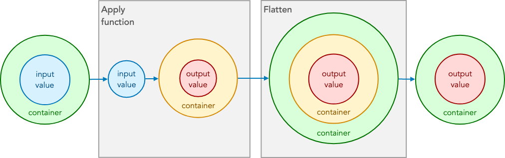
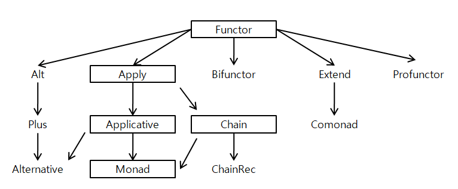
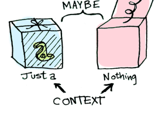

# 1. 함수형 프로그래밍이란?


## 1) 정의를 발췌하는 것부터 시작해보자

> 💡 “함수형 프로그래밍은 성공적인 프로그래밍을 위해 부수 효과를 최대한 멀리하고 조합성을 강조하는 프로그래밍 패러다임이다. 함수형 프로그래밍이 부수 효과를 최대한 멀리하는 이유는 다음 두 가지를 위해서다. 하나는 오류를 줄이기 위해서고, 또 하나는 조합성 혹은 모듈화 수준을 높이기 위해서다. (...) 높은 모듈화 수준은 생산성을 높이고, 오류 없는 함수들의 조합은 프로그래밍 전체의 안정성을 높여 준다.”
>
> <함수형 자바스크립트 프로그래밍>, 유인동

> 💡 “진짜 목표는 애플리케이션의 부수효과(side effect)를 방지하고 상태 변이(mutation of state)를 감소시키기 위해 데이터의 제어 흐름과 연산을 추상(abstract)하는 것입니다.”
>
> <함수형 자바스크립트>, 루이스 아텐시오

> 💡 “함수형 프로그래밍은 순수 함수와 선언형 프로그래밍의 토대 위에 함수 조합(function composition)과 모나드 조합(monadic composition)으로 코드를 설계하고 구현하는 기법입니다.”
>
> <Do it 타입스크립트 프로그래밍>, 전예홍

어지러운 단어들이 나열되는 가운데 `조합`, `순수 함수`, `부수효과`, `추상` 등의 단어가 눈에 띈다.

## 2) 무엇인지를 설명하기 보다 뭐가 좋은지를 설명하는 편이 좋다

여러 자료들을 찾아보면 함수형 프로그래밍의 많은 장점 중 빈번하게 언급되는 것들을 꼽아 나름의 정의를 내려보면 다음과 같다.

> 💡 **작지만 조합성이 좋은 함수들을 활용하여 선언적이고 안전한 프로그래밍을 할 수 있다**

코드를 작성하고 유지 보수하는 입장에서 프로그램의 동작을 예측하기 쉬워지고, 함수의 실행 결과 또한 보다 안전해진다는 뜻이다.

- `순수 함수` - 함수의 동작이 함수 인자에만 의존하므로 동일한 입력에는 항상 같은 값을 반환함. 따라서 함수 실행에 따른 부수 효과(side effect)가 없음. 무상태성(stateless)을 지향하여 외부 변수에 접근 후 이를 변화시키는 등의 동작이 없음.

  ```tsx
  const sum = (a, b) => a + b;

  let result = 0;
  const sumWithSideEffect = (a, b) => {
    result += a;
    result += b;
    return result;
  };
  ```

- `불변성` - 데이터의 변경이 필요한 경우 원본 데이터 구조를 변경하지 않고 복사본을 만들어서 사용함.

  ```tsx
  const obj = { count: 1 };

  // { ...obj, count: obj.count + 1 } // immutable
  // obj.count += 1 // mutable
  ```

- `선언형 함수` - 명령형 프로그램이 ‘어떻게(How)’에 집중하는 반면, 선언형 프로그래밍은 ‘무엇을(What)’에 집중하는 패러다임. 이미 다들 React에서 잘 사용하고 있는 패러다임.

  ```jsx
  // Imperative (How)
  const newArr = [];
  for (let i = 0; i < arr.length; i++) {
    if (arr[i].length !== 0) {
      newArr.push(arr[i].charAt(0).toUpperCase() + arr[i].substring(1));
    }
  }
  ```

  ```jsx
  // Declarative (What)
  function convert(s) {
    return s.charAt(0).toUpperCase() + s.substring(1);
  }
  const newArr2 = arr.filter((v) => v.length !== 0).map((v) => convert(v));
  ```

뭐가 좋은지는 알겠는데, 아직 이것만으로는 그건 여전히 주장일 뿐이다. 어떻게 그러한 장점들이 프로그래밍적으로 구현될 수 있는지를 살펴보도록 하자.

## 3) 실제 상황을 통해 접근해보기

함수형 프로그래밍은 현실적인 문제에 대한 분할 정복 과정에서 함수를 보다 적극적으로 사용하려는 패러다임이다. 함수 합성, 그리고 함수가 합성되는 연결부에서의 자료 구조(모나드)를 정의하는 것에 많은 공을 들인다.

함수 합성은 흔하게 만날 수 있는 패턴이다. 쉽게 말하자면 그냥 하나의 함수를 실행한 결과를 다른 함수에 전달하면 함수를 합성한게 된다.

어찌 보면 간단한 함수 합성이 자주 사용되고 프로그래밍적으로 의미를 갖는 이유가 있다. 함수는 하나의 특정한 동작이고 우리가 최종적으로 만들 프로그램은 여러 동작을 쌓아올린 결과물이 된다. 즉, 어려운 문제를 여러 단계로 나누어 푸는 `분할 정복` 과 같은 맥락이다.

자바스크립트로 표현한 함수 합성은 대략 다음과 같다.

```tsx
const compose = (fn1, fn2) => (x) => fn1(fn2(x));
```

여기 값을 더하고 빼는 두 가지 함수가 있다. 두 함수를 실제로 합성해보자.

```tsx
const plus = (a) => a + 1;
const minus = (a) => a - 1;

plus(minus(1)); // 1
```

전혀 어렵지 않다. 하지만 두 함수 중 어느 하나에라도 인자를 넣지 않고 실행하게 되면 결과는 `NaN` 가 나오고, 프로그램은 깨지게 된다.

우리가 실제 로직을 작성할 때 또한 다음과 같은 지옥의 `널(null) 체크` 를 하게 되는 일이 생각보다 빈번하다. 아래 예시는 객체를 타고 들어가 값을 꺼내기 위해 if문을 사용해 개발자가 한땀 한땀 널 체크를 해주고 있는 상황이다. if문 바깥 스코프의 변수를 읽어오느라 코드를 읽는 시선도 오락가락하기 때문에 코드의 흐름이 한눈에 들어오지 않는다.

때문에 함수의 핵심적인 동작과 그렇지 않은 부가적인 부분이 잘 분리되어 있지 않은 느낌을 받게 되고, 유지보수하기 좋은 코드가 아니라는 결론에 다다르게 된다.

```tsx
function getCountry(student) {
  let school = student.school();

  if (school !== null) {
    let address = school.address();

    if (address !== null) {
      return address.country();
    }
  }
  return "존재하지 않는 국가입니다!";
}
```


하지만 함수형 프로그래밍에서는 위와 같은 성가신 널 체크나, 심지어 try - catch 같은 별도의 에러처리도 하지 않는다. 일단 위 예제를 함수형으로 바꿔 쓸 경우 아래와 같이 바꿔쓸 수 있다.

```tsx
const find = (db, id) => // nullable(null, undefined)을 던질 수도 있는 로직
const safeFindStudent = R.curry((db, id) => Maybe.fromNullable(find(db, id)))

// R.prop('x')({ x: 100 }); // 100, 객체에서 특정 키 값에 해당하는 value를 뽑는 연산
// 세 속성 중 하나라도 결과가 Nothing 모나드라면 이후 연산은 전부 건너 뜀
const getCountry = (student) => student
	.map(R.prop("school"))
	.map(R.prop("address"))
	.map(R.prop("country"))
	.getOrElse("존재하지 않는 국가입니다!") // Maybe.getOrElse()

// R.compose - 인자로 받은 함수를 뒤에서 앞으로 실행해나감
const country = R.compose(
	getCountry,
	safeFindStudent
);
```

이런 일이 어떻게 가능한걸까?

이 비밀을 풀기 위해 예제 코드에서 확인할 수 있는 `Maybe`에 주목할 필요가 있다. Maybe는 `Just`와 `Nothing` 을 두 하위형으로 갖고 있는 `타입 클래스(type class)` 이다. 타입 클래스는 함수를 만들 때 특별한 타입으로 제약하지 않아도 된다는 점만 언급해두겠다(ex. `Monad<T>`).

Maybe가 무엇인지보다 이것이 갖는 의미에 대해 좀 더 곱씹어 보자. 이미 우리가 잘 알고 있는 지식에 빗대어보자면, 마치 Promise가 비동기 상황을 값으로 바꾸어 다룰 수 있도록 `구상화(reify)` 시킨 것과 유사한 컨셉이라고 볼 수 있다. 이러한 관점에서 보자면 Maybe는 에러 상황을 널 체크 로직을 구상화 한 것이다. 스칼라에서는 Maybe를 Optional이라고 부른다. 뜻만 보자면 이쪽이 좀 더 와닿는 느낌이다.

`Either`라는 것도 있다. Either는 절대로 동시에 발생하지 않는 두 값 a(Left - 에러 메시지 또는 예외 객체를 담음), b(Right - 성공한 값을 담음)를 논리적으로 구분한 자료구조다. 즉, 에러 상황을 값으로 구상화 한 케이스라고 할 수 있다.

# 2. 모나드(Monad)


## 1) 값을 컨테이너에 싸서 드셔보세요


Umm~ Yummy~~

Maybe와 Either는 잡시 미뤄두고 앞에서 지나가듯 언급했던 Promise를 다시 살펴보자. Promise는 앞서 말한 것처럼 `비동기 상황을 값으로 변환` 해주는 도구다. 콜백 함수에 비해 예외처리나 결과 값을 연쇄적으로 처리할 때 큰 강점을 갖다.

새삼스레 살펴보자면 Promise는 `.then()`, `.catch()`, `.finally()` 메서드를 갖는 자바스크립트 클래스다.

```tsx
const asyncThing = new Promise((res, rej) => {
	// ...
})
	.then(...)
	.catch(...)
	.finally(...)
```

Promise는 비동기 요청 성공 시 then으로, 실패 시 catch로 분기시키는 등 값을 안전하게 다룰 수 있도록 해준다. Promise라는 컨테이너로 비동기 상황을 감싼 덕이라고 할 수 있다.

앞서 함수 합성을 소개하며 언급했던 간단한 예시도 다시 한번 살펴보자. 배열로 감싸지 않고 값을 그냥 다뤘을 때는 값의 유무에 따라 함수가 예외를 발생시켰다.

배열로 한번 감싸니 값이 없을 때는 함수를 실행하지 않는다. 값을 배열이라는 자료 구조로 감싸면서 함수 합성을 보다 안전하게 할 수 있게 된 것이다.

```tsx
const plus = (a) => a + 1
const minus = (a) => a - 1

plus(minus(1)) // 1
plus(minus()) // NaN

// Array가 출동한다면?
[1].map(plus).map(minus).forEach(res => console.log(res))
[].map(plus).minus(minus).forEach(res => console.log(res))
```

햄을 김치에 싸서 먹으면 맛있듯이, 값을 적절한 자료구조로 감싸서 다루면 더 좋은 결과를 얻을 수 있다. 바로 이러한 접근 방식이 모나드가 함수형 프로그래밍에서 하는 역할이다.

## 2) 드디어 모나드...

`모나드(Monad)`를 설명하기 위한 서문이 길었다. 이렇게 앞을 길게 뺀 이유가 있다. 모나드를 구글에 검색하다보면 여러가지 우스개 소리를 만나게 된다.


> 💡 [이건 나한테 일주일에 한번 꼴로 일어나는 일이다]
>
> 나 : 와 씨 나 드디어 모나드(~~양자역학~~)가 뭔지 이해한거 같음!
>
> 친구 : 진짜?
>
> 나 : 아 잠깐만, 까먹음...ㅎㅎ;;

이런 농담이라든지, 아니면 이런 이야기들이 돌아다니기 때문이다.

> 💡 어떤 개념을 비로소 깨닫는 순간을 ‘Aha moment’라 부르기도 하는데, 더글라스 크록포드의 말을 인용하자면, 모나드를 이해하는 Aha moment를 겪는 순간, 다른 사람에게 모나드를 설명할 수 없게 되는 [저주](https://stackoverflow.com/questions/19544794/what-is-crockfords-law)에 걸린다고 한다.
> ([https://lqez.dev/blog/the-curse-of-understanding.html](https://lqez.dev/blog/the-curse-of-understanding.html))

그래서 겁먹지 말자고 나름대로 틈틈이 빌드업을 깔아뒀다. 핵심이 중요하므로, 다시 우리가 뭘 알고 싶었는지를 생각하며 함수형 프로그래밍을 한 문장으로 정리해 되짚어보자.

> 💡 함수형 프로그래밍은 현실적인 문제에 대한 분할 정복 과정에서 함수를 보다 적극적으로 사용하려는 패러다임이다. 함수 합성, 그리고 함수가 합성되는 연결부에서의 자료 구조(모나드)를 정의하는 것에 많은 공을 들인다.

함수형 프로그래밍은 함수 합성과, 그 합성 사이에 존재하는 연결부를 매끄럽게 이어주는 적절한 자료 구조로 변환시켜주는 작업을 중심에 두고 성립하는 패러다임이라고 할 수 있다. 단순히 배열 메서드의 체이닝 정도로 이해하면 많이 아쉬운 이유다.

다시 한번 예시 코드를 통해 접근해보자. 핵심은 에러가 날지도 모르는 어떠한 값을 래퍼 객체로 감싸 격리시킨다는 점이다.

```tsx
class Wrapper {
  constructor(value) {
    this._value = value;
  }

  map(f) {
    return new Wrapper(f(this._value));
  }
}

const wrap = (v) => new Wrapper(v);

const wrappedValue = wrap("hello, fp!");

// R.identity - (v) => v // 항등 함수, 캡슐화한 자료형에서 값을 꺼낼 때 사용
wrappedValue.map(R.identity); // "hello, fp!"
wrappedValue.map(R.toUpper); // "HELLO, FP!"
```

이렇게 하면 컨테이너 안에 넣어 값을 얻고 싶은 코드는 무조건 `map` 을 통해서만 접근할 수 있게 된다. 다만 함수를 여럿 체이닝하는 상황에서 이 값이 null이나 undefined라면 곳곳에서 런타임 에러로 로직이 터져나가고, 함수를 합성하기 매우 곤란할 것이다.

이제 그간 우리가 처리해줬던 널 체크를 `Wrapper` 클래스에 위임하여 대신 처리하도록 하고, 핵심적인 로직들에만 손대기 위한 작업으로 넘어가보도록 하자.

참고로 함수형 프로그래밍에서는 이렇게 map을 구현하고 있는 클래스를 `펑터(functor, 함수자)` 라고 부른다. 펑터는 값을 래퍼 안으로 `승급(lifting, 값을 컨테이너로 감쌈)`한 다음 함수를 적용하고 다시 래퍼에 넣을 목적을 염두에 둔 함수 매핑이 가능한 자료구조다. `Array.prototype.map()` 을 떠올려도 좋다.

## 3) 열고 닫고, 열고 닫고, 열고 닫고...

위에서 구현했던 Wrapper는 최초에 값이 입력된 이후 map으로 전달된 함수를 통해서만 값에 접근할 수 있는데, 그 결과값을 다시 Wrapper로 감싸서 리턴하고 있음을 확인할 수 있다.

이렇게 자기 자신으로 다시 한번 더 감싸서 리턴하는 이유는, 앞서 이야기 했던 함수 합성의 연결부에서 타입이 달라져서 체인이 끊기는 사태를 방지하기 위함이다.

계속 언급했던 `Array.prototype.map()` 와 `Promise` 뿐만 아니라 심지어 DOM을 컨테이너로 감싸 체이닝한다는 점에서 제이쿼리(`$`) 까지도 체이닝 패턴을 구현하고 있고, 이는 이들 모두 자기 자신을 리턴하는, 형식을 보존하는 함수자임을 나타낸다. 즉, 우리는 펑터를 계속해서 써오고 있었던 셈이다.



[https://www.cocoawithlove.com/blog/an-aside-about-flatmap-and-monads.html](https://www.cocoawithlove.com/blog/an-aside-about-flatmap-and-monads.html)

이제 펑터에 대해 충분히 뜸을 들이며 감을 잡았으니 모나드까지 나아가보자.

모나드란,

> 💡 모나드는 펑터, 어플라이, 어플리커티브, 체인의 특징을 모두 구현한 타입 클래스다.



판타지 랜드 규격

위 도식은 [판타지 랜드(Fantasy Land) 규격](https://github.com/fantasyland/fantasy-land)에서 발췌한 것이며 하스켈(Haskell) 표준 라이브러리 구조를 자바스크립트 방식으로 재구성한 것이다.

- `펑터(Functor, 함수자)` : `map`이라는 인스턴스 메서드를 가지는 클래스. 함수를 포장된 값에 적용한다.

- `어플라이(Apply)` : 펑터이면서 `ap`라는 인스턴스 메서드를 가지는 클래스

- `어플리커티브(Applicative)` : 어플라이이면서 `of`라는 클래스 메서드를 가지는 클래스. 포장된 함수를 포장된 값에 적용한다.

- `체인(Chain)` : 어플리커티브이면서 chain이라는 메서드를 가지는 클래스

- `모나드(Monad)` : 모나드는 펑터, 어플라이, 어플리커티브, 체인의 특징을 모두 구현한 타입 클래스. 포장된 값을 반환하는 함수에 포장된 값을 적용한다.

그리고, 모나드는 다음 인터페이스를 준수해야 한다.

- `형식 생성자(type constructor)` : 모나드형(모나드 인터페이스를 실제로 구현한 형식)을 생성

- `단위 함수(unit function)` : 어떤 형식의 값을 모나드에 삽입함. `of` 로 명명.

- `바인드 함수(bind function)` : 연산을 서로 체이닝 함. 함수자의 fmap에 해당, 편의상 map으로 줄여 부름.

- `조인 연산(join operation)` : 모나드 자료구조의 계층을 눌러 폄. 모나드 반환 함수를 다중 합성할 때 중요함.

하지만 여기서 중요한 건, 모나드가 단순히 함수자의 클래스에 몇 가지 메서드를 추가로 구현한 형태에 지나지 않는다는 점이다. 그 말을 증명하기 위해 아까 만들었던 Wrapper 클래스를 모나드로 만들어보자.

```tsx
class Wrapper {
  // 형식 생성자
  constructor(value) {
    this._value = value;
  }

  static of(a) {
    // 단위 함수
    return new Wrapper(a);
  }

  map(f) {
    // 바인드 함수 (함수자)
    return Wrapper.of(f(this._value));
  }

  join() {
    // 조인 연산 - 중첩된 계층을 눌러 폄
    if (!(this._value instanceof Wrapper)) {
      return this;
    }
    return this._value.join();
  }

  get() {
    return this._value;
  }

  toString() {
    // 자료구조를 나타낸 문자열을 반환
    return `Wrapper (${this._value})`;
  }
}
```

그리고 다음과 같이 사용한다.

```tsx
// Wrapper("HELLO, MONADS!")
Wrapper.of("Hello, Monads!").map(R.toUpper).map(R.indentity);
```

이제 모나드를 직접 구현한 코드를 살펴보며 모나드의 실체에 접근해볼 차례다.

# 3. 널 체크를 위한 Maybe

## 1) Maybe 모나드 구현



[https://lazyswamp.tistory.com/entry/functorsapplicativesandmonadsinpictures](https://lazyswamp.tistory.com/entry/functorsapplicativesandmonadsinpictures)

Maybe 모나드는 다음 하위 타입 클래스들로 구성된다.

- `Just(value)` : 존재하는 값을 감싼 컨테이너
- `Nothing()` : 값이 없는 컨테이너, 또는 추가 정보 없이 실패한 컨테이너. 이를 사용해 존재하지 않는 값에도 함수를 적용할 수 있음.

실제 Maybe를 구현한 코드를 확인해보자.

```tsx
class Maybe {
  // 컨테이너 형 - 부모 클래스
  static just(a) {
    return new Just(a);
  }

  static nothing() {
    return new Nothing();
  }

  static fromNullable(a) {
    return a !== null ? Maybe.just(a) : Maybe.nothing();
  }

  static of(a) {
    return just(a);
  }

  get isNothing() {
    return false; // Maybe는 Nothing이 아님
  }

  get isJust() {
    return false; // Maybe는 Just가 아님
  }
}
```

몇 가지 눈여겨볼 부분이 있다.

- 단위 함수인 `of` 가 static 메서드로 들어있다. 어떤 값을 Maybe 모나드로 만들기 위해서는 `Maybe.of(a)` 와 같은 방식으로 사용하면 된다.

- 또 다른 static 메서드인 `.fromNullable()` 은 인자를 받아 그것이 null인지 체크하고, 만약 유효한 값이면 `.just(a)` 로 `Just` 모나드를 생성해 리턴하고, null이라면 `Nothing` 을 생성해 리턴한다. 위에서 언급했듯 Just와 Nothing은 Maybe를 상속받은 하위 클래스다.

## 2) Just 모나드 구현

```tsx
class Just extends Maybe {
  // 값이 있는 경우에 해당하는 Maybe 하위형
  constructor(value) {
    super();
    this._value = value;
  }

  get value() {
    return this._value;
  }

  map(f) {
    // Just에 함수를 매핑하고 값을 변환 후, 다시 컨테이너에 Wrapping (Just / Nothing)
    return Maybe.fromNullable(f(this._value));
  }

  getOrElse() {
    return this._value; // 자료 구조 값을 추출
  }

  filter(f) {
    return Maybe.fromNullable(f(this._value) ? this._value : null);
  }

  chain() {
    return f(this.value);
  }
}
```

Promise로 치면 resolve에 해당하는 Just도 살펴보자.

- Just는 Maybe를 상속 받는다.

- `map()` 은 Just가 갖고 있는 값에 인자로 전달 받은 함수를 매핑하여 값에 적용한 다음, 다시 컨테이너(Just / Nothing)에 Wrapping한다.

- Just의 `getOrElse()` 는 갖고 있는 값을 그대로 리턴한다. 아래에서 확인하겠지만 반대로 Nothing의 getOrElse()는 인자로 받은 값을 그대로 리턴한다. 내부에서 가지고 있는 값이 없기 때문이다.

## 3) Nothing 모나드 구현

```tsx
class Nothing extends Maybe {
  map(f) {
    return this;
  }

  get value() {
    throw new TypeError("Nothing의 값은 가져올 수 없습니다.");
  }

  getOrElse(other) {
    return other; // 자료 구조의 값은 무시하고 무조건 인자로 받은 값을 리턴함
  }

  filter(f) {
    return this._value;
  }

  chain(f) {
    return this;
  }
}
```

- Nothing의 value는 존재하지 않으므로 value를 호출했을 때 에러를 던지는 것을 볼 수 있다.

- 위에서 언급한 것처럼 Nothing의 getOrElse는 자료 구조의 값은 무시하고 무조건 인자로 받은 값을 리턴한다.

- map이나 chain을 걸어주었을 때도 아무 일도 하지 않고 자기 자신만을 리턴한다.

## 4) 총 정리!

이제 첫 번째 챕터에서 봤던 의미불명의 예제 코드를 다시 꺼내와서 Maybe의 내부 구현과 함께 확인해보자.

```tsx
const find = (db, id) => // nullable(null, undefined)을 던질 수도 있는 로직
const safeFindStudent = R.curry((db, id) => Maybe.fromNullable(find(db, id)))

// R.prop('x')({ x: 100 }); // 100, 객체에서 특정 키 값에 해당하는 value를 뽑는 연산
// 세 속성 중 하나라도 결과가 Nothing 모나드라면 이후 연산은 전부 건너 뜀
const getCountry = (student) => student
	.map(R.prop("school"))
	.map(R.prop("address"))
	.map(R.prop("country"))
	.getOrElse("존재하지 않는 국가입니다!") // Maybe.getOrElse()

// R.compose - 인자로 받은 함수를 뒤에서 앞으로 실행해나감
const country = R.compose(
	getCountry,
	safeFindStudent
);
```

위 예제에서 `getCountry`의 인자로 들어오는 student는 Maybe이다. 따라서 세 map 연산 중 어느 것이라도 null을 리턴하게 되면 후속 연산은 모두 Nothing이 되고, Nothing의 map은 this를 리턴하므로 아무 일도 일어나지 않는다. 선언적으로 결과를 도출하면서 동시에 널 값까지 허용하는 로직이 되었다!

이외에도 예상하지 못한 에러 등을 대응하기 위해서는 앞서 언급했듯 `Either` 모나드가, 입출력에는 `IO` 모나드가 사용된다. 하지만 모든 모나드를 다 다룰 수 없고, 모나드의 종류도 정말 다양하므로 같이 살펴본 내용들에 대한 이해를 기반으로 조금 더 찾아보면 좋을 것 같다.

참고 도서의 최종 결과물은 아래와 같다.

```tsx
const getOrElse = R.curry((message, container) => container.getOrElse(message));

// 값을 읽어서 학생 정보를 DOM에 출력
const showStudent = R.compose(
  map(append("#student-info")),
  liftIO,
  getOrElse("학생을 찾을 수 없습니다"),
  map(csv),
  map(R.props(["ssn", "firstname", "lastname"])),
  chain(findStudent),
  chain(checkLengthSsn),
  lift(cleanInput)
);
```

# 4. 참고 자료

- 루이스 아텐시오 - 함수형 자바스크립트
- 유인동 - 함수형 자바스크립트 프로그래밍
- 전예홍 - Do it 타입스크립트 프로그래밍
