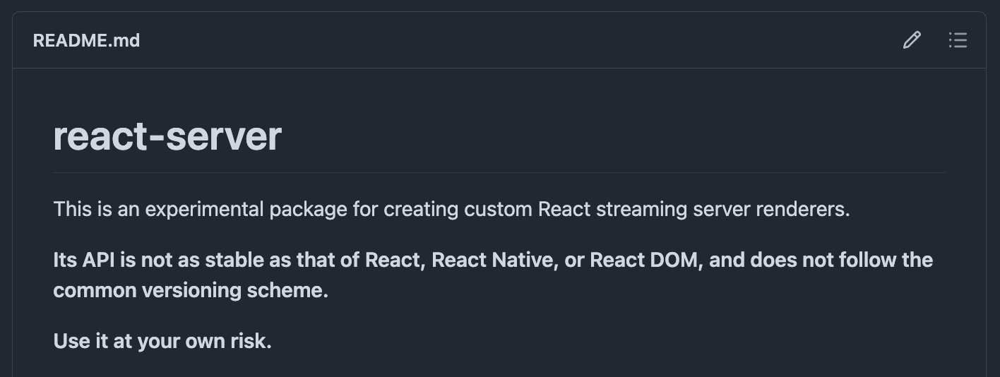
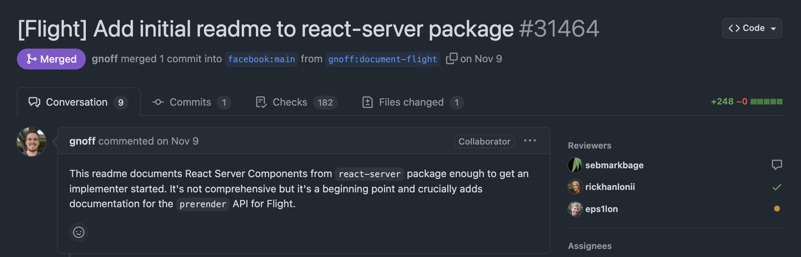
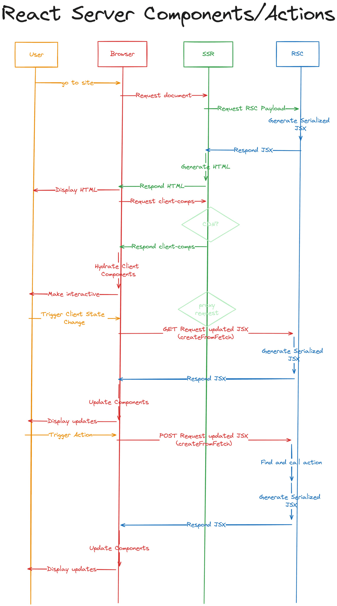

그동안 `RSC(React Server Components)`와 `Streaming SSR`에 대한 기술 포스팅을 해왔다.

- [2023-10-24 "처음부터 RSC가 있었으면 됐잖아?"](https://saengmotmi.netlify.app/react/rsc_and_isomorphic/)

- [2024-01-27 Streaming SSR로 비동기 렌더링 하기](https://saengmotmi.netlify.app/react/streaming_ssr/)

- [2024-02-23 \[A는 B\] 1. RSC란?](https://saengmotmi.netlify.app/react/what-is-rsc/)

- [2024-11-01 React Router v7, Static Prerendering?](https://saengmotmi.netlify.app/react/rrv7-static-prerendering/)

하지만 그간 주변으로부터 들어온 RSC 관련한 질문에 답해주면서도 그랬고, 가장 최근에 작성한 포스팅을 곰곰 되짚어보면서도 이상하게 설명이 막히는 부분이 느껴졌다. 예를 들면 이런 질문들이다.

- RSC와 Streaming SSR을 어떻게 구분해야 하나?

- RSC 없이 Streaming SSR만 사용할 수 있나? 혹은 그 반대도 가능한가?

꼬리에 꼬리를 밟으며 나아가다 보니 그간 RSC 및 Streaming SSR에 대한 이해가 근본적인 오개념 위에 세워져 있었음을 깨달았다.

한동안 수치심에 몸부림 쳤지만 한편으로는 나와 같은 혼란을 겪고 계실 수도 있는 분들을 생각하며 A/S 포스팅을 작성하기로 마음먹었다.


<p align="center">으악! 미안합니다!!!</p>

## 1. react-server가 6년 만에 문서화...!

React 레포지토리의 packages 폴더에 들어가보면 React를 구성하는 다양한 패키지들(ex. react, react-dom, react-reconciler 등)이 있다. 그 중에서도 `react-server`([링크](https://github.com/facebook/react/tree/main/packages/react-server))라는 패키지가 있다. 이 패키지는 React의 서버 측 렌더링에 대한 구현을 담고 있으며 React Server Components와 Streaming SSR을 구현하는 데 사용된다.

RSC와 Streaming SSR은 근 몇년 간 React 생태계의 가장 큰 아젠다였기에 뭔가 적당한 설명이 있겠거니 싶을 수도 있겠지만 설명은 실상 이게 전부였다.



<p align="center">알아서 쓰시오!</p>

사실 아직 확정되지 않은 구현을 문서화 하는 것도 애매하긴 하지만... 적어도 `Fizz`와 `Flight`에 대한 개념을 알고 싶은 개발자들에게는 불편함이었을 것이다. React 레포지토리를 주의 깊게 살펴본 분들은 어느 정도 단어가 눈에 익었을 테지만 어디에도 공식적인 정의가 없는 것은 의문이고 아쉬웠다.

그러다 지난 24년 11월 9일, 이런 PR([링크](https://github.com/facebook/react/pull/31464))이 올라왔다.



> `react-server` is a package implementing various Server Rendering capabilities. The two implementation are codenamed `Fizz` and `Flight`.
>
> _(react-server는 다양한 서버 렌더링 기능을 구현하는 패키지입니다. 두 가지 구현의 코드명은 Fizz와 Flight입니다.)_
>
> `Fizz` is a renderer for Server Side Rendering React. The same code that runs in the client (browser or native) is run on the server to produce an initial view to send to the client before it has to download and run React and all the user code to produce that view on the client.
>
> _(Fizz는 서버 사이드 렌더링 React를 위한 렌더러입니다. 클라이언트(브라우저 또는 네이티브)에서 실행되는 것과 동일한 코드가 서버에서 실행되어 클라이언트에 전송할 초기 뷰를 생성하고, 클라이언트에서 해당 뷰를 생성하기 위한 모든 사용자 코드를 다운로드하고 실행해야 합니다.)_
>
> `Flight` is a renderer for React Server Components. These are components that never run on a client. The output of a React Server Component render can be a React tree that can run on the client or be SSR'd using `Fizz`.
>
> _(Flight는 React 서버 컴포넌트를 위한 렌더러입니다. 클라이언트에서 실행되지 않는 컴포넌트입니다. React 서버 컴포넌트 렌더링의 출력은 클라이언트에서 실행되거나 Fizz를 사용하여 SSR할 수 있는 React 트리가 될 수 있습니다.)_

Fizz와 Flight는 React 내부적으로 Streaming SSR과 RSC 구현체를 구분하기 위한 코드명이다. 잘 아시는 분들은 이미 알고 있었겠지만, 내 입장에서는 레포지토리 어디를 뒤져봐도 이 코드명에 대한 언급이 없었어서 당혹스러웠다. 이제라도 드디어 명확하게 알 수 있게 되어 다행으로 생각하고 있다.

참고로 Fizz에 대한 첫 언급은 2018년에 올라왔던 세바스티안 마크보게의 PR([링크](https://github.com/facebook/react/pull/14144))에서 볼 수 있고 기존에 구현된 `react-stream`을 가져오는 것이었다. 언급되어 있는 레포지토리를 따라가봤더니 예전에 잠깐 살펴본적 있는 [react-dom-stream](https://github.com/aickin/react-dom-stream) 이었다.

## 2. Fizz와 Flight, 개념 세우기

이 두 가지를 어떻게 구분해서 생각하면 좋을까? 현재 RSC 관련 대표적인 구현체는 `Next.js`의 App Router다.

물론 Next.js 이외에도 `Waku`([링크](https://waku.gg/)) 같은 RSC 기반 프레임워크도 있고, 아직 출시되지는 않았지만 `React Router`도 향후 `Single Fetch`([링크](https://remix.run/docs/en/main/guides/single-fetch))를 기반으로 Next.js와는 다른 방식으로 RSC를 지원할 예정이기에 이 구현체들을 비교하다보면 더욱 명확하게 이해할 수 있을 것이다.

하지만 많은 설명 자료들이 가장 대중적인 Next.js를 기준으로 하고 있고, Streaming SSR과 RSC가 결합되어 사용하는 데다 딱히 구분하여 설명하지 않기 때문에(물론 같이 쓰이는게 일반적인 시나리오겠지만) 이 둘을 구분하는 것이 어려웠다.

그래서 굳이 구분을 해보자면 이렇다.

- **React Fizz**:

  - Streaming SSR을 위한 HTML 스트리밍 메커니즘.

  - 서버에서 쏘고, 클라이언트 측에서 받아주는 로직이 모두 존재함.

  - 기존의 클라이언트 컴포넌트(동형 컴포넌트)만 지원하고 서버 전용 컴포넌트에 대한 개념은 없음.

  - 비동기 렌더링이므로 `renderToPipeableStream`을 사용함.

  - Fizz를 통해 진행되는 Streaming SSR의 구현은 대체로 예전에 이를 설명하기 위해 작성했던 포스팅([링크](https://saengmotmi.netlify.app/react/streaming_ssr/))에서 다루고 있다.

- **React Flight**:

  - RSC를 위한 JSON 직렬화(RSC Payload) 및 스트리밍 메커니즘. 그러니까 1) 가상돔을 RSC Payload로 직렬화 하는 메커니즘 + 2) Fizz(renderToPipeableStream)와 묶어 구현 중이다.

  - 비동기 렌더링이므로 `renderToPipeableStream`을 사용하지만, 번들러와 결합해야 서버 전용 컴포넌트를 지원할 수 있으므로([ESM 기반 구현체](https://github.com/facebook/react/pull/26889)도 있으므로 엄밀히 말하면 꼭 번들러가 필요한 건 아니지만), 번들러와 결합된 구현체(ex. `react-dom-server-webpack`)를 사용하게 됨.

  - Flight를 통해 진행되는 RSC의 구현은 대체로 예전에 RSC를 설명하기 위해 작성했던 포스팅([링크](https://saengmotmi.netlify.app/react/what-is-rsc/#2-%EC%BB%A4%EB%AE%A4%EB%8B%88%ED%8B%B0%EB%A1%9C-%EB%B6%80%ED%84%B0-%EC%96%BB%EC%9D%80-%EC%97%AC%EB%9F%AC%EA%B0%80%EC%A7%80-%EC%9E%90%EB%A3%8C%EB%93%A4))에서 다루고 있다.

  - 주의) 단, 이 포스팅에서 Streaming SSR에 대한 부분을 제외하고 `RSC Payload` 관련 내용이 Flight에 해당한다.

다시 한번 정리해보자면,

- `Flight` 없이 `Fizz`만 쓸 수 있다. RSC를 안쓰고 Streaming SSR만 쓰는 경우가 이에 해당한다. (ex. React Router v7의 SSR, Static Pre-rendering)

- `Fizz` 없이 `Flight`만 쓸 수 있다. RSC를 쓰지만 굳이 모든 비동기 렌더링이 다 끝날 때까지 기다렸다가 HTML을 한 방에 쏴주는 경우가 이에 해당한다. 하지만 굳이 그렇게 할 이유가 없기에 일반적인 케이스는 아닐 것이다.

## 3. 오개념 바로잡기

### 3-1) 왜 renderToString -> renderToPipeableStream으로 바뀌었을까?

개념은 어느 정도 설명한거 같으니 지금부터는 내가 이해를 바로 잡게 된 스토리를 쭉 설명해보는 방식으로 일단 풀어보면 좋을 것 같다.

기존 SSR은 `react-dom/server`의 `renderToString` API([링크](https://ko.react.dev/reference/react-dom/server/renderToString))에 의존하고 있었다. 하지만 이제 더 이상 renderToString은 권장되지 않는다.

```ts
const html = renderToString(reactNode, options?)
```

왜일까? 일단 동기 함수이기 때문이다. Node.js 서버 런타임의 실행 환경을 떠올려보면 Streaming SSR 이전의 React SSR은,

- 1. `싱글 스레드` + `이벤트 루프`의 특성을 살려 가급적 메인 스레드 블로킹을 피하는 방식으로 구현할 것

- 2. `TTFB(Time To First Byte)`를 줄이기 위해 가급적 빠르게 응답을 보내기

두 가지의 문제를 해결해야하는 상황이었다. renderToString이라는 API를 사용하는 이상 어느 것도 해결할 수 없다.

예를 들면, 렌더링 도중 빨리 렌더링 된 부분을 먼저 클라이언트로 보내고 완료되지 않은 부분은 일단 Suspense로 처리한 뒤 추가로 클라이언트로 보내는 방식을 생각해보자.

그러려면 renderToString이 Suspense를 지원해야 하지만 그렇지 못하다. 이유는 그냥 생각해보면 당연하다.

- renderToString의 인자는 ReactNode임. 내부적으로 render를 진행하고 그 결과물을 HTML을 뽑아줌.

- 하지만 그대로 실행이 종료되기 때문에 결과물에는 fallback만 찍혀있을 것. 이 상태의 HTML이 클라이언트로 전송.

- 이후 Suspense의 렌더링이 끝나더라도 HTML에 대한 GET 요청이 종료되었으므로 이걸 클라이언트에 넘겨줄 수 있는 방법이 없다.

참고로 이제 Next.js에서는 HTML을 리턴해야 하는 케이스이지만 Suspense는 지원해야 하는 상황 등을 고려하여 `renderToPipeableStream`을 감싼 헬퍼 함수([링크](https://github.com/vercel/next.js/blob/7a47ed5123b8dac03e9483cb823e224370da2667/packages/next/src/server/render.tsx#L129-L133))를 만들어 쓰고 있다.

renderToPipeableStream을 쓰는 것은 동일하지만 스트림이 `allReady`가 될 때까지 기다렸다가 결과물만 HTML만 변환해주는 방식이다.

```ts
async function renderToString(element: React.ReactElement) {
  const renderStream = await ReactDOMServerPages.renderToReadableStream(
    element
  );
  await renderStream.allReady;
  return streamToString(renderStream);
}
```

```ts
export async function streamToString(
  stream: ReadableStream<Uint8Array>
): Promise<string> {
  const decoder = new TextDecoder("utf-8", { fatal: true });
  let string = "";

  for await (const chunk of stream) {
    string += decoder.decode(chunk, { stream: true });
  }

  string += decoder.decode();

  return string;
}
```

그러면 다회차에 걸쳐 `렌더링 -> 전송`을 반복할 수 있는 메커니즘을 새롭게 지원할 필요가 있고, 그걸 가능하게 하는 것이 `renderToPipeableStream`([링크](https://ko.react.dev/reference/react-dom/server/renderToPipeableStream)) 이다.

```js
import { renderToPipeableStream } from "react-dom/server";
import express from "express";
import App from "./App";

const app = express();

app.get("/", (req, res) => {
  // React 요소를 서버 사이드 렌더링할 때
  const stream = renderToPipeableStream(<App />, {
    // 모든 React 트리가 준비되면 호출
    onAllReady() {
      // 헤더 설정 후 response로 파이핑
      res.setHeader("Content-Type", "text/html");
      stream.pipe(res); // 클라이언트로 응답이 청크 단위로 전송 됨
    },
    onError(error) {
      console.error(error);
    },
  });
});

app.listen(3000, () => {
  console.log("Server is listening on port 3000");
});
```

이 API 기반의 서버 측 렌더링 및 스트리밍과 결합하여 클라이언트 측에서 받아서 화면을 업데이트 해주는 렌더링 엔진 역할을 해주는 것까지 포함한 시스템이 `React Fizz` 이다.

이렇게 하면 기존의 한계였던 한 방에 HTML을 쏘는 것을 넘어 여러 덩어리에 걸쳐 HTML을 스트리밍 할 수 있게 된다.

### 3-2) Fizz가 여전히 해결하지 못하는 것들

하지만 여전히 한계는 남아있다.

- 기존 React SSR에서 기본으로 삼고 있던 `Isomorphic Component(서버/클라이언트 동형 컴포넌트)`를 기반으로 하는 것이기에 서버 전용 로직 및 서버 측 로직의 트리 셰이킹(`Zero Bundle Size React Server Components` - [링크](https://ko.react.dev/blog/2020/12/21/data-fetching-with-react-server-components)) 까지는 최적화하기 어렵다

- 즉, 이것은 HTML을 쏘는 것이지 가상돔 자체를 쏘는 것은 아니다

이 한계를 벗어나기 위해 React 팀은 RSC를 통해 1) 서버 전용 컴포넌트와 2) 가상돔 streaming을 위한 직렬화 메커니즘을 도입했으며, 이를 위한 구현체가 `React Flight`이다. 이와 관련해서는 이전에 작성한 포스팅([링크](https://saengmotmi.netlify.app/react/what-is-rsc/))에서 자세히 다루었다.

아무튼 서버 전용 컴포넌트를 렌더링 하려면 번들러와의 통합이 필요하다. 요약하자면,

- RSC의 가상돔은 직렬화를 고려해야 하기 때문에 `$$typeof`에 함수 컴포넌트를 직접 넣을 수 없기 때문.

- 대신 번들러가 청킹해준 자바스크립트 파일에 대한 레퍼런스(경로)를 대신 넣어둔다.

RSC 런타임이 좀 헷갈릴 수 있는데 가급적 쉽게 이해하려면

- 1. HTTP 응답으로 HTML을 쏴주는 SSR 서버

- 2. 가상돔을 직렬화하여 응답하는 RSC 런타임

두 가지로 나뉘고, 1이 2에게 요청하고 2에서 돌려받은 결과물을 정리해서 1의 응답으로 사용한다고 생각하면 어느 정도 명확해지지 않을까 싶다.

아래는 Kent C.Dodds가 RSC 요청 호출 구조에 대해 정리한 도표([링크](https://x.com/kentcdodds/status/1765769438132113779))다. 구조가 복잡한데 이 내용을 한 눈에 볼 수 있어 좋다.



RSC를 렌더링 한다는 것은 무엇일까? react-server-dom-webpack의 `createFromFetch` 는 RSC 응답을 클라이언트 측 렌더링과 결합하는데 쓰인다.

```js
function createFromFetch<T>(
  promiseForResponse: Promise<Response>,
  options?: Options
): Thenable<T> {
  const response: FlightResponse = createResponseFromOptions(options);
  promiseForResponse.then(
    function (r) {
      startReadingFromStream(response, (r.body: any));
    },
    function (e) {
      reportGlobalError(response, e);
    }
  );
  return getRoot(response);
}
```

```js
import React from "react";
import { createFromFetch } from "react-server-dom-webpack/client";

async function App() {
  const response = await fetch("/rsc");
  const serverResponse = createFromFetch(response);

  return (
    <div>
      <h1>Client</h1>
      <React.Suspense fallback={<p>Loading...</p>}>
        {serverResponse.readRoot()}
      </React.Suspense>
    </div>
  );
}

export default App;
```

`react`와 `react-dom` / `react-native` 등을 분리할 정도로 추상화 레이어를 열심히 나누는 React에서 `Webpack` 이라는 세부적인 번들러를 언급하는 식의 구현을 추가한 걸까?

왜냐하면 기본적으로 제공되는 `ReactDOMServer.renderToPipeableStream`은 RSC의 세부 구현에 대해 모르기 때문이다. 따라서 가상돔 스트림 응답을 줄 때 번들러에 대한 정보를 함께 녹여서 제공할 수 없다.

```js
function renderToPipeableStream(
  children: ReactNodeList,
  options?: Options
): PipeableStream {
  const request = createRequestImpl(children, options);
  let hasStartedFlowing = false;
  startWork(request);
  // 생략 ...
}
```

그래서 번들러랑 결합된 형태의 renderToPipeableStream 이 필요하다. `react-server-dom-webpack`에서 제공하는 renderToPipeableStream의 구현을 보자. 예상대로 `webpackMap` 라는 정보를 추가로 받고 있다.

```js
function renderToPipeableStream(
  model: ReactClientValue,
  webpackMap: ClientManifest,
  options?: Options
): PipeableStream {
  const request = createRequest(
    model,
    webpackMap // <- 추가된 부분
    // 생략 ...
  );
  // 생략 ...
}
```

그리고 `createRequest` 라는 함수는 `react-server-dom-webpack`에서 제공하는 함수로, RSC의 가상돔을 직렬화하는 역할을 하므로, 이 함수를 통해야만 비로소 React의 렌더링이 RSC를 지원할 수 있게 된다.

### 3-3) Fizz에는 renderToPipeableStream만 있는 것이 아니다

위에서 Fizz에 렌더링을 끊어서 보여주는 서버 측 로직과 그것에 더하여 이를 받아주는 클라이언트 로직도 있다고 언급했다. 어찌보면 당연한 것이, 조각조각 날아오는 것들을 한 덩어리로 만들기 위해서는 클라이언트에서 적절히 처리해줄 수 밖에 없다.

클라이언트 측 처리는 아래와 같이 세 단계로 나뉜다. 전반적인 흐름을 알고 싶다면 앞서 언급한 [포스팅](https://saengmotmi.netlify.app/react/streaming_ssr/)을 참고하면 된다.

1. **Fizz 데이터 초기화**: 클라이언트에서 completeBoundary, completeSegment 같은 React Fizz 메서드와 상호작용하기 위한 글로벌 설정.

2. **DOM 처리**: 서버에서 스트리밍된 template 태그를 탐색하고, React 클라이언트의 상태를 업데이트.

3. **MutationObserver**: DOM의 변화를 감지하여 새로 추가된 Fizz 데이터를 동적으로 처리.

실제 코드를 보고 싶다면 초기화 관련 코드([링크](https://github.com/facebook/react/blob/2a9f4c04e54294b668e0a2ae11c1930c2e57b248/packages/react-dom-bindings/src/server/ReactDOMServerExternalRuntime.js))에서 부터 출발하면 되겠지만 그렇게까지 깊게 들어갈 필요까지는 잘 모르겠다.

그래도 이 부분은 생소한 부분일 것이기 때문에 GPT의 힘을 빌어 상세한 설명을 남겨본다.

<br>

#### 1. 초기화

Fizz 데이터는 서버에서 `<template>` 태그를 통해 스트리밍됩니다. 이 태그들이 DOM에 추가되면, 해당 데이터를 파싱하여 React 클라이언트가 처리할 수 있도록 합니다.

- 현재 DOM의 `<body>`에서 이미 존재하는 `template` 태그를 찾아 처리합니다.

- DOM이 아직 로딩 중이면 **MutationObserver**를 설치하여 새로운 데이터 추가를 감지합니다.

```js
if (document.body != null) {
  if (document.readyState === "loading") {
    installFizzInstrObserver(document.body);
  }
  handleExistingNodes((document.body: HTMLElement));
}
```

<br>

#### 2. Fizz 데이터 처리

이 두 함수는 DOM에서 `template` 태그를 찾고, 각 태그의 `data-*` 속성을 읽어 React 클라이언트와 상호작용하도록 합니다.

<br>

##### (1) `handleExistingNodes`

- 주어진 노드(`<body>` 등)에서 `template` 태그를 모두 찾고, 각 노드를 처리합니다.

```javascript
function handleExistingNodes(target: HTMLElement) {
  const existingNodes = target.querySelectorAll("template");
  for (let i = 0; i < existingNodes.length; i++) {
    handleNode(existingNodes[i]);
  }
}
```

<br>

##### (2) `handleNode`

- 각 `template` 태그의 `data-*` 속성을 기반으로 적절한 React 클라이언트 메서드를 호출합니다.

```javascript
function handleNode(node_: Node) {
  if (node_.nodeType !== 1 || !(node_: HTMLElement).dataset) {
    return;
  }
  const dataset = (node_: HTMLElement).dataset;

  if (dataset['rxi'] != null) {
    clientRenderBoundary(...);
    node.remove();
  } else if (dataset['rri'] != null) {
    completeBoundaryWithStyles(...);
    node.remove();
  } else if (dataset['rci'] != null) {
    completeBoundary(...);
    node.remove();
  } else if (dataset['rsi'] != null) {
    completeSegment(...);
    node.remove();
  }
}
```

- 주요 데이터 속성 및 동작:

  1. **`data-rxi`**: 특정 경계가 클라이언트에서 렌더링되어야 할 때 호출됩니다.

  2. **`data-rri`**: 스타일과 함께 경계를 완료합니다.

  3. **`data-rci`**: 경계를 완료합니다.

  4. **`data-rsi`**: 특정 세그먼트를 완료합니다.

<br>

#### 3. MutationObserver 설치

- DOM에서 새롭게 추가되는 노드를 관찰하여 `template` 태그가 추가되면 `handleNode`를 호출합니다.

- DOM이 완전히 로드된 뒤에는 `DOMContentLoaded` 이벤트로 기존 관찰된 변화를 처리하고 관찰을 중지합니다.

```js
function installFizzInstrObserver(target: Node) {
  // 생략 ...
  const fizzInstrObserver = new MutationObserver(handleMutations);
  fizzInstrObserver.observe(target, { childList: true });
  window.addEventListener("DOMContentLoaded", () => {
    handleMutations(fizzInstrObserver.takeRecords());
    fizzInstrObserver.disconnect();
  });
}
```

## 4. 분량 조절에 실패하며... 마무리...

예상은 했지만 역시나 분량이 많아졌다. 이제까지의 내용을 정리하자면,

- `Fizz`는 React의 서버 측 렌더링을 위한 HTML 스트리밍 메커니즘이다.

- `Flight`는 RSC를 위한 JSON 직렬화 및 Fizz를 통하여 구현한 스트리밍 메커니즘이다.

다음 글에서는 Next.js 이외의 구현체인, `React Router`(Remix)의 `Single Fetch`([링크](https://remix.run/docs/en/main/guides/single-fetch))를 통해 Fizz 구현체에 대해 좀 더 자세히 알아보고, 향후 React Router에서 RSC가 구현된다면 어떤 방식으로 구현될지에 대해 알아보게 될 것 같다.

이번 글은 부디 안 틀리고 도움이 되었으면 좋겠다... 끝...
