react-router v7이 출시를 위해 열심히 준비 중입니다. 아직 정식 버전까지는 못왔고 10/31일 기준 `react-router@7.0.0-pre.4`([링크](https://github.com/remix-run/react-router/pull/12205)) 까지 와있습니다.

dev 브랜치 타겟의 [공식 문서](https://reactrouter.com/dev/guides)를 들어가보면 변경에 대한 설명을 읽어볼 수 있습니다.

이번 메이저 업데이트에는 재밌는 변경 사항들이 많은데요. 그 중에서 가장 눈길이 갔던 Static Prerendering에 초점을 맞춰 살펴보겠습니다.

## 1. ‘라우터’는 프론트엔드 헤게모니의 최전선이다


최근 프론트엔드 생태계를 놓고 쭉 살펴보면 문득 ‘라우터’를 두고 꽤나 치열한 싸움이 벌어지고 있다는 생각도 듭니다. 제가 생각하는 주요 플레이어들을 나열해볼게요.

- **Next.js App Router**

  - 가장 먼저 React Server Components를 기반으로 한 라우터를 본격적으로 선보임.

  - 컴포넌트 단위의 세분화 된 렌더링 / 캐싱 전략을 사용할 수 있으며, 스트리밍 SSR을 지원함.

  - 서버 / 클라이언트 간 경계를 유연하게 건널 수 있으며, 이를 기반으로 API를 쉽게 추가할 수도 있음.

- **React Router**

  - 가장 오래된, 가장 유연한, 가장 많은 사용자를 가진 라우터 라이브러리.

  - loader, action 컨셉을 가장 먼저 도입하고 정착시켜 React 생태계의 API 설계에 영향을 미침.

  - vite plugin을 기반으로 서버측 기능을 구현하였고, 유연하고 확장성 있는 설계가 장점. React Router만 쓸 수도, Remix로 넘어갈 수도 있음.

- **Tanstack Router**

  - Tanstack Query와 결합하여 경로 탐색 + 내장 데이터 페칭 솔루션을 지원함.

  - 경로, 심지어 경로 매개변수에 대해서도 100% Type Safety 하도록 설계되었음.

  - 풀스택 솔루션을 원할 경우 Tanstack Start로 마이그레이션할 수 있음.

라우터가 중요한 이유는 **길의 갈림길**에서 많은 일이 일어나기 때문입니다.


페이지에서 또 다른 페이지로 이동할 때 어떤 일이 일어나나요? 새롭게 이동해야 하는 미지의 페이지에서 필요한 정보를 받아오게 됩니다.

CSR의 경우에는 화면을 그리는데 필요한 json 데이터겠고요. 만약 경로 단위로 스플리팅 되어 있는 제품이라면 HTML 문서, 또 그에 딸린 JavaScript 번들을 포함 다양한 리소스를 네트워크를 통해 다운받게 됩니다.

이 요소들이 모두 불려와 화면을 완성하기 까지는 다소간의 시간이 필요하겠지요.

하지만 기다림은 지루합니다. 유저의 기다림을 최대한 줄이기 위해서는 어떤 부분을 건드리는게 좋을까요? 이미 언급되었지만 이 **전환이 일어나는 장소인 라우터를 공략**해야 합니다.

가장 대표적인 예시로 `Network Waterfall` 을 들 수 있겠습니다.

일반적으로 Tanstack Query의 useQuery를 사용하게 된다면 컴포넌트 단위로 데이터 페칭이 일어나도록 설계하는 것입니다. 바꾸어 생각해보면 컴포넌트가 마운트되는 시점이 미뤄지는 만큼 데이터 페칭도 그만큼 미뤄지게 됩니다.

이걸 개선하려면 Tanstack Router를 사용하거나 React Router의 loader를 함께 사용해야겠습니다.

[](https://www.youtube.com/watch?v=95B8mnhzoCM)

<p align="center">너무 좋은 발표이니 아직 안보셨다면 꼭 한번 봐주세요</p>

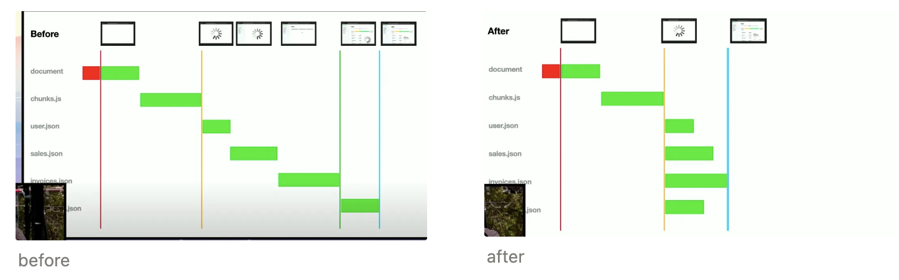

좌측 스크린샷에서 보시는 것처럼 네트워크 요청이 직렬로 이루어져 네트워크 폭포수를 이루게 됩니다.

반면 페이지를 그리는데 필요한 데이터 의존성을 모두 페이지 진입 시점으로 끌어당겨 병렬로 요청하도록 만들고, 그리고 이를 Context를 통해 필요한 컴포넌트로 직접 꽃아주면 어떨까요?

과거에는 이 ‘페이지 진입 시점’, 즉 페이지 렌더링을 위한 데이터 의존성이 완성되는 시점을 꼭 서버 측에서만 둘 수 있다고 생각했는데요. 이젠 사실 꼭 그럴 필요는 없습니다.

React Router가(어쩌면 Relay가 먼저?) loader API로 렌더링과 데이터 페칭을 분리하면서 이 가설을 깔끔하게 증명했죠.

## 2. 라우터와 번들러, RSC의 두 가지 필요 조건

지금까지 라우터는 길의 갈림길, 그리고 이 갈림길에서 일어나는 ‘미지의 정보’에 대한 효과적인 처리를 도와야 한다고 설명했습니다.

조금 더 나아가봅시다. 데이터를 당겨 받을 수 받을 수 있는 자리라는 측면에서만 중요한 것은 아닙니다. **무지의 단위** 혹은 **앎이 일어나는 자리**를 갈라주는 정하는 곳이기도 합니다.

우리가 흔히 알고 있는 예시로는 경로 별 코드 스플리팅을 떠올려볼 수 있겠습니다.

```tsx
import React, { lazy, Suspense } from "react";
import { BrowserRouter as Router, Routes, Route } from "react-router-dom";

const Home = lazy(() => import("./pages/Home"));
const About = lazy(() => import("./pages/About"));
const UserProfile = lazy(() => import("./pages/UserProfile"));

const Loader = () => (
  <div>
    <p>Loading...</p>
  </div>
);

function App() {
  return (
    <Router>
      <Suspense fallback={<Loader />}>
        <Routes>
          <Route path="/" element={<Home />} />
          <Route path="/about" element={<About />} />
          <Route path="/profile/:id" element={<UserProfile />} />
        </Routes>
      </Suspense>
    </Router>
  );
}

export default App;
```

A 페이지를 진입하는 시점에 꼭 B에 대한 정보를 당장 받아올 필요는 없습니다. A에 대한 정보만 빠르게 받아서 보여주는게 유리하겠죠. 그래서 `React.lazy()` 를 사용하여 번들을 분할합니다.

하지만 `React.lazy()` 를 쓰기만 한다고 저절로 번들이 각각의 청크로 분할 될까요? 이 작업은 Webpack이나 Vite 같은 번들러에서 처리해줍니다. 빌드 타임에 파일을 읽어들여 `React.lazy()`, `import()` 구문을 만나면 별도의 모듈로 분리하는데요. 즉, **번들러가 ‘앎의 단위’를 경로별로 나눠주는 셈**입니다.

이 과정에서 번들러는,

1. 하나의 빌드 결과물을 여러 청크로 분리할 수 있고

2. **분할된 청크의 이름과 경로를 알게 됩니다.**

이런 정보들을 알고 있는 번들러가 앞서 언급한 라우터와 손을 잡으면 어떤 일이 일어날까요?

경로와 경로의 경계, 서버와 클라이언트의 경계를 마음대로 주무를 수 있게 됩니다. 이론상 프론트엔드와 서버의 경계가 사라지는 것입니다.

이게 무슨 소리일까요?

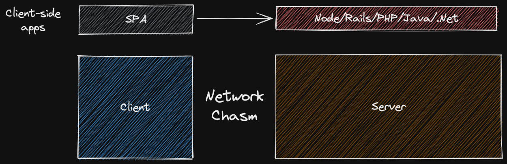

<p align="center">https://kentcdodds.com/blog/remix-the-yang-to-react-s-yin</p>

서버와 클라이언트는 통신(ex. HTTP)을 통해 정보를 주고 받습니다. 문자열 형태로 직렬화 된 정보만 서버 경계를 넘나들 수 있습니다.

HTML은 문자열입니다. 건널 수 있습니다. 자바스크립트 객체? `JSON.stringify()` 로 문자열로 바꾸면 건널 수 있습니다. 함수, Promise 등은? JSON 직렬화가 불가능하므로 건널 수 없습니다. React 가상돔? 어림도 없죠.

하지만 RSC는 가상돔을 문자열로 직렬화 하여 컴포넌트가 네트워크 경계를 넘을 수 있도록 합니다.

첫 번째 예시 코드는 JSON 변환 가능 요소들로만 구성되어 있어 특별한 조치 없어도 건널 수 있습니다. 놀랍게도 Symbol도 직렬화가 가능합니다!

```tsx
// 1-1. JSON 직렬화가 가능한 컴포넌트 예시
React.createElement("div", { title: "oh my" })
// 1-2. 가상돔 변환
{
  $$typeof: Symbol(react.element),
  type: "div",
  props: { title: "oh my" },
  ...
}
```

두 번째 예시를 볼까요? 함수 컴포넌트가 끼어있네요.

```tsx
// 2-1. JSON 직렬화가 불가능한 예시
function MyComponent({children}) {
  return <div>{children}</div>;
}
// 2-2. 가상돔 변환 불가능
{
  $$typeof: Symbol(react.element),
  type: MyComponent  // 함수는 JSON이 못 돼요!
  props: { children: "oh my" },
  ...
}
```

하지만 이걸 함수 컴포넌트의 참조, 즉 자바스크립트 청크의 ‘경로’로 대체한다면 어떨까요? 이제는 경계를 넘을 수 있게 됩니다.

```tsx
// 3-1. 함수 컴포넌트의 참조를 경로로 대체하여 JSON 직렬화 가능
{
  $$typeof: Symbol(react.element),
  type: {
    $$typeof: Symbol(react.module.reference),
    name: "default",
    // 3-2. 번들러가 생성한 경로
    filename: "./src/ClientComponent.client.js"
  },
  props: {
    children: {
      $$typeof: Symbol(react.element),
      type: "span",
      props: {
        children: "Hello from server land"
      }
    }
  }
}
```

이렇게 서버 경계를 넘은 가상돔 데이터는 화면에 끼워집니다.

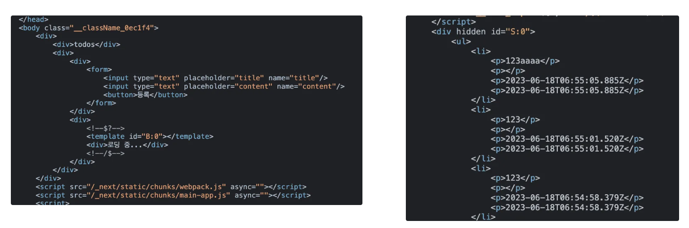

좌측 스크린샷을 보시면 `<!--$?--><!--/$-->` 라는 주석이 있고 그 사이에 `template[id="B:0"]` 이라는 식별자가 있습니다. 식별자를 기준으로 자리 표시자 안쪽에서 매칭되는 데이터를 교체해주는 것이고, 자리 표시자는 React 내부에 이미 정의되어 있습니다.

```tsx
const SUSPENSE_START_DATA = "$";
const SUSPENSE_END_DATA = "/$";
const SUSPENSE_PENDING_START_DATA = "$?";
const SUSPENSE_FALLBACK_START_DATA = "$!";
```

이렇게 하려면 번들러가 1) 청크를 나눠주고 2) 그것의 경로를 알려줘야만 합니다. 그리고 이 정보들이 필요해지는 상황은 경로가 변경될 때입니다. RSC를 활용하기 위해 번들러와 라우터가 협력해야 하는 이유입니다.

서버와 클라이언트가 RSC를 활용해 상호 협력하여 화면을 그리는 시나리오를 확인해보시죠.

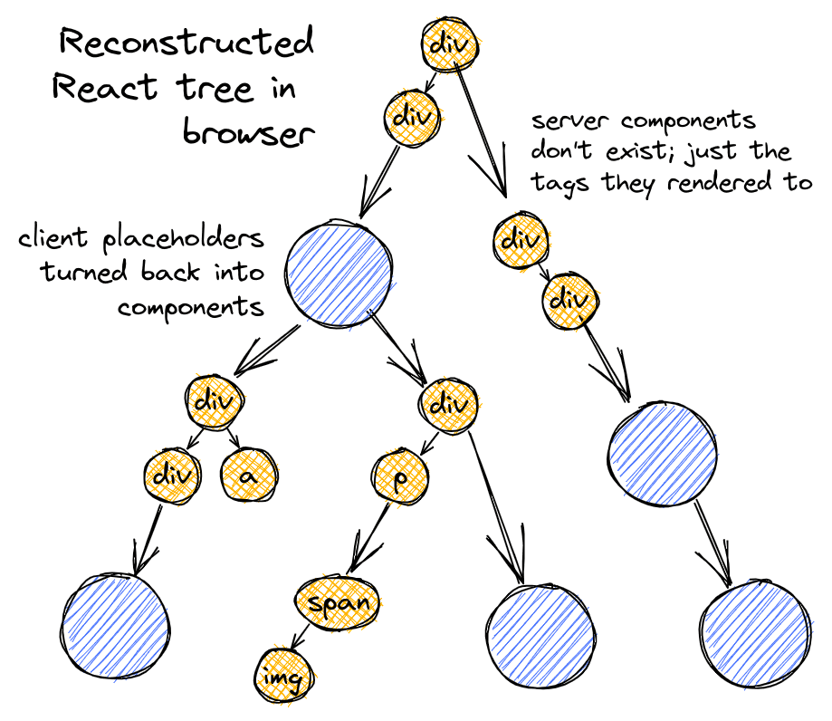

**[최초 렌더링]**

- 클라이언트가 서버에 화면을 달라고 요청하고, 서버는 React로 화면을 렌더링하고 첫 응답은 HTML로 만들고, 후속 응답은 스트리밍한다.

- 클라이언트가 받아보는 최초 응답은 1) 일부 완성되어 있고(서버 컴포넌트 + 클라이언트 컴포넌트의 서버 측 렌더링) 2) 덜 그려진 부분은 식별자로 만든 placeholder(Suspense 등으로 나뉜 경계)가 뚫려 있는 HTML 형태이다.

- 서버는 렌더링이 모두 완료될 때까지 식별자 + 추가 렌더링 된 내용물(가상돔의 일부)을 스트리밍으로 중간 중간 끊어 보내준다.

- 클라이언트는 가상돔을 받을 때마다 짝이 맞는 식별자 자리에 화면의 일부를 끼워넣고 렌더링한다.

**[페이지 이동]**

- 특정 페이지로 이동하겠다고 서버에 정보를 담아 요청을 보낸다.

- 서버는 해당 페이지를 서버에서 미리 그려 가상돔을 얻고, 이를 직렬화 + 스트리밍 하여 클라이언트로 응답한다.

- 클라이언트에는 이미 가상돔 트리가 존재하므로 응답 받은 직렬화 된 가상돔을 파싱하여 트리의 적절한 곳에 끼워넣고 리렌더링 한다.

- 이 과정에서 변경된 부분만 업데이트 되므로 라우팅을 하더라도 변경되지 않은 DOM 영역이 있다면 언마운트 되지 않는다.

## 3. 하지만 서버 컴포넌트에 ‘서버’가 꼭 필요하진 않을지도

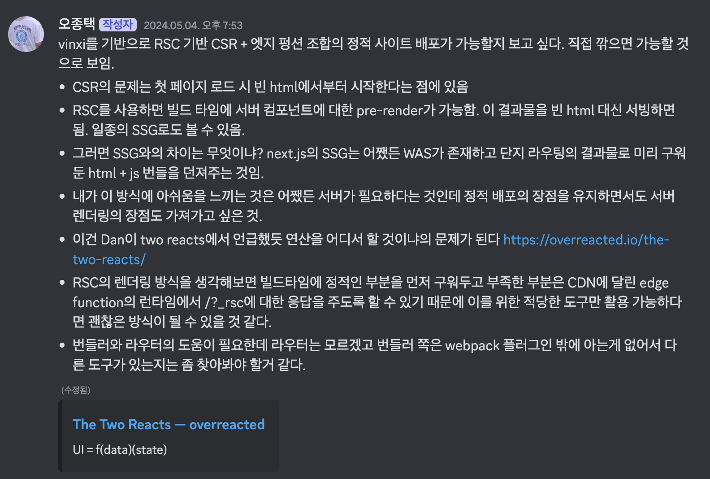

<p align="center">24.05 쯤에 썼던 메모. 이걸 결국 React Router에서 구현했다.</p>

그렇다고 RSC를 사용하기 위해 항상 네트워크 상에 존재하는 ‘서버 인스턴스’가 필요한 것은 아닙니다. 좀 더 정확히는 ‘컴퓨팅 파워’를 제공할 수 있는, 하지만 클라이언트는 아닌 그 무언가가 필요한 것이죠.

예를 들면 CDN에 달린 엣지 펑션이라든가, 서버리스 람다 라든가, 서비스 워커라든가, 로컬 호스트(?) 라든가…?

농담 아니라 사실 진짜로 로컬 호스트는 우리의 컴퓨터를 기반으로 한 ‘서버’가 맞죠. 그래서 Next.js로 SSG를 할 때 빌드를 돌리면 열심히 페이지를 미리 구워서 번들로 만들어 줍니다.

이제 Next.js나 Gatsby만 가능한 것은 아닙니다. 로컬 호스트에서 띄운 서버에서 RSC를 사용하여 HTML 형태로 페이지를 미리 구워둘 수 있습니다.

그것이 이번에 React Router v7에 추가된 `Static Prerendering` 입니다. React Router의 서버 기능은 vite plugin의 형태로 제공되며, 이 플러그인과 React Router를 합치면? Remix가 됩니다!

```tsx
// vite.config.ts
import { reactRouter } from "@react-router/dev/vite";
import { defineConfig } from "vite";

export default defineConfig({
  plugins: [
    reactRouter({
      // return a list of URLs to prerender at build time
      async prerender() {
        return ["/", "/about", "/contact"];
      },
    }),
  ],
});
```

여담으로 훗날 React Router에서 loader로 RSC 그 자체를 넘길 수도 있게 된다고 합니다. 원리를 생각해보면 사실 못할 것도 없지요.

```tsx
export async function loader() {
  return {
    products: <Products />,
    reviews: <Reviews />,
  };
}

export default function App({ data }) {
  return (
    <div>
      {data.products}
      {data.reviews}
    </div>
  );
}
```

에…아무튼 저는 마침 정적 페이지로 구성하면 좋을 행사 페이지 를 만들어야 했고 곧바로 사용해보았습니다.

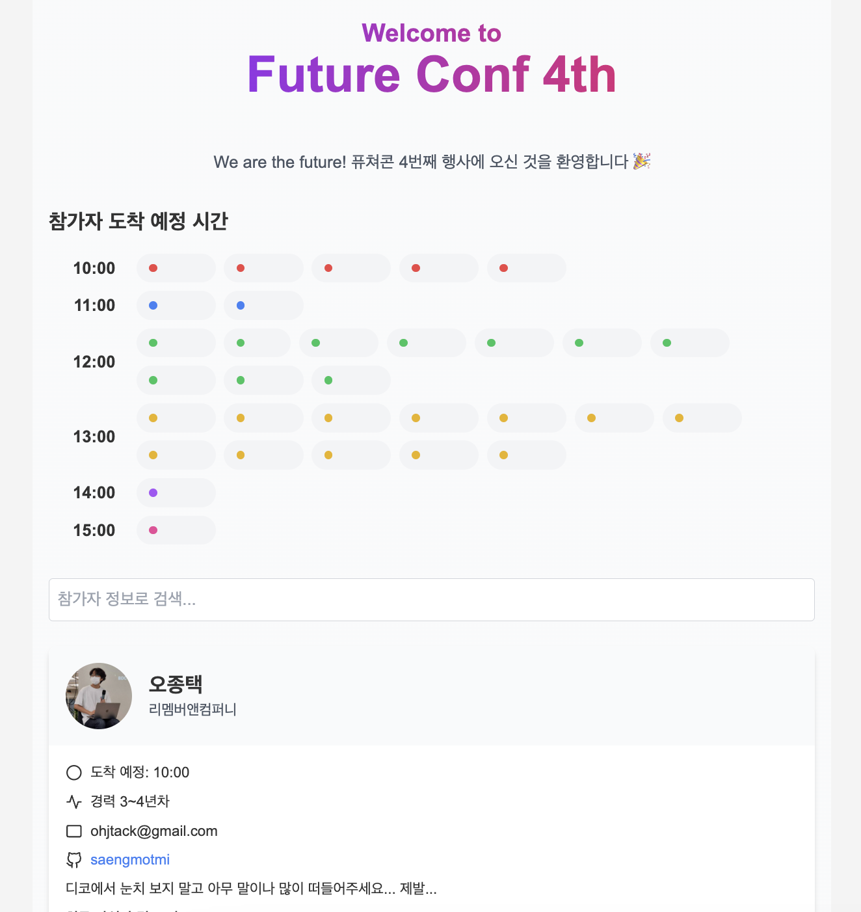

<p align="center">디자인은 v0에게 외주를 주어 보았습니다</p>

package.json은 아래와 같이 세팅하면 되고요. 핵심은

- `react-router` 에 빌드 시 활용되는 Node.js 환경 전용 cli 명령어(`NEW!`)와

- `react-router-serve` 패키지의 cli(`NEW!`)

를 통해 실행하게 된다는 점입니다. next build와 next start 비슷한거라고 생각하시면 됩니다.

```json
{
  "scripts": {
    "dev": "react-router dev",
    "build": "react-router build",
    "start": "react-router-serve ./build/server/index.js",
    "typecheck": "react-router typegen && tsc"
  },
  "devDependencies": {
    "@react-router/dev": "^7.0.0-pre.1",
    // 생략
    "vite": "^5.4.9"
  },
  "dependencies": {
    "@react-router/node": "^7.0.0-pre.1",
    "@react-router/serve": "^7.0.0-pre.1",
    // 생략
    "react-router": "^7.0.0-pre.1"
  }
}
```

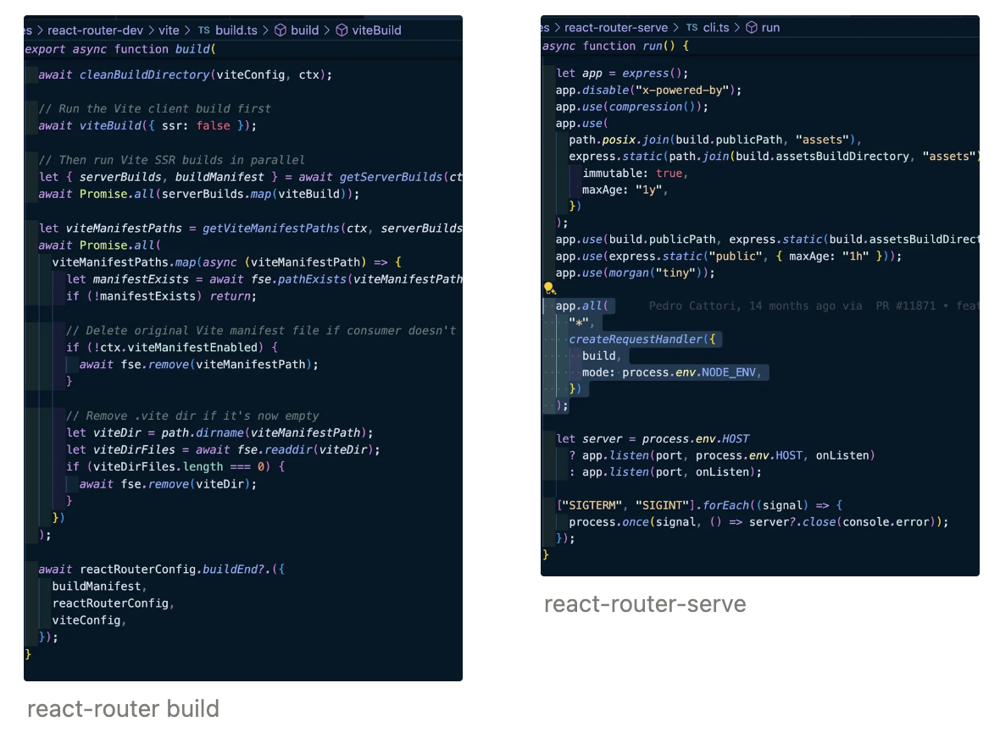

그리고 빌드 결과는? 대실패로써? 덕분에 아래 PR이 만들어졌습니다.

https://github.com/remix-run/react-router/pull/12161

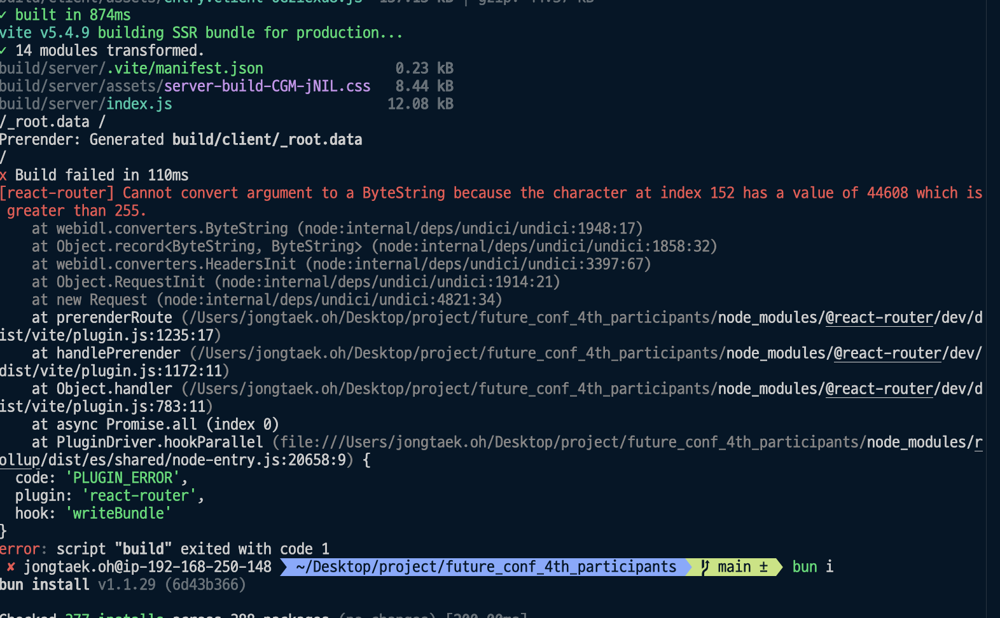

ㅋㅋ;;

모든 것들이 정상적으로 진행되다가 loader에 JSON 데이터를 넣자마자 빌드가 터져서 조금 들여다보니 vite plugin에서 열어준 서버에서 아래와 같은 형태로 loader를 굽고, 그 값을 헤더에 담아 React Router 서버 런타임으로 넘겨줍니다.

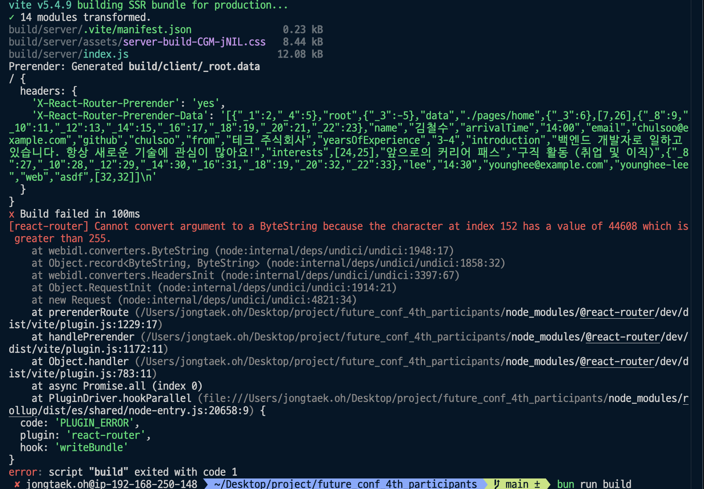

하지만 그 값에 한글과 같은 non-ASCII 문자가 들어있었고, 제대로 처리하지 못해 Node 런타임에서 에러가 발생한 것이었습니다. `encodeURI` 를 통해 아래와 같이 처리해주었더니 정상적으로 빌드할 수 있었습니다.

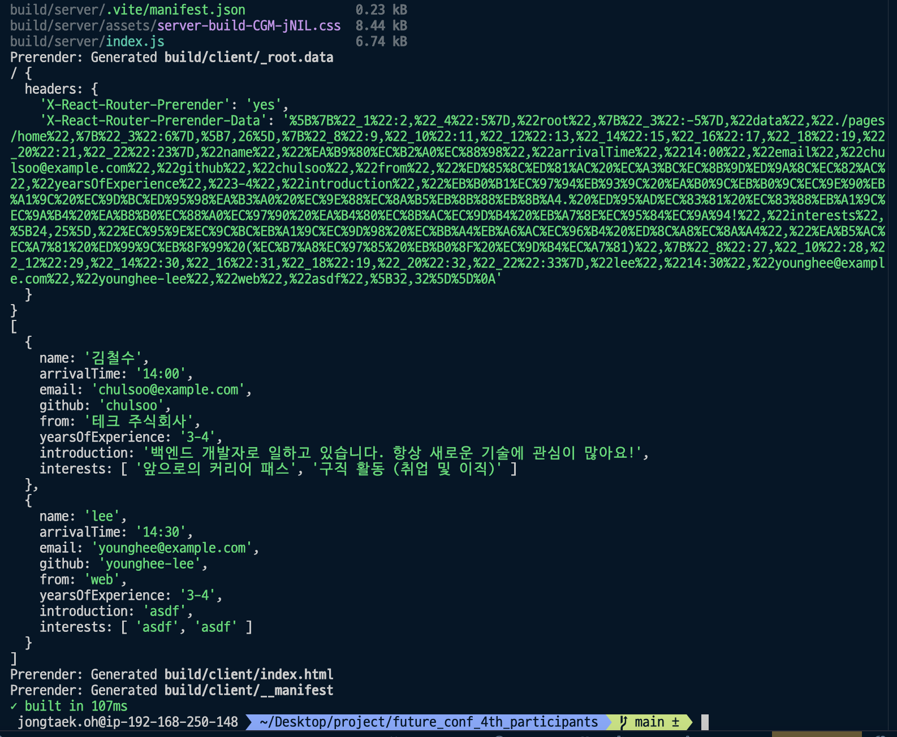

그러면 빌드 결과물을 살펴보겠습니다.

일단 아래와 같은 파일들을 얻게 되는데요. 서버와 클라이언트 폴더로 나눠지는군요.

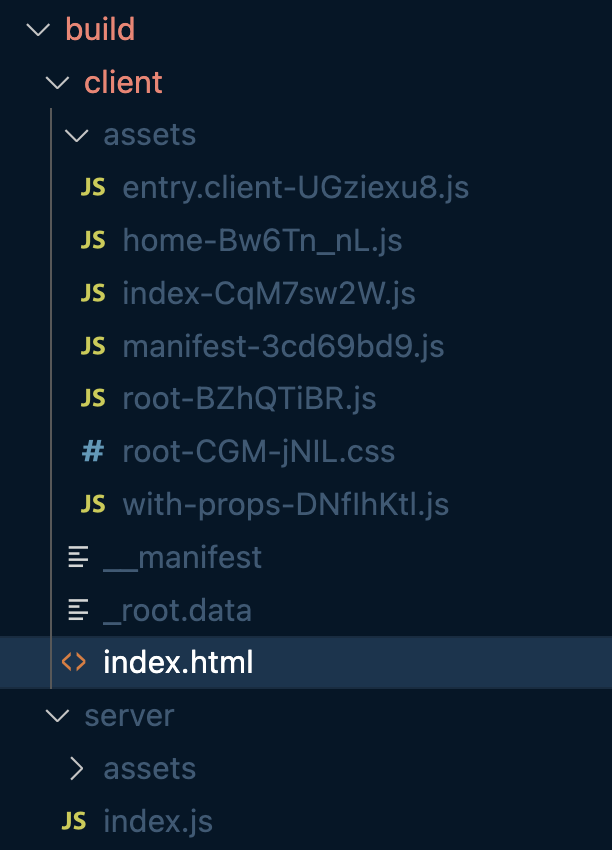

그리고 아무래도 엔트리포인트가 될 `/client/index.html` 을 살펴보지 않을 수 없겠죠?

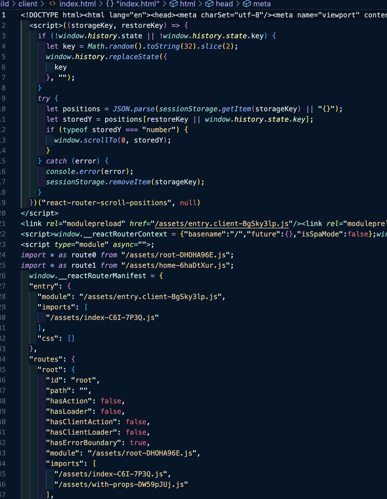

첫 줄에 생성된 HTML들을 확인할 수 있고, 그 뒤로 React 번들이나 여러 청크들을 불러오는 코드가 보입니다.

그리고 조금 더 내려보면… 이런 것들을 확인할 수 있는데요. 엥 이것이 무엇이냐? 앞에서 살펴본 RSC군요.

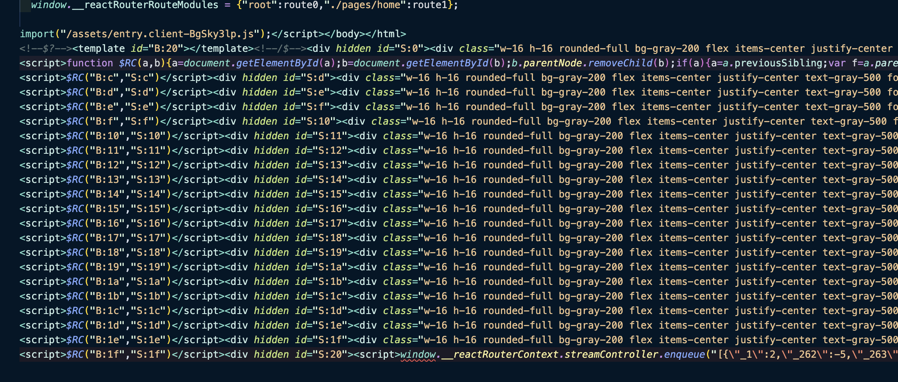

아래와 같이 참가자들 프로필 이미지를 그리는데 Suspense를 사용한 곳이 있었고, 이 부분이 서버 컴포넌트 / 클라이언트 컴포넌트의 경계로 나누어진 것이었습니다.

Static Prerendering의 경우 요청을 보내 받아올 서버가 없으니 HTML 하단에 미리 스크립트 태그로 RSC 렌더링 결과물을 꽃아두는 것으로 이해했습니다.

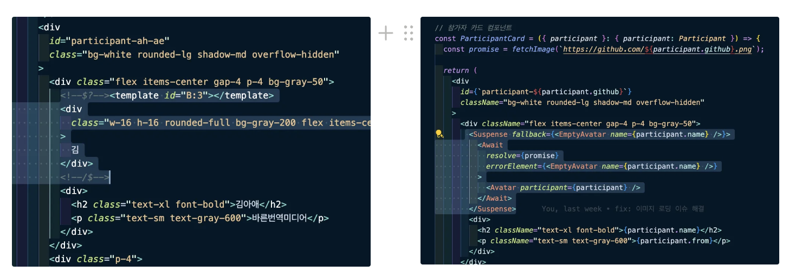

해당 스크립트들은 클라이언트 컴포넌트의 구성요소로써 HTML이 로드 되고 차례로 불려 프로필 카드에 들어가 있는 placeholder들을 대체하게 됩니다.

정리해보자면… 매우 우연한 기회로 React Router에서 RSC를 구현하고 있음을 확인하였는데요. CSR 제품을 SSG로 쓸 수 있게 되는 만큼 추후 실제 제품에서도 Static prerendering을 사용하여 멋진 Web Vital 지표를 볼 수 있게 되기를 고대해봅니다.

여담으로 아직 출시되지 않은 React Router의 기능도 써보고, v0로 디자인과 코드를 뽑아보고, 처음으로 테일윈드 세팅도 해보고, Bun으로 라이브러리를 몽키 패칭하고, CloudFlare Pages로 배포하는 과정에서 문제도 겪어보는 좋은 시간이었네요. 좀 더 자주 이런 작은 토이 프로젝트를 해봐야겠어요 :)

### 여담) 요즘 대세는 디스코드

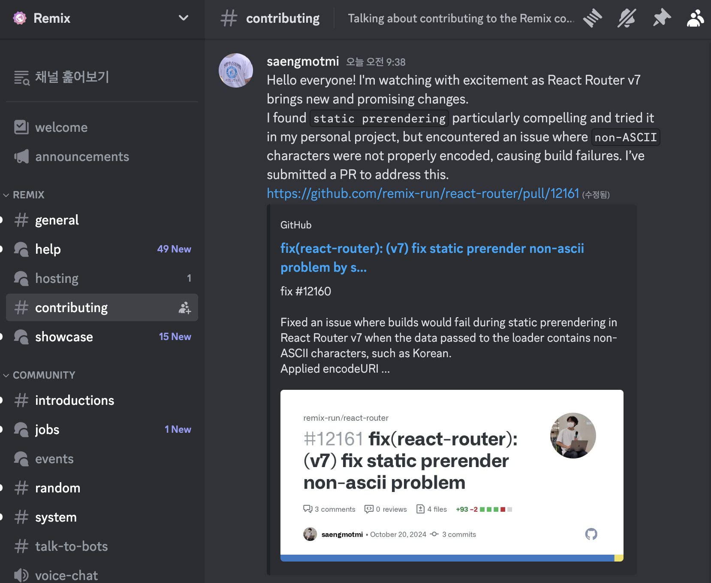

스크린샷은 제 PR을 봐달라고 구걸하는 장면입니다 ㅎㅎ..

저만 몰랐지만 많은 오픈소스 프로젝트들이 디스코드에서 사용자 / 기여자들과 소통하고 있습니다. 이슈나 PR을 올리기 전에 디스코드에서 소통하고, 그걸 PR로 올려주는 걸 선호한다는 이야기를 어디선가 전해들었는데요. 다음엔 이쪽 채널을 먼저 이용해봐야겠습니다.
