> 주의: 이 글은 2023년 7월 즈음 작성되었으며, 약간의 윤문을 거쳐 최근 발행되었습니다. React의 신규 스펙에 대한 글인 만큼 그 사이 변경이 생겼을 수 있습니다.

어떻게 보면 React SSR의 비동기 렌더링은 이미 정해져 있는 미래였다고도 할 수 있을 것 같습니다. `renderToString`이 동기 함수라는 속성을 타고 태어난 순간 부터 말이죠.

## 1. Node.js, 싱글 스레드 그리고 이벤트 루프

다들 익히 들어 알다시피 Node.js는 싱글 스레드 / 이벤트 루프를 사용하여 많은 요청을 빠르게 처리하는 메커니즘을 가지고 있습니다.

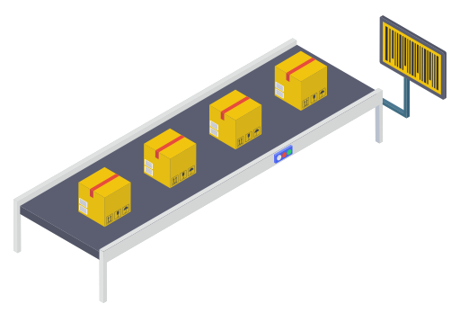

한줄짜리 컨테이너 벨트만 있는 공장을 생각해봅시다. 이 공장의 직원들은 컨베이어 벨트를 따라 쭉 늘어서 자기 앞으로 지나가는 일을 처리합니다. 종종 벨트 위로 너무 빡센 일감이 들어오거나, 직원의 몸이 좋지 않거나 는 이유로 제때 일을 처리하지 못하고 전체 컨베이어 벨트가 멈추기도 합니다. 공장 입장에서는 큰 손해죠.

그래서 이 공장은 너무 무거운 일감이거나 곧바로 완료할 수 없는 일감일 경우 벨트 밖으로 잠시 물건을 벨트 밖에서 대기하는 직원들에게 던져두는 방식으로 일하라고 개선 지시를 내렸습니다.

벨트 바깥에서 대기 중이던 또 다른 직원들이 무거운 일감을 처리해주는 동안 벨트에 붙은 직원들은 평소처럼 일감을 처리하고, 벨트 바깥 직원들이 벨트 안쪽으로 완료된 일감을 다시 던져주는 방식으로 말이죠.

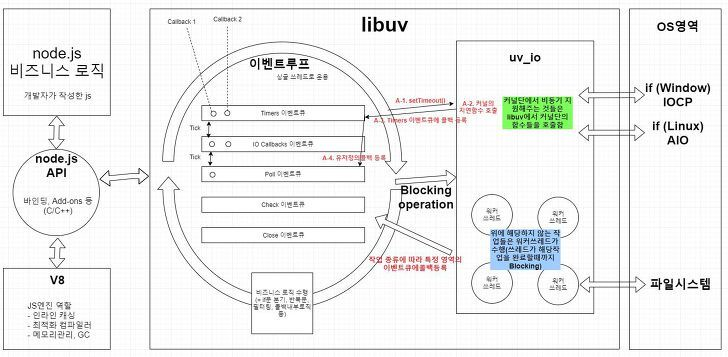

https://sjh836.tistory.com/149 (내용이 아주 좋습니다)

이는 Node.js가 싱글 스레드 환경 하에서 콜 스택과 이벤트 루프를 사용하여 동기 / 비동기 코드를 처리하는 방식을 단순화 한 설명입니다.

곧바로 응답을 빠르게 받아볼 수 없는 요청들은 모든 처리가 끝날 때까지 메인 스레드를 Block 할 수 있는 위험이 있기 때문에 Node.js는 setTimeout이나 Promise 같은 미래에 처리될 값들은 콜백 함수 형태로 이벤트 루프로 넘겨져 비동기적으로 처리하도록 했습니다.

기본적으로 이벤트 루프는 6개의 `Phase(Macrotask Queue)`와 2개의 `Microtask Queue`를 가지고 있다는 점도 참고로 짚어두고 가면 좋을 것 같습니다. 동기 코드 처리를 담당하는 `콜 스택`과 비동기 코드 처리를 담당하는 `이벤트 루프`가 서로 상호 작용하면서 싱글 스레드 만으로도 여러가지 비동기적인 처리를 가능케 합니다.

<video controls autoplay width="100%" src="https://file.notion.so/f/f/7a813495-7f43-4f9b-8425-adb83564ac6f/e0e7a9d0-3625-4a99-8d8c-ea64f3ff994a/assets_YJIGb4i01jvw0SRdL5Bt_26702aaabc7845f78315b112015c067d_compressed.mp4?id=e64d02b6-f02a-4c3f-8a9d-1697dbea802d&table=block&spaceId=7a813495-7f43-4f9b-8425-adb83564ac6f&expirationTimestamp=1706436000000&signature=tYIzDSsdPku1_rm7T0rzyjtoHjsleKircxv6xF6Vhw8&downloadName=assets_YJIGb4i01jvw0SRdL5Bt_26702aaabc7845f78315b112015c067d_compressed.mp4"></video>

https://www.builder.io/blog/visualizing-nodejs-close-queue

## 2. renderToString API의 제한된 동시성(Limited Concurrency)

하지만 일은 시나리오 대로만 돌아가지 않습니다. 가상의 가게를 하나 생각해보겠습니다. 사장님은 주방 직원 한명과 함께 열심히 장사를 하고 있었습니다. 주문이 들어왔을 때 적당히 처리할 수 있는 일은 사장님이 처리하고, 그렇지 못할 거 같을 때 직원에게 일처리를 넘기는 방식으로 가게를 잘 굴리고 있었습니다.

그런데 어느 날 진상 손님이 찾아와 깽판을 치기 시작했습니다. 사장님은 진상 손님에게 한참을 붙들려 업무를 보지 못했고, 손님들의 무수한 전화의 요청을 놓치고 말았습니다… 직원은 사장이 일을 안 시키니 놀고만 있었고요.

이처럼 싱글 스레드 환경에서 구성된 서버의 메인 스레드가 Block 되면 서버는 요청을 제대로 처리하지 못하게 됩니다. 그리고 이와 같은 현상은 `ReactDOMServer.renderToString()` 으로 구성된 React SSR 서버에서도 동일하게 나타납니다.

```jsx
const App = ({ data }) => {
	return // ...
}

export const getServerSideProps = async () => {
	await sleep(10_000); // 10 seconds
  return { ... }
}
```

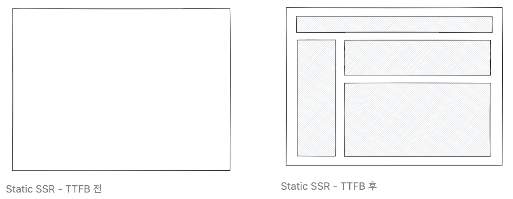

> 😠 ??? : “우리의 킹갓 짱짱 Next.js가 그런 후진 성능일 리가 없습니다!!”

애석하게도 사실입니다. 실제로 2017년 Next.js issue에 SSR에 대한 제한된 동시성 성능 이슈(https://github.com/vercel/next.js/issues/1840) 가 보고된 적이 있습니다.

여러 대의 SSR 인스턴스를 띄우거나, 응답을 캐싱하라는 등의 해결책을 내놓긴 했지만 근본적인 문제이자 한계는 renderToString이 동기 함수라는 점에 있습니다. 물론 이것만이 동시성 성능 문제의 전부는 아니지만 구조적인 문제인 만큼 해결될 필요가 있었습니다.

이윽고 React의 Concurrent Feature를 본격적으로 반영한 새로운 메이저 업데이트 ver. 18은 이에 대해 **1) Streaming SSR**과 **2) 선택적 Hydration**이라는 두 가지 해결책을 내놓습니다. (https://github.com/reactwg/react-18/discussions/37)

- **Streaming HTML** lets you start emitting HTML as early as you’d like, streaming HTML for additional content together with the `<script>` tags that put them in the right places.

- **Selective Hydration** lets you start hydrating your app as early as possible, before the rest of the HTML and the JavaScript code are fully downloaded. It also prioritizes hydrating the parts the user is interacting with, creating an illusion of instant hydration.

## 3. 준비된 Chunk로 부터 낙하! (Streaming SSR로 비동기 렌더링)


인간이 가장 공포를 느낀다는…? (http://mbiz.heraldcorp.com/military/view.php?ud=20200408000739)

그렇다면 전체를 기다리지 말고 준비된 부분까지만 끊어서 먼저 보내놓고 무거운 요청들을 뒤로 미룰 수 있다면 어떨까요? 그래서 React는 `renderToString`을 deprecated 처리하고 `renderToReadableStream` API를 사용하라고 권장하고 있습니다. 이 API는 [ReadableStream API](https://developer.mozilla.org/en-US/docs/Web/API/ReadableStream)를 기반으로 준비된 Chunk 부터 응답을 보내줄 수 있도록 설계되었습니다.

```jsx
import { renderToReadableStream } from 'react-dom/server';

async function handler(request) {
  **const stream = await renderToReadableStream(<App />, {**
    bootstrapScripts: ['/main.js']
  });
  return new Response(stream, {
    headers: { 'content-type': 'text/html' },
  });
}
```

이제부터 기존의 SSR과 새로운 SSR을 구분하기 위해 이제 `Static SSR` 과 `Streaming SSR` 두 가지로 용어를 분리하여 사용하겠습니다.

그나저나 HTML이 스트리밍 된다니… 갑자기 웹 소켓이라도 열리는 걸까요? 그렇지 않습니다.

비밀은 바로 `HTTP/1.1` 스펙의 Header 값 중 Transfer-Encoding: chunked 라는 라는 값(HTTP/2 부터는 기본적으로 스트리밍이 가능합니다)에 있습니다.

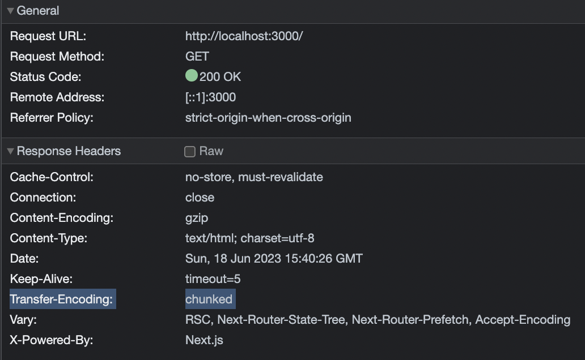

https://developer.mozilla.org/en-US/docs/Web/HTTP/Headers/Transfer-Encoding

이 스펙은 HTTP 요청을 보낼 때 전체 사이즈를 알지 못할 때 사용합니다. 일반적으로는 Content-Length를 응답에 함께 보내지만 스트리밍 요청의 경우 그게 불가능하죠. 그래서 브라우저는 남은 Chunk의 길이가 0이 될 때까지 커넥션을 닫지 않고 기다리면서 TCP/IP 핸드쉐이크 비용을 절약하게 됩니다.

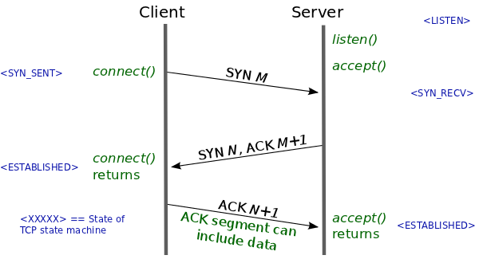

- 클라이언트 : “서버야 안녕? 통신하쉴?(SYN)” (SYN)

- 서버 : “ㅇㅇㅋㅋ(ACK) 클라 준비 완?(SYN)” (SYN + ACK)

- 클라이언트 : “ㅇㅇㅋㅋ(ACK) 이제 통신 ㄲ” (ACK)

Next.js 13의 App Router를 사용한 Streaming SSR 응답 결과물을 직접 확인해보도록 하겠습니다. 아래 스크린샷에서 노란색으로 표시된 부분 하나 하나가 chunk 단위라고 봐주시면 되겠습니다. 브라우저의 개발자 도구는 최종 결과물만 보여주기 때문에 데이터가 들어오는 과정을 보려면 아래와 같이 직접 찍어보셔야 합니다.

```tsx
const http = require("http");

http.get("http://example.com", (res) => {
  res.on("data", (chunk) => {
    console.log("Received chunk: ", chunk.toString());
  });
});
```

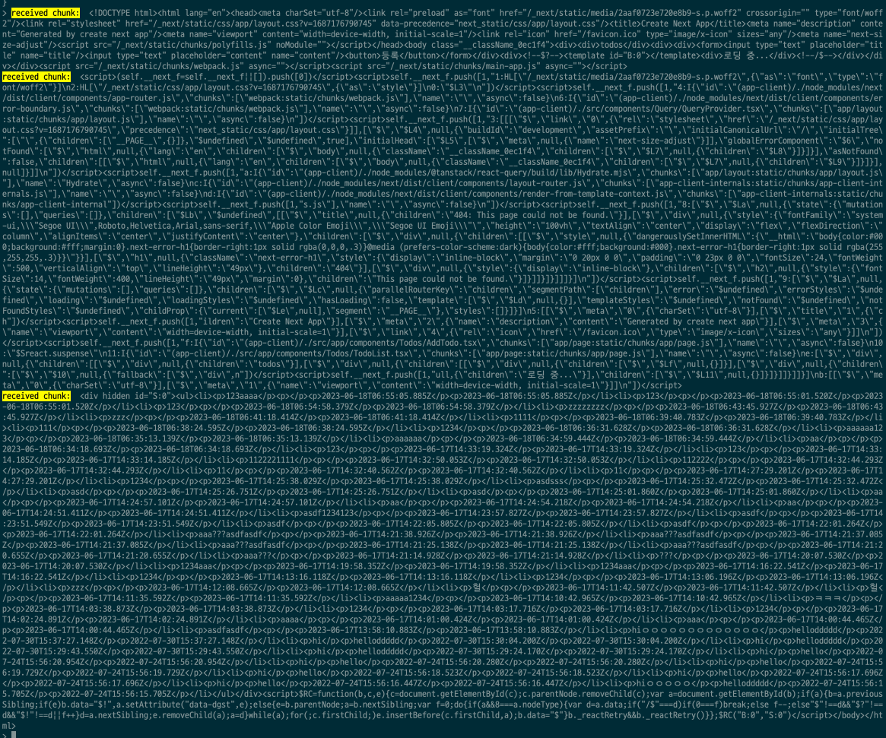

SSR 응답의 세 가지 청크 중 첫번째 응답은 아래와 같이 Suspense 경계가 아직 resolve 되지 않아 fallback 컴포넌트를 보여주고 있는 상태의 HTML입니다.

```jsx
/** catch */
<Suspense fallback={<div>로딩 중...</div>}>
  {/** try */}
  <Todo />
</Suspense>
```

만약 SSR이 동기 함수를 통하여 이루어졌다면 첫 응답으로 ‘로딩 중’이 아니라 모든 데이터가 채워진 상태의 HTML을 받게 되었겠죠. 하지만 첫 응답(TTFB)이 지금보다 훨씬 늦었을 겁니다.

여기서 눈여겨볼 점은 `$?` 라는 문자열과 `template#B:0` 태그입니다. 이 부분은 뒤에 후속 응답으로 들어올 실제 데이터의 Placeholder 입니다.

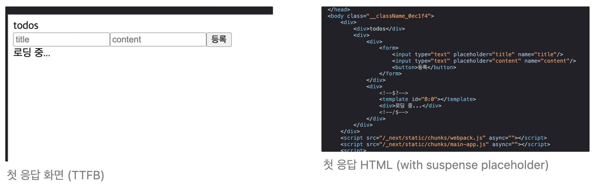

두 번째 청크는 메타 정보에 가까워 세 번째 청크로 곧장 넘어가보겠습니다. 세 번째 청크는 **1) 화면에 보여져야 할 실제 데이터와 2) 스크립트 태그** 두 영역으로 나뉘어 있습니다.

실제 데이터가 일단은 hidden 처리되어 있고 id 셀렉터가 `S:0` 임을 알 수 있습니다.

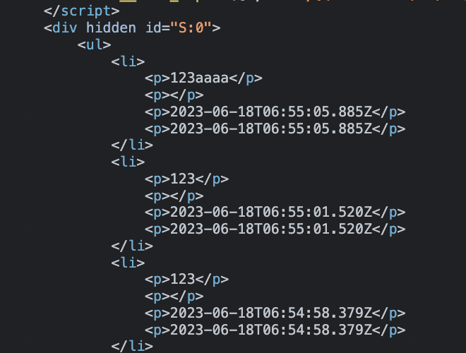

마지막으로 스크립트 태그를 먼저 살펴보겠습니다. `replaceContent("B:0", "S:0")` 에서 볼 수 있듯이 id 셀렉터가 `B:0`인 요소(아까 언급했던 placeholder 자리에)와 `S:0` (새로 들어온 데이터)인 HTML 요소를 갈아 끼우는 동작을 합니다. 참고로 이 스크립트 코드는 React 코드 내에 [리터럴 스크립트 형태](https://github.com/facebook/react/blob/613e6f5fca3a7a63d115988d6312beb84d37b4db/packages/react-dom-bindings/src/server/fizz-instruction-set/ReactDOMFizzInstructionSetInlineCodeStrings.js#L6-L8)로 들어 있습니다.

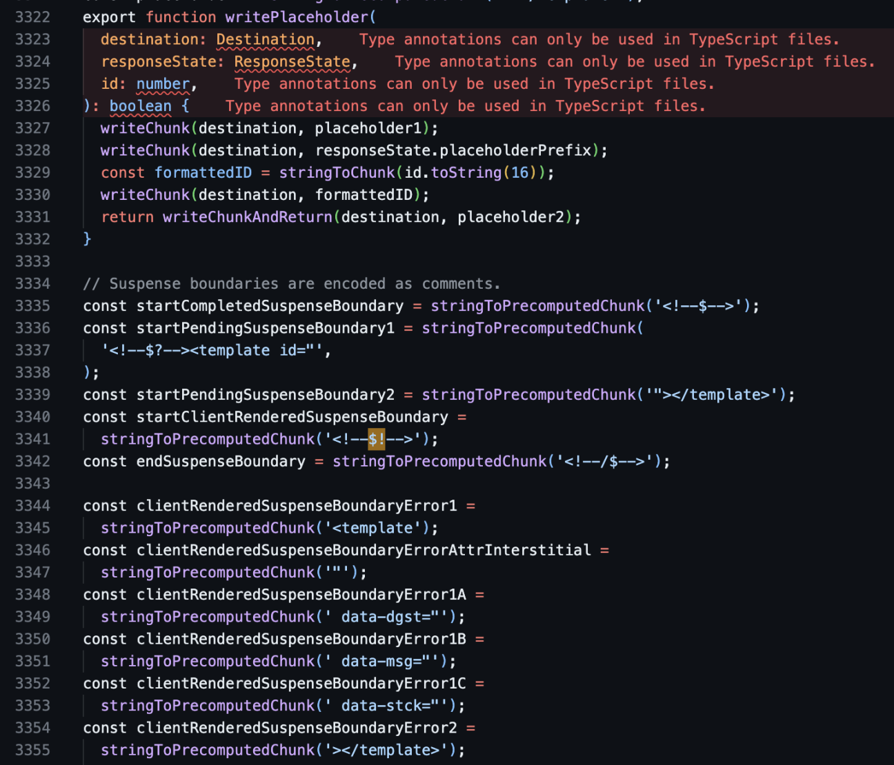

Placeholder 생성 로직 (writePlaceholder) https://github.com/facebook/react/blob/613e6f5fca3a7a63d115988d6312beb84d37b4db/packages/react-dom-bindings/src/server/ReactFizzConfigDOM.js#L3315-L3355

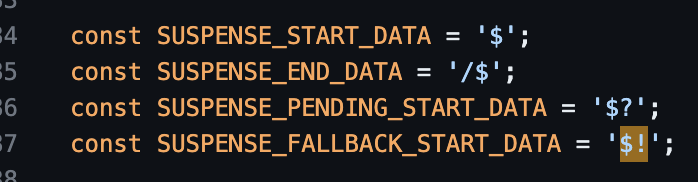

Suspense 경계 식별을 위한 매직 리터럴 (https://github.com/facebook/react/blob/613e6f5fca3a7a63d115988d6312beb84d37b4db/packages/react-dom-bindings/src/client/ReactFiberConfigDOM.js#L184-L187)

```jsx
<script>
    const replaceContent = function(targetID, removeID, newContent) {
        let removeElement = document.getElementById(removeID);
        removeElement.parentNode.removeChild(removeElement);

        let targetElement = document.getElementById(targetID);
        if (targetElement) {
            let prevSibling = targetElement.previousSibling;
            if (newContent) {
                prevSibling.data = "$!";
                targetElement.setAttribute("data-dgst", newContent);
            } else {
                let parentElement = prevSibling.parentNode;
                let nextSibling = prevSibling.nextSibling;
                let balance = 0;
                do {
                    if (nextSibling && 8 === nextSibling.nodeType) {
                        let siblingData = nextSibling.data;
                        if ("/$" === siblingData)
                            if (0 === balance)
                                break;
                            else
                                balance--;
                        else
                            "$" !== siblingData && "$?" !== siblingData && "$!" !== siblingData || balance++;
                    }
                    let nextSiblingCopy = nextSibling.nextSibling;
                    parentElement.removeChild(nextSibling);
                    nextSibling = nextSiblingCopy;
                } while (nextSibling);

                while (removeElement.firstChild) {
                    parentElement.insertBefore(removeElement.firstChild, nextSibling);
                }
                prevSibling.data = "$";
            }

            if(prevSibling._reactRetry) {
                prevSibling._reactRetry();
            }
        }
    };

    replaceContent("B:0", "S:0");
</script>
```

기존 Static SSR과 비교하여 Streaming SSR을 표현하면 아래와 같은 모습이 되겠네요. 이렇게 일정 Chunk 단위로 끊어 응답을 보내주게 된다면 마치 `requestAnimationFrame` 처럼 메인 스레드를 과도하게 오래 점유하는 현상은 조금 줄어들지 않을까요?

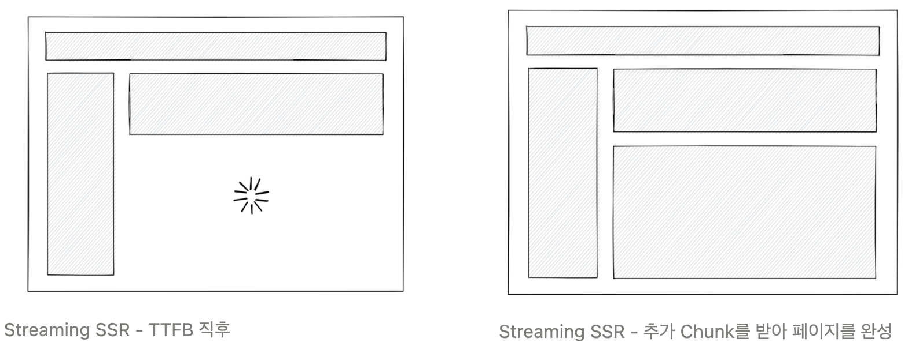

지금까지의 설명으로 이제 Streaming SSR에 대해 어느 정도 궁금증이 풀리셨기를 바랍니다 :)

## 4. Suspense Under The Hood

끝내기 전에 Suspense에 대해 언급해두고 가는게 좋겠습니다.

**Suspense 컴포넌트는 리액트 컴포넌트의 비동기 로딩 상황을 일급(First-class)으로, 또 선언적으로 다룰 수 있도록 해주는 도구**입니다.

일급이라는 개념에 대해 먼저 짚어볼 필요가 있습니다. 일급 객체(first-class object) 또는 일급 시민(first-class citizen)이라는 용어는 프로그래밍 언어 디자인에서 특정 개체가 언어의 기능을 제한 없이 사용할 수 있음을 나타내는 용어입니다. 다시 말해, 언어에서 일급 객체로 취급되는 개체는 변수에 할당될 수 있고, 데이터 구조 내에 저장될 수 있으며, 함수의 매개변수로 전달될 수 있고, 함수의 반환 값이 될 수 있습니다.

예를 들어, JavaScript에서 함수는 일급 객체입니다. 함수는 변수에 할당될 수 있으며, 객체의 속성으로 설정될 수 있고, 다른 함수의 매개변수로 전달되거나 반환될 수 있습니다.

그러한 측면에서 자바스크립트에서 비동기를 다루는 최초의 방법이었던 콜백 패턴은 비동기를 일급 값으로 다룰 수 없지만, Promise의 등장으로 자바스크립트는 비동기를 일급 값으로 다룰 수 있다고 볼 수 있습니다.

Suspense는 우리가 비동기 로딩 상황을 직접 값처럼 다루도록 해주며, 그 처리를 간결하고 선언적인 형태로 작성할 수 있게 해준다는 사실을 알 수 있습니다.

- Suspense는 컴포넌트가 데이터를 아직 로드하지 못했을 때 대신 보여줄 컴포넌트를 정의할 수 있게 해줍니다. 이를 통해, 데이터가 로드되는 동안 사용자에게 보여줄 대체 컨텐츠를 우리가 제어할 수 있게 됩니다.

- 우리가 직접 로딩 상태를 추적 및 관리할 필요 없이, 비동기 작업이 어떻게 처리되어야 할지를 '선언'하면 됩니다. Suspense가 그 선언에 따라 알아서 작업을 수행하고, 적절한 컴포넌트를 렌더링합니다.

```jsx
/** catch */
<Suspense fallback={<div>로딩 중...</div>}>
  {/** try */}
  <Todo />
</Suspense>
```

물론 마법처럼 되는 것은 아니고, 마치 에러 메시지가 상위 컨텍스트로 전파되듯, 상위 컴포넌트로 Promise를 throw 하여 컴포넌트가 로딩 상태임을 전파시켜야 합니다. try-catch의 catch가 에러 상태를 받아 처리해주듯이 Suspense는 비동기 상태를 대신 처리해주는 것이죠.

아래 코드는 Suspense의 창안자인 Sebastian Markbåge가 설명을 위해 작성한 예제(Pseudo-Code)입니다.

```tsx
let cache = new Map();
let pending = new Map();

function fetchTextSync(url) {
  if (cache.has(url)) {
    return cache.get(url);
  }
  if (pending.has(url)) {
    throw pending.get(url);
  }
  let promise = fetch(url)
    .then((response) => response.text())
    .then((text) => {
      pending.delete(url);
      cache.set(url, text);
    });
  pending.set(url, promise);
  throw promise;
}

async function runPureTask(task) {
  for (;;) {
    try {
      return task();
    } catch (x) {
      if (x instanceof Promise) {
        await x;
      } else {
        throw x;
      }
    }
  }
}
```

핵심은 `throw` 입니다. 무한 루프를 돌면서 던져지는(throw) 것들을 감지하고, 그 중 Promise의 인스턴스가 있을 경우 await 하여 Promise에 대해 resolve 시도하고 다른 컴포넌트를 먼저 렌더링 합니다. 최종적으로 try가 잘 끝나게 되면 runPureTask는 리턴되고 UI는 fallback에서 컴포넌트 Children으로 전환됩니다.

(실제 React 내부 코드에서는 Promise 대신 Thenable을 사용하고 있다는 점, Promise 대신 SuspenseException을 던진다는 점 정도가 차이점입니다)
