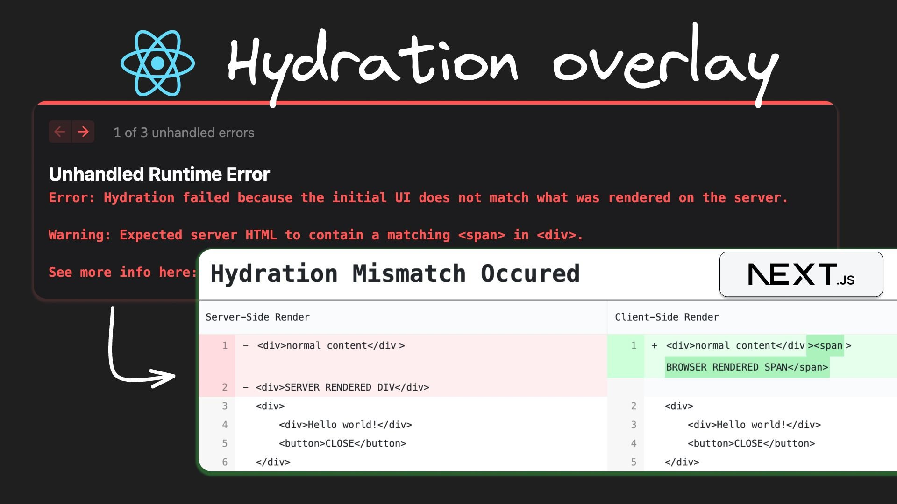

## 1. 리액트가 이벤트를 처리하는 방법

리액트에서 화면이 그려지는 과정에 대해서는 익숙할 것이다. `React.createRoot()` 에서부터 출발하여 쭈우욱 자식 요소를 탐색하며 가상돔을 어쩌구… 하는 Render 과정 이후 호스트 객체(ex. DOM)에 Commit 하면 사용자에게 보여진다.

이벤트는 어떨까? 너무 멀리 가지 않기 위해 결론 부터 말하자면 리액트는 네이티브 이벤트 대신, 이를 한번 래핑한 `합성 이벤트(Synthetic Event)` 를 사용한다. 왜 굳이 이런 귀찮은 짓을…? 공식 문서에서는 `일부 브라우저의 불일치를 수정` 하기 위함이라고 설명([링크](https://ko.react.dev/reference/react-dom/components/common#react-event-object))하고 있다. jQuery에서 브라우저별 표준을 대신 맞춰줬던 것을 떠올리면 비슷한 느낌일 것 같다.

하지만 모든 이벤트를 합성 이벤트에서 들고 있는 건 아니라서 리액트 합성 이벤트에서 정의하고 있는 것 이외의 속성에 접근하려면 `e.nativeEvent` 로 직접 접근해야 한다.

사실 이게 중요한 건 아니다. 중요한 건 이 합성 이벤트 시스템은 이벤트 리스너를 개별 DOM에 위치시키지 않고 모든 이벤트를 `이벤트 위임(Event Delegation)` 으로 처리하고 있고, 이를 위한 중앙 집중형 컨트롤러가 존재한다는 사실이다.


루트 노드의 위치가 변경되었다는 사실보다 이벤트가 상위로 전파되어 단일 지점에서 처리된다는 점이 포인트이다 (https://legacy.reactjs.org/blog/2020/08/10/react-v17-rc.html#changes-to-event-delegation)

리액트 16에서 17로 넘어갈 때 이벤트 위임 컨트롤러를 무조건 html 태그에 붙이지 않고, `createRoot()` 가 실행되는 루트 요소에 붙이도록 조정했다는 내용(한 페이지 안에 여러 React가 있으면 죄다 html로 달라 붙어 이벤트 처리에 혼란이 생기는 문제)만 감안하고 아래 인용을 살펴보면 된다.

> 그러나 대부분의 이벤트에 대해 React는 실제로 이벤트를 선언한 DOM 노드에 연결하지 않습니다. 대신 React는 이벤트 유형당 하나의 핸들러를 `document`노드에 직접 연결합니다. 이를 [이벤트 위임](https://davidwalsh.name/event-delegate) 이라고 합니다 . 대규모 애플리케이션 트리의 성능 이점 외에도 [이벤트 재생](https://twitter.com/dan_abramov/status/1200118229697486849) 과 같은 새로운 기능을 더 쉽게 추가할 수 있습니다 .
>
> React는 첫 번째 릴리스부터 자동으로 이벤트 위임을 수행해 왔습니다. 문서에서 DOM 이벤트가 발생하면 React는 어떤 구성 요소를 호출할지 파악한 다음 React 이벤트가 구성 요소를 통해 위로 "거품"됩니다. 그러나 그 뒤에서 네이티브 이벤트는 이미 `document`React가 이벤트 핸들러를 설치하는 수준까지 버블링되었습니다.

하지만 이걸 보자고 새삼스레 리액트의 이벤트 위임 시스템을 알아본 건 아니다.

## 2. 약간은 잘못 알고 있었을지도 모를 Hydration의 정체

리액트는 가상돔으로 추상화 되어 구체적인 호스트 객체 없이도 작동 가능한 렌더러이다. 즉, 꼭 브라우저 DOM이 없이 영혼(?)만 가지고도 `재조정(reconciliation)`을 포함한 리액트 특유의 렌더링 메커니즘을 모두 사용 가능하며, 그렇기 때문에 당연하게도 서버 환경에서도 리액트를 사용한 렌더링이 가능하다.

서버에서도 가상돔 렌더링이 가능하니 이걸 HTML 응답으로 구워서 보내줄 수 있다는 설명은 굳이 필요도 없을 것이다. 우리는 이미 `react-dom/server` 의 `renderToString()` 이나 `renderToPipeableStream()` 에 대해 잘 알고 있다. 이 친구들은 가상돔을 HTML 문자열로 변환해준다. 직렬화 메서드라고도 부를 수 있다.

다만 리액트 앱이 HTML로만 구워지고 땡이라면 반의 반쪽 짜리가 된다. 서버 측에서 렌더링을 한 결과물에 이벤트 리스너도 포함되어 있을텐데 함수는 HTML이나 JSON으로 직렬화가 불가능(일반적인 방식으로는…) 하다.

그렇다면… 왠지 `on-` 으로 시작하는 이벤트 리스너들을 어떻게든 직렬화 해서 클라이언트로 쏴주고, 그 목록을 순회하면서 `addEventListener` 를 해줘야 할 것 같지만 그렇지가 않다. 위에 언급했듯 리액트는 똘똘하게도 최상위에서 이벤트 위임 방식으로 이벤트 리스닝을 하고 있다. 클라이언트에서 일어나는 첫 렌더링 때 이미 서버에서 그려준 HTML을 재활용할 수 있느냐, 하는 효율의 문제가 된다.

얘기가 여기까지 왔으니 `hydrateRoot` 쪽의 코드를 살펴보자. 최상위 요소에 중앙 집중식으로 이벤트 리스너를 붙이는 부분이 `listenToAllSupportedEvents()` 이고, 렌더링 과정에서 호스트 객체를 재활용할 것인지를 결정하는 부분이 `createHydrationContainer()` 이다. 어차피 내부적으로는 다시 `createFiberRoot()` 를 호출한다.

우리가 일반적으로 생각하는 `createRoot()` 시나리오와는 거의 차이가 없고, 다만 createFiberRoot에 넘겨주는 hydrate flag가 true냐, false냐의 차이가 있을 따름이다([링크](https://github.com/facebook/react/blob/2d80a0cd690bb5650b6c8a6c079a87b5dc42bd15/packages/react-reconciler/src/ReactFiberReconciler.new.js#L247-L298)). 여기부터의 로직을 이해하기 위해 https://jser.dev/react/2023/03/17/how-does-hydration-work-in-react/ 에서 많은 도움을 받았다.

```tsx
export function hydrateRoot(
  container: Document | Element,
  initialChildren: ReactNodeList,
  options?: HydrateRootOptions
): RootType {
  // ...
  const root = createHydrationContainer(
    initialChildren,
    null,
    container,
    ConcurrentRoot,
    hydrationCallbacks,
    isStrictMode,
    concurrentUpdatesByDefaultOverride,
    identifierPrefix,
    onRecoverableError,
    transitionCallbacks
  );
  markContainerAsRoot(root.current, container);
  if (enableFloat) {
    Dispatcher.current = ReactDOMClientDispatcher;
  }
  listenToAllSupportedEvents(container);
  if (mutableSources) {
    for (let i = 0; i < mutableSources.length; i++) {
      const mutableSource = mutableSources[i];
      registerMutableSourceForHydration(root, mutableSource);
    }
  }
  return new ReactDOMHydrationRoot(root);
}
```

```tsx
// 최상위에 매달려 이벤트 위임으로 리액트 이벤트를 처리하는 부분
export function addEventBubbleListener(
  target: EventTarget,
  eventType: string,
  listener: Function
): Function {
  target.addEventListener(eventType, listener, false);
  return listener;
}
```

createHydrationContainer가 실행되는 과정 중에 리액트는 기존 DOM 트리의 재사용 가능한 부분이 있으면 Fiber 내부에서 `stateNode` 라는 값으로 직접 참조되어 렌더링 자원을 절약한다. 즉, 하이드레이션에 대한 직관적인 비유(ex. "서버에서 HTML 받고 각 DOM에 이벤트 리스너를 부착하는 과정")는 실제 구현과는 조금 거리가 있다는 뜻이다.

하지만 곰곰 생각해보면 이 전략은 클라이언트 측에서 Fiber 트리를 렌더링하는 과정과 기존 DOM 트리 간 커서를 유지하며 더듬더듬 맞춰나가는 과정이 매끄럽게 진행된다는 걸 전제로 가능한 방법이다.

만약 이 과정에서 문제가 생긴다면 어떻게 될까? 리액트는 `warnNonhydratedInstance()` 와 `throwOnHydrationMismatch()` 라는 함수로 뜨거운 맛을 보여준다.

"거, 에러는 너무 심한 것 아니오" 라고 생각이 들기도 하겠지만, 이렇게 뜨거운 맛을 보여줘야 하는 이유는 이벤트가 잘못된 DOM을 참조하여 동작하는 초유의 사태를 막기 위해서다. 공식 문서에서는 이렇게 설명하고 있다.

> React는 hydration 에러에서 복구됩니다, 하지만 **다른 버그들과 같이 반드시 고쳐줘야 합니다.** 가장 나은 경우는 그저 느려지기만 할 뿐이지만, 최악의 경우엔 이벤트 핸들러가 다른 element에 붙어버립니다.
> (https://ko.react.dev/reference/react-dom/client/hydrateRoot#hydrating-server-rendered-html)

하이드레이션에 실패했을 때 서버 측 결과물을 버리고 클라이언트 측 렌더링 결과물로 덮어 씌우는 이유이며, 아래와 같이 hydration 상황에서 던져진 에러인지를 구분하여 새로운 렌더링을 재시도하도록 되어있다.

```jsx
function recoverFromConcurrentError(
  root,
  originallyAttemptedLanes,
  errorRetryLanes,
) {
  // If an error occurred during hydration, discard server response and fall
  // back to client side render.

  // Before rendering again, save the errors from the previous attempt.
  const errorsFromFirstAttempt = workInProgressRootConcurrentErrors;

  const wasRootDehydrated = isRootDehydrated(root);
  if (wasRootDehydrated) {
    // The shell failed to hydrate. Set a flag to force a client rendering
    // during the next attempt. To do this, we call prepareFreshStack now
    // to create the root work-in-progress fiber. This is a bit weird in terms
    // of factoring, because it relies on renderRootSync not calling
    // prepareFreshStack again in the call below, which happens because the
    // root and lanes haven't changed.
    //
    // TODO: I think what we should do is set ForceClientRender inside
    // throwException, like we do for nested Suspense boundaries. The reason
    // it's here instead is so we can switch to the synchronous work loop, too.
    // Something to consider for a future refactor.
    const rootWorkInProgress = prepareFreshStack(root, errorRetryLanes);
    rootWorkInProgress.flags |= ForceClientRender;
    if (__DEV__) {
      errorHydratingContainer(root.containerInfo);
    }
  }

  const exitStatus = renderRootSync(root, errorRetryLanes);
```

하이드레이션 에러는 다양한 이유로 발생한다. 익히 알려진 케이스들 뿐만 아니라 리액트 팀이 파악하고 있는 에러 케이스들에 대해서 모두 보고 싶다면 코드 베이스에 정리된 [테스트 케이스](https://github.com/facebook/react/blob/main/packages/react-dom/src/__tests__/ReactDOMHydrationDiff-test.js) 에서 확인 가능하다.

## 3. Hydration Error… 를 방치하지 않기 위한 몸부림

사실 하이드레이션은 별게 아니다. 뒷단에서 알아서 돌아가는 과정이기 때문이다. 하지만 그걸 고치려고 마음을 먹는 순간 이야기는 달라진다. 어디서 뭐 때문에 일어나는지 이유를 파악하기가 어렵기 때문이다.

원래 이랬는데,


그나마 23년도 초에 아래와 같이 미묘하게 개선([PR 링크](https://github.com/vercel/next.js/pull/44857))되었다. 어떤 문제가 있는지를 보여주고는 있지만, 여전히 정확히 어느 위치에서 문제가 생기고 있는지를 확인하기에는 정보가 부족하다.


이건 디버깅을 위한 에러 메시지가 아니라 뭐랄까… ‘메롱’ 같다. 코드 어딘가에 에러를 남겨놓았으니 가서 찾아봐라… 에러 세계의 대해적시대라고 불러도 될 것 같다.


"발생한 에러는 어디에 숨겼나?"


"잘 찾아봐. 하이드레이션 에러 전부를 DOM 어딘가에 두고 왔으니까."

이 고통은 리액트 개발자들의 유구한 전통이었는데 근래 [builder.io](http://builder.io) 쪽에서 react-hydration-overlay([깃허브](https://github.com/BuilderIO/hydration-overlay), [아티클](https://www.builder.io/blog/announcing-react-hydration-overlay))라는 라이브러리를 공개해주었다. 서버와 클라이언트 측 Diff가 생긴 지점을 좀 더 예쁘게 보여주는 개발 도구이다. 선녀 그 자체다.



하지만 이러한 마법이 어떻게 가능한 것일까? 원리는 생각보다 간단했다.

- 1. 웹팩 플러그인을 사용하여 번들에 코드를 삽입한다. 이 코드는 `hydration-overlay-initializer.js` 라는 파일이고, 클라이언트 측에서 실행될 때 몇 가지 초기화 동작들을 한다.

  ```jsx
  window.BUILDER_HYDRATION_OVERLAY = {};

  // 3. 에러 이벤트에 대해 리스너를 걸고 대기한다.
  // 4. 만약 hydration 에러가 감지되면 그 시점의 innerHTML을 떠서 전역 객체에 저장한다
  window.addEventListener("error", (event) => {
    const msg = event.message.toLowerCase();
    const isHydrationMsg =
      msg.includes("hydration") || msg.includes("hydrating");

    if (isHydrationMsg) {
      window.BUILDER_HYDRATION_OVERLAY.ERROR = true;
      let appRootEl = document.querySelector(
        window.BUILDER_HYDRATION_OVERLAY.APP_ROOT_SELECTOR
      );

      if (appRootEl) {
        window.BUILDER_HYDRATION_OVERLAY.CSR_HTML = appRootEl.innerHTML;
      }
    }
  });

  // 1. 루트 요소를 찾는다
  let BUILDER_HYDRATION_OVERLAY_ELEMENT = document.querySelector(
    window.BUILDER_HYDRATION_OVERLAY.APP_ROOT_SELECTOR
  );
  // 2. 루트 요소를 찾았을 경우 그 이하 innerHTML을 그대로 떠서 전역 객체에 저장한다
  if (BUILDER_HYDRATION_OVERLAY_ELEMENT) {
    window.BUILDER_HYDRATION_OVERLAY.SSR_HTML =
      BUILDER_HYDRATION_OVERLAY_ELEMENT.innerHTML;
  }
  ```

- 2. 클라이언트 측 렌더링이 진행된다. 하이드레이션 오버레이 컴포넌트가 마운트 된다

  ```jsx
  export function HydrationOverlay(props: PropsWithChildren) {
    return (
      <>
        {props.children}
        <Overlay />
      </>
    );
  }
  ```

- 3. 오버레이 컴포넌트는 1단계에서 등록해둔 이벤트 리스너를 통해 전역 객체에 SSR과 CSR 타이밍에 대한 innerHTML이 등록되었는지 확인하고 `beautify`, `react-diff-viewer` 라는 라이브러리를 사용해 diff가 생긴 지점을 렌더링하고 이를 모달 안에 심어 띄워준다.

  ```jsx
  useEffect(() => {
    if (!window.BUILDER_HYDRATION_OVERLAY) {
      console.warn(
        "[ReactHydrationOverlay]: No `window.BUILDER_HYDRATION_OVERLAY` found. Make sure the initializer script is properly injected into your app's entry point."
      );
      return;
    }
    const ssrHtml = window.BUILDER_HYDRATION_OVERLAY.SSR_HTML;
    const newCSRHtml = window.BUILDER_HYDRATION_OVERLAY.CSR_HTML;

    if (!ssrHtml || !newCSRHtml) return;

    const newSSR = beautify(ssrHtml, { format: "html" });
    setSSRHtml(newSSR);
    const newCSR = beautify(newCSRHtml, { format: "html" });
    setCSRHtml(newCSR);

    setShowModal(true);
    if (window.BUILDER_HYDRATION_OVERLAY.ERROR) {
      setHasHydrationMismatch(true);
    }
  }, []);
  ```

## 4. 조금 많이 늦게 도착한, 그래도 아주 많이 반가운 Next.js의 Hydration Error 관련 DX 업데이트…

놀랍게도 24년 2월 27일… Next.js 쪽에 위에 설명된 하이드레이션 에러 관련 Diff를 표시해주는 에러 모달을 머지했고, `next@canary` 에서 사용해볼 수 있게 되었다… (아오!!!)

- 관련 PR 1: https://github.com/vercel/next.js/pull/62590

- 관련 PR 2: https://github.com/vercel/next.js/pull/62684


핵심 구현을 보면 대략 이렇다. 웹팩 쪽 구현은 없고 기존 Next.js 쪽 에러 오버레이에 추가 구현이 붙은 모양새라서 builder.io 쪽 라이브러리 구현보다는 과정이 간단해보인다. console.error를 후킹해서 하이드레이션 관련 에러를 좀 더 rich 하게 제공하도록 변경되었다.

우선 아래 코드는 원래 리액트에서 제공하던 하이드레이션 에러 관련하여 콘솔에 정보를 주던 코드이다. https://github.com/facebook/react/pull/10026 에서 최초로 작업되었다.

```jsx
export function checkForUnmatchedText(
  serverText: string,
  clientText: string | number | bigint,
  isConcurrentMode: boolean,
  shouldWarnDev: boolean
) {
  const normalizedClientText = normalizeMarkupForTextOrAttribute(clientText);
  const normalizedServerText = normalizeMarkupForTextOrAttribute(serverText);
  if (normalizedServerText === normalizedClientText) {
    return;
  }

  if (shouldWarnDev) {
    if (__DEV__) {
      if (!didWarnInvalidHydration) {
        didWarnInvalidHydration = true;
        console.error(
          'Text content did not match. Server: "%s" Client: "%s"',
          normalizedServerText,
          normalizedClientText
        );
      }
    }
  }

  if (isConcurrentMode && enableClientRenderFallbackOnTextMismatch) {
    // In concurrent roots, we throw when there's a text mismatch and revert to
    // client rendering, up to the nearest Suspense boundary.
    throw new Error("Text content does not match server-rendered HTML.");
  }
}
```

여기서부터는 Next.js 쪽 코드이고, React에서 넘겨주는 에러를 처리하기 위해 console.error를 패치하고 있다. 원래 에러를 처리하던 오버레이는 존재했지만 `serverContent` 와 `clientContent` 에 대한 구체적인 정보를 오버레이에 제공하고 있다.

```jsx
export const hydrationErrorState: HydrationErrorState = {};

/**
 * Patch console.error to capture hydration errors.
 * If any of the knownHydrationWarnings are logged, store the message and component stack.
 * When the hydration runtime error is thrown, the message and component stack are added to the error.
 * This results in a more helpful error message in the error overlay.
 */
export function patchConsoleError() {
  const prev = console.error;
  console.error = function (msg, serverContent, clientContent, componentStack) {
    if (knownHydrationWarnings.has(msg)) {
      hydrationErrorState.warning = [
        // remove the last %s from the message
        msg,
        serverContent,
        clientContent,
      ];
      hydrationErrorState.componentStack = componentStack;
      hydrationErrorState.serverContent = serverContent;
      hydrationErrorState.clientContent = clientContent;
    }

    // @ts-expect-error argument is defined
    prev.apply(console, arguments);
  };
}
```

```jsx
// https://github.com/facebook/react/blob/main/packages/react-dom/src/__tests__/ReactDOMHydrationDiff-test.js used as a reference
const htmlTagsWarnings = new Set([
  "Warning: In HTML, %s cannot be a descendant of <%s>.\nThis will cause a hydration error.%s",
  "Warning: Expected server HTML to contain a matching <%s> in <%s>.%s",
  "Warning: Did not expect server HTML to contain a <%s> in <%s>.%s",
]);

export const isHtmlTagsWarning = (msg: NullableText) =>
  Boolean(msg && htmlTagsWarnings.has(msg));
```

```jsx
// NOTE: Error 컴포넌트 내부 로직
// 외부에서 받은 error 객체를 순회하면서 현재 모달 오버레이에 보여줄 에러 선택 (ex. 1/3)
const activeError = useMemo<ReadyErrorEvent | null>(
  () => readyErrors[activeIdx] ?? null,
  [activeIdx, readyErrors]
)
const error = activeError.error
const isServerError = ['server', 'edge-server'].includes(
  getErrorSource(error) || ''
)

const errorDetails: HydrationErrorState = (error as any).details || {}
const [warningTemplate, serverContent, clientContent] =
  errorDetails.warning || [null, '', '']

const isHtmlTagsWarningTemplate = isHtmlTagsWarning(warningTemplate)
const hydrationWarning = warningTemplate
  ? warningTemplate
      .replace('%s', serverContent)
      .replace('%s', clientContent)
      .replace('%s', '') // remove the last %s for stack
      .replace(/^Warning: /, '')
  : null
```

```jsx
{
  hydrationWarning && activeError.componentStackFrames && (
    <>
      <p id="nextjs__container_errors__extra">{hydrationWarning}</p>
      <PseudoHtml
        className="nextjs__container_errors__extra_code"
        componentStackFrames={activeError.componentStackFrames}
        serverTagName={isHtmlTagsWarningTemplate ? serverContent : ""}
        clientTagName={isHtmlTagsWarningTemplate ? clientContent : ""}
      />
    </>
  );
}
```

구현이 어려워보이진 않았는데… 빨리 좀 해줬으면 좋았잖니… 아무튼 가까운 시일 내에 있을 Next.js 업데이트에 포함될 예정이라고 한다. 하이드레이션 에러 잡고 렌더링 성능 향상 이룩하자.

참고로 https://github.com/facebook/react/pull/28476 등의 작업을 보면 하이드레이션 관련 로직을 리팩토링 하고, 에러를 HTML이 아니라 JSX(가상돔)로 표현하기 위해 Fiber 쪽으로 옮기고 있다. 앞으로 하이드레이션 관련 에러가 좀 더 보기 좋아질 것으로 기대해볼 수 있을 것 같다.
