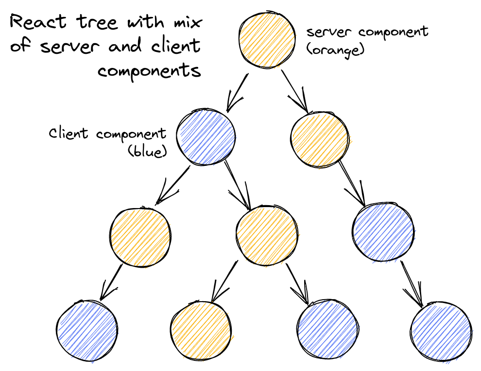
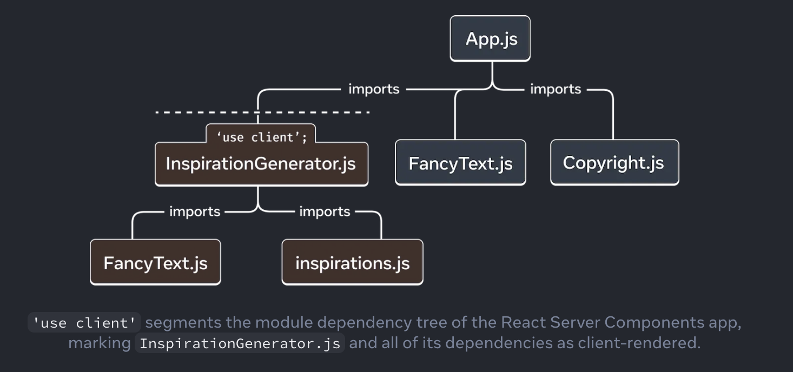
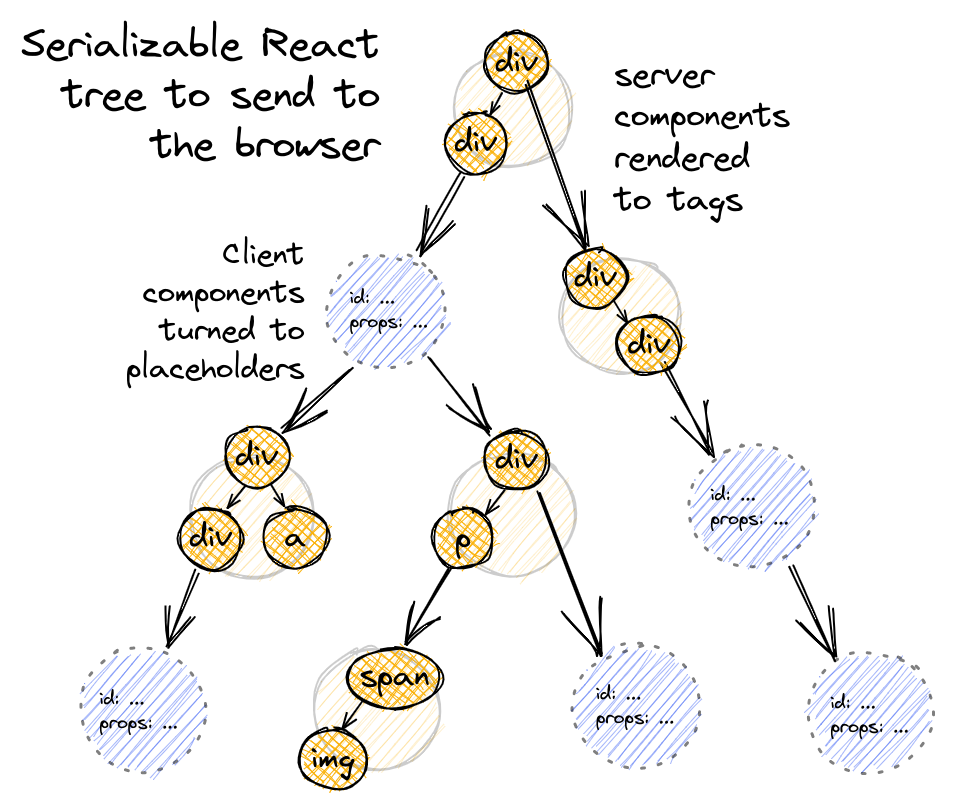
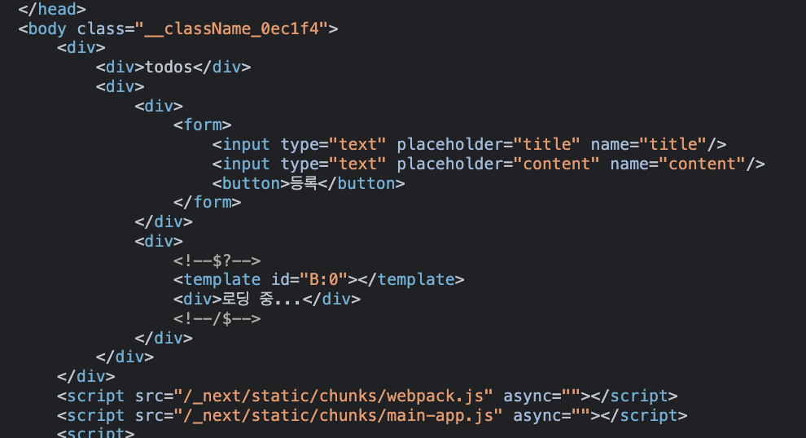
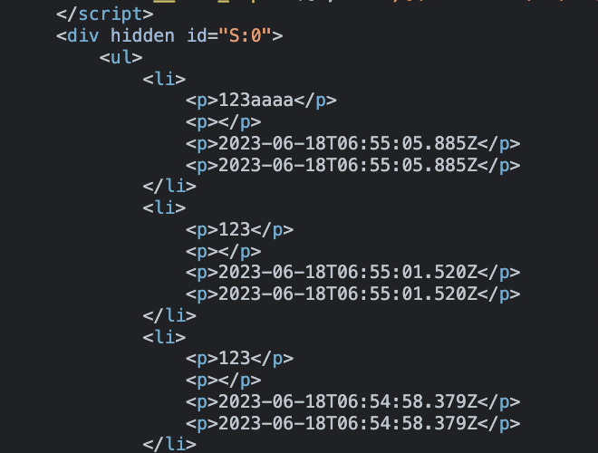
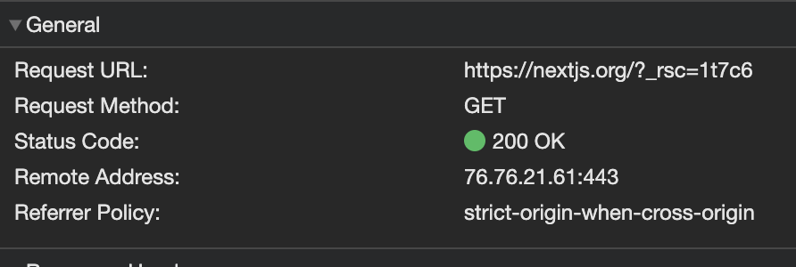
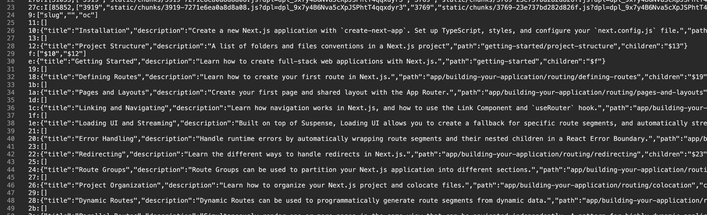
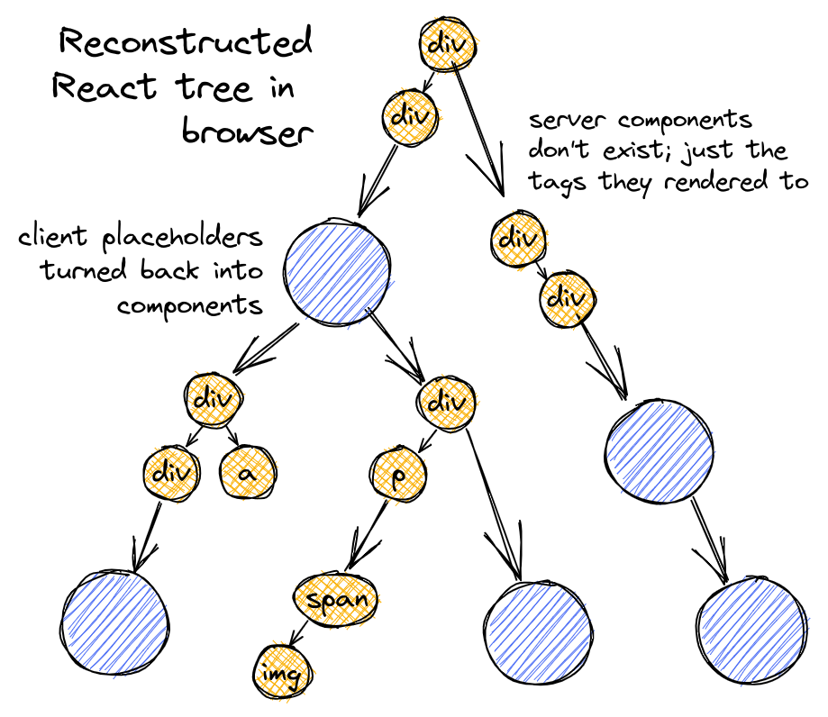

‘면접 질문에 어떻게 답하면 좋을까요?’ 라는 질문을 종종 받는다. 그럴 때마다 **“A는 B다”** 라고 정의를 먼저 내린 후 그에 대한 추가 설명이나 비유, 사용 경험 등을 이어서 답변하라고 대답한다. B가 A의 핵심적인 부분을 정의하는 서술일 수록 이후에 이어나갈 설명이 쉬워지기 때문이다. 그리고 이러한 정의를 얼마나 적확하게 하는가는 설명하고자 하는 대상에 대한 서술자의 이해 수준에 깊게 연관된다.

다만 그런 방법론을 아는 것과 잘 실천하는 건 다른 문제다. 최근에 설명해달라고 요청 받았다가 설명의 입구를 찾지 못했던 개념어들에 대해 천천히 정리를 해보려고 한다. 그냥 하면 재미 없으니 [A는 B] 라는 시리즈로 이름을 붙여보았다. 물론 시작하자마자 끝날 지도 모르겠지만… 하나라도 할 수 있다면 그 자체로 의미가 있다고 생각한다.

첫 번째 주제는 `RSC(React Server Components)`다. 아래 정의는 이 글을 모두 작성하고 다시 돌아와서 얻은 하나의 문장이다.

> 📖 React Server Components는 **1) 서버에서만 실행되는 컴포넌트**이며, **2) RSC Payload를 기반으로 서버와 클라이언트를 통합(w/ 번들러, 라우터)하는 렌더링 메커니즘**이기도 하다.

그러면 이제 시작해보자. A에게로 떠나는 여행… 레지고…

## 1. 공식 자료에서 부터 시작하자

이 부분만 읽고 곧장 이해를 하기는 어려울 것이다. 이해가 쉽게 되기를 기대하는 형태의 글은 아니고... 워낙 RSC 메커니즘에 대해서 불명확하게 쓰여있거나 혹은 설명이 되어 있더라도 조각조각 흩어져 있어 전체 흐름을 파악하기 어려운 것 같다는 느낌을 받았다. 한 군데다 몰아뒀다 정도의 의미가 있을 것 같다.

큼직한 개념이나 몇몇 단어들만 머릿속에 넣어두고 `2. 커뮤니티로 부터 얻은 여러가지 자료들` 쪽으로 넘어가는 걸 추천한다. 오히려 마지막까지 다 읽고 나서 다시 돌아와서 1의 내용을 정독하면 좀 더 와닿는 부분이 있지 않을까 싶다.

### 1-1) React Docs

일단 가장 공식적인 자료부터 접근해보자.

리액트 공식 문서에서 서버 컴포넌트로 검색해보면 아직 서버 컴포넌트에 대한 직접적인 정의는 없고, 대신 새롭게 프로젝트를 세팅하는 방법을 알려주는 부분에서 이런 [언급](https://react.dev/learn/start-a-new-react-project#bleeding-edge-react-frameworks)이 나온다.

> As we’ve explored how to continue improving React, we realized that integrating React more closely with frameworks (specifically, with routing, bundling, and server technologies) is our biggest opportunity to help React users build better apps. The Next.js team has agreed to collaborate with us in researching, developing, integrating, and testing framework-agnostic bleeding-edge React features like [React Server Components.](https://react.dev/blog/2023/03/22/react-labs-what-we-have-been-working-on-march-2023#react-server-components)
>
> (React를 지속적으로 개선하는 방법을 모색하면서, **React를 프레임워크(특히 라우팅, 번들링 및 서버 기술)와 더 긴밀하게 통합하는 것**이 React 사용자가 더 나은 앱을 구축하도록 도울 수 있는 가장 큰 기회라는 것을 깨달았습니다. Next.js 팀은 React 서버 컴포넌트와 같이 프레임워크에 구애받지 않는 최첨단 React 기능을 연구, 개발, 통합 및 테스트하는 데 우리와 협력하기로 합의했습니다.)

여기서 알 수 있는 사실은 리액트는 앞으로 특히 **라우팅, 번들링, 서버 기술**과 관련하여 **프레임워크와 밀접하게** 발전해나갈 것이라는 점, 그런 흐름 속에서도 **RSC라는 특정 프레임워크에 구애받지 않는, 메타적인 무언가**를 기반으로 한 프레임워크가 만들어질 것이라는 언급 정도이다.

### 1-2) React Labs: What We've Been Working On – March 2023

리액트 팀은 커뮤니티와 소통하기 위해 공식 블로그를 작성한다. 그 중 RSC에 대해 언급한 대목이 있다.

> React Server Components (or RSC) is a **new application architecture** designed by the React team. (https://react.dev/blog/2023/03/22/react-labs-what-we-have-been-working-on-march-2023#react-server-components)

23년 3월에 작성된 글이고 벌써 1년 가까이 됐다는 사실(24.02)이 소름 돋는 부분이다. 눈에 띄는 부분은 `new application architecture` 라는 표현이다.

단순히 서버에서 실행하는 컴포넌트 같은 설명으로 시작하고 있지 않다. 컴포넌트 그 자체를 의미하기보다는 **서버 컴포넌트를 실행하는 환경과 설계 철학까지 포괄**하는 설명으로 보인다.

그리고 이런 설명이 이어진다.

> we are introducing a new kind of component—Server Components—that run ahead of time and are excluded from your JavaScript bundle. Server Components can run during the build, letting you read from the filesystem or fetch static content. They can also run on the server, letting you access your data layer without having to build an API. You can pass data by props from Server Components to the interactive Client Components in the browser.
>
> (**미리 실행되고 자바스크립트 번들에서 제외되는 새로운 종류의 컴포넌트**인 서버 컴포넌트를 소개합니다. 서버 컴포넌트는 빌드 중에 실행되어 파일 시스템에서 읽거나 정적 콘텐츠를 가져올 수 있습니다. 또한 서버에서 실행할 수 있으므로 API를 빌드하지 않고도 데이터 레이어에 액세스할 수 있습니다. 서버 컴포넌트에서 브라우저의 대화형 클라이언트 컴포넌트로 Props를 통해 데이터를 전달할 수 있습니다.)

> RSC combines the simple “request/response” mental model of server-centric Multi-Page Apps with the seamless interactivity of client-centric Single-Page Apps, giving you the best of both worlds.
>
> (RSC는 서버 중심 멀티 페이지 앱의 단순한 '요청/응답' 정신 모델과 클라이언트 중심 싱글 페이지 앱의 원활한 상호 작용을 결합하여 두 가지 장점을 모두 제공합니다.)

글을 좀 더 예민하게 분해해보자. ‘**미리 실행되고 자바스크립트 번들에서 제외**되는 새로운 종류의 컴포넌트’는 비교적 정의에 가까운 부분이다.

그 외의,

- 서버 컴포넌트는 빌드 중에 실행되어 파일 시스템에서 읽거나 정적 콘텐츠를 가져올 수 있다

- 서버에서 실행할 수 있으므로 별도의 API를 통하지 않고도 데이터 레이어(ex. DB)에 액세스할 수 있다

- 서버 컴포넌트에서 브라우저의 인터렉티브 한 클라이언트 컴포넌트로 Props로 값을 전달 할 수 있다

하는 부분들은 서버 컴포넌트를 사용하여 ‘할 수 있는 일’에 대한 서술이라고 할 수 있다. 서버 컴포넌트가 무엇인가에 대한 정의까지는 아니라고 봐야 한다. 중요하긴 하지만, 저 목록으로 부터 다시 한번 핵심적인 뭔가를 추출해내야 한다는 생각을 해볼 수 있다.

뒤어 이어지는 ‘서버 중심 MPA의 단순한 'Request / Response' 멘탈 모델과 클라이언트 중심 SPA의 원활한 상호 작용을 결합하여 두 가지 장점을 모두 제공’한다는 문장은 이 1, 2, 3, 4를 한번 묶은 설명인 만큼, 이 부분에 조금 더 집중해보는 것도 좋겠다. 기존 클라이언트 중심의 멘탈 모델만을 가지고 있던 리액트에 서버 중심적인 멘탈 모델이 추가된다는 점을 명확히 하고 있다는데 의의를 둘 수 있겠다.

### 1-3) react/rfcs (RFC: React Server Components)

이번엔 두 글에서 모두 언급된 react/rfcs 의 [RSC 관련 문서](https://github.com/reactjs/rfcs/blob/main/text/0188-server-components.md#summary)를 참고해볼 차례다. 원문과 함께 싣고 싶었지만 분량 상 번역본만 실어본다.

> 이 RFC는 서버 컴포넌트라는 곧 출시될 React의 기능에 대해 설명합니다. 서버 컴포넌트를 사용하면 개발자는 **서버와 클라이언트를 아우르는 앱을 구축**하여 클라이언트 측 앱의 풍부한 상호 작용과 기존 서버 렌더링의 향상된 성능을 결합할 수 있습니다:
>
> - 서버 컴포넌트는 **서버에서만 실행**되며 **번들 크기에 전혀 영향을 미치지 않**습니다. 코드가 클라이언트에 다운로드되지 않으므로 번들 크기를 줄이고 시작 시간을 개선하는 데 도움이 됩니다.
>
> - 서버 컴포넌트는 데이터베이스, 파일 시스템 또는 (마이크로)서비스와 같은 **서버 측 데이터 소스에 액세스**할 수 있습니다.
>
> - 서버 컴포넌트는 클라이언트 컴포넌트, 즉 기존 React 컴포넌트와 원활하게 통합됩니다.
>
> - 서버 컴포넌트는 서버에서 데이터를 로드하고 클라이언트 컴포넌트에 Props로 전달하여 클라이언트가 페이지의 인터랙티브한 부분을 렌더링할 수 있도록 합니다.
>
> - 서버 컴포넌트는 렌더링할 클라이언트 컴포넌트를 동적으로 선택할 수 있으므로 **클라이언트는 페이지를 렌더링하는 데 필요한 최소한의 코드만 다운로드**할 수 있습니다.
>
> - 서버 컴포넌트는 다시 로드될 때 클라이언트 상태를 보존합니다. 즉, 서버 컴포넌트 트리를 다시 불러올 때 클라이언트 상태, 포커스, 진행 중인 애니메이션까지 중단되거나 재설정되지 않습니다.
>
> - 서버 컴포넌트는 점진적으로 렌더링되며 **렌더링된 UI 단위를 클라이언트에 점진적으로 스트리밍**합니다. 이를 서스펜스와 결합하면 개발자가 의도적인 로딩 상태를 만들고 페이지의 나머지 부분이 로드될 때까지 기다리는 동안 중요한 콘텐츠를 빠르게 표시할 수 있습니다.
>
> - 또한 개발자는 **서버와 클라이언트 간에 코드를 공유**하여 단일 컴포넌트를 사용하여 한 경로에서는 서버에서 일부 콘텐츠의 정적 버전을 렌더링하고 다른 경로에서는 클라이언트에서 해당 콘텐츠의 편집 가능한 버전을 렌더링할 수 있습니다.

정의라고 부를 만한 부분은 없어보이고, 역시 서버 컴포넌트를 사용하면 무엇이 가능한지를 설명하고 있다. 사실 새로운 기술이 등장하고 RFC 단계에서 이것이 정확히 무엇인지에 대해 기술 제안자도 명확히 설명할 수 없는 걸지도 모른다.

아무튼 앞에서 살펴봤던 이야기가 좀 나오고, 새롭게 눈에 띄는 부분도 있다.

서버 컴포넌트에 대한 추가적인 설명으로,

- 렌더링할 클라이언트 컴포넌트를 동적으로 선택할 수 있으므로 클라이언트는 페이지를 렌더링하는 데 필요한 최소한의 코드만 다운로드할 수 있다

- 다시 로드될 때 클라이언트 상태를 보존한다

- 점진적으로 렌더링되며 렌더링된 UI 단위를 클라이언트에 점진적으로 스트리밍 한다

- 서버와 클라이언트 간에 코드를 공유하여 하나의 컴포넌트로 정적 버전과 동적 버전을 한번에 작성할 수 있다(← 이 부분은 이해가 좀 어려울 수 있는데 RFC의 Basic Example을 참고) 라는 점이 언급된다.

### 1-4) Next.js Docs (Server Components)

현재 유일하게 프레임워크 내에 RSC에 대한 통합 기능을 제공하는 Next.js의 문서를 빼놓을 수 없다.

> React Server Components allow you to write UI that can be rendered and optionally cached on the server. In Next.js, the rendering work is further split by route segments to enable streaming and partial rendering, and there are three different server rendering strategies:
>
> (React 서버 컴포넌트를 사용하면 **서버에서 렌더링하고 선택적으로 캐시할 수 있는 UI를 작성**할 수 있습니다. Next.js에서는 렌더링 작업을 경로 세그먼트별로 더 분할하여 스트리밍 및 부분 렌더링을 가능하게 하며, 세 가지 다른 서버 렌더링 전략이 있습니다:)
>
> - [Static Rendering](https://nextjs.org/docs/app/building-your-application/rendering/server-components#static-rendering-default)
>
> - [Dynamic Rendering](https://nextjs.org/docs/app/building-your-application/rendering/server-components#dynamic-rendering)
>
> - [Streaming](https://nextjs.org/docs/app/building-your-application/rendering/server-components#streaming)

여기에서는 앞에서 살펴보지 못했던 `캐시(Cache)` 개념과 정적, 동적, 스트리밍 렌더링 방식에 대한 언급이 나온다. 다만 이번 글의 분량에서 함께 다루기는 어렵겠다.

서버 컴포넌트의 이점에 대해서도 일단 건너 뛰고, Next.js App Router의 동작 방식을 설명한 부분으로 넘어가보자.

> On the server, Next.js uses React's APIs to orchestrate rendering. The rendering work is split into chunks: by individual route segments and [Suspense Boundaries](https://react.dev/reference/react/Suspense).
>
> (서버에서 Next.js는 React의 API를 사용하여 렌더링을 오케스트레이션합니다. 렌더링 작업은 개별 경로 세그먼트와 서스펜스 바운더리에 따라 청크로 나뉩니다.)
>
> Each chunk is rendered in two steps: (각 청크는 아래 두 단계에 따라 렌더링 됩니다.)
>
> 1. React renders Server Components into a special data format called the **React Server Component Payload (RSC Payload)**.
>
>    (React는 서버 컴포넌트를 React 서버 컴포넌트 페이로드(RSC 페이로드)라는 특수 데이터 형식으로 렌더링합니다.)
>
> 2. Next.js uses the RSC Payload and Client Component JavaScript instructions to render **HTML** on the server.
>
>    (Next.js는 RSC 페이로드와 클라이언트 컴포넌트 자바스크립트 명령어를 사용하여 서버에서 HTML을 렌더링합니다.)
>
> Then, on the client: (그리고 나서 클라이언트 측에서는,)
>
> 1. The HTML is used to immediately show a fast non-interactive preview of the route - this is for the initial page load only.
>
>    (HTML은 경로의 빠른 비-인터렉티브 미리보기를 즉시 표시하는 데 사용되며, 이는 초기 페이지 로드에만 사용됩니다.)
>
> 2. The React Server Components Payload is used to reconcile the Client and Server Component trees, and update the DOM.
>
>    (React 서버 컴포넌트 페이로드는 클라이언트 및 서버 컴포넌트 트리를 재조정(reconciliation)하고 DOM을 업데이트하는 데 사용됩니다.)
>
> 3. The JavaScript instructions are used to [hydrate](https://react.dev/reference/react-dom/client/hydrateRoot) Client Components and make the application interactive.
>
>    (자바스크립트가 실행되면서 클라이언트 컴포넌트를 하이드레이트 하고 애플리케이션이 상호작용 가능한 상태가 됩니다.)

우리가 앞서 RSC에 대한 명세를 살펴보던 것과는 다르게, RSC를 기반으로 한 리액트 애플리케이션의 렌더링이 실제 어떻게 동작하는가에 대한 설명으로 보인다.

아무래도 기술적인 서술이다보니 `RSC Payload`라는 또 새로운 개념어가 나오는데 상당히 중요해보인다. 실제로도 매우 중요하다! 그렇다보니 문서에서는 아래와 같이 이어서 설명을 덧붙여주고 있다.

> **What is the React Server Component Payload (RSC)?**
>
> The RSC Payload is a compact binary representation of the rendered React Server Components tree. It's used by React on the client to update the browser's DOM. The RSC Payload contains:
>
> (RSC 페이로드는 **렌더링된 React 서버 컴포넌트 트리의 압축된 바이너리 표현**입니다. 클라이언트에서 React가 브라우저의 DOM을 업데이트하는 데 사용됩니다. RSC 페이로드에는 다음이 포함됩니다:)
>
> - The rendered result of Server Components (**서버 컴포넌트의 렌더링 결과물**)
>
> - Placeholders for where Client Components should be rendered and references to their JavaScript files (클라이언트 **컴포넌트가 렌더링될 위치**와 해당 **자바스크립트 파일에 대한 참조를 위한 플레이스홀더**)
>
> - Any props passed from a Server Component to a Client Component (**서버 컴포넌트에서 클라이언트 컴포넌트로 전달된 모든 Props**)

사실 이 개념은 RFC 후반부 FAQ 대목에서 지나가듯 언급된 바 있긴 하다.

> **What is the response format?**
>
> It’s like JSON, but with “slots” that can be filled in later. This lets us stream content in stages, breadth-first. Suspense boundaries mark intentionally designed visual state so we can start showing the result before all of it has fully streamed in. This protocol is a richer form that can *also* be converted to an HTML stream in order to speed up the initial, non-interactive render.
>
> (JSON과 비슷하지만 나중에 채울 수 있는 '슬롯'이 있습니다. 이를 통해 콘텐츠를 단계적으로, 폭을 넓혀가며 스트리밍할 수 있습니다. 서스펜스 경계는 의도적으로 설계된 시각적 상태를 표시하여 모든 콘텐츠가 완전히 스트리밍되기 전에 결과를 보여줄 수 있도록 합니다. 이 프로토콜은 초기 비대화형 렌더링 속도를 높이기 위해 HTML 스트림으로 변환할 수도 있는 더 풍부한 형식입니다.)

이 설명에서 언급된 JSON과 유사한 ‘response format’이라는 것이 바로 RSC Payload이고 ‘슬롯’이라는 개념이 Next.js Docs에서 언급된 ‘references to their JavaScript files’ 와 연결되는 부분이다. RSC Payload는 이 글의 최후반부에 아주 중요한 개념으로 다시 등장하니 좀 더 힘주어 기억해두어도 좋겠다.

이상 많은 내용을 살펴봤지만 여전히 추상적이다. 그래도 이런 공식적인 문서를 한번 쯤은 통과해야 하는 이유를 찾아보자면 개념에 대한 전체적인 뼈대를 얻을 수 있기 때문이다.

꼭 공식 문서로 시작할 필요는 없다. 이해를 얻기 좋은 수단이라면 다양하게 활용하는게 좋다. 하지만 결국 모든 설명들은 공식 문서에서 언급된 정의를 벗어날 수 없다. 이 점이 중요하다. 쉬운 설명은 꽤나 자주 잘못된 길로 빠지곤 한다. 정의를 한번이라도 살펴본 사람과 그렇지 않은 사람 사이에 오개념이 발생할 확률이 얼마나 될지는 강조하지 않아도 납득되리라 생각한다.

## 2. 커뮤니티로 부터 얻은 여러가지 자료들

1을 기반으로 리액트 커뮤니티에서 이해를 돕기 위해 생산한 몇몇 자료들을 기반으로 설명을 이어 나가본다.

### 2-1) Why do Client Components get SSR'd to HTML? (Dan Abramov)

나는 개인적으로 이번 RSC 플로우를 겪으면서 리액트 커뮤니티는 Dan 같은 사람을 가질 자격이 없다고 생각했다. RSC가 발표되고 그것이 Next.js 13 버전에 탑재되어 발표되는 과정에서 Github와 Twitter 등지에서 얼마나 필요 이상으로 심한 비난들이 쏟아졌는지, 한편 그 비난들을 하나하나 찾아다니며 설득하고 설명하던 Dan의 모습은 얼마나 처절했는지 기억하는 사람들은 공감할 수 있을 것이다.

아무튼 RSC가 커뮤니티에 보급되는 과정에서 빼놓을 수 없는 역할을 한 사람이다. 그의 블로그에 최근 연재되고 있는 포스트들([A Chain Reaction](https://overreacted.io/a-chain-reaction/), [The Two Reacts](https://overreacted.io/the-two-reacts/)) 또한 RSC를 보급하기 위한 방법을 찾고 있는 과정으로서 염두하고 읽어야 할 것 같다.

Dan이 RSC를 설명하기 위해 만들었던 많은 자료 중에 가장 처음으로 살펴봐야 할 것은 바로 **Why do Client Components get SSR'd to HTML?** ([링크](https://github.com/reactwg/server-components/discussions/4)) 에서 소개된 도표다.

새로이 소개된 개념을 이해하기 위해 필요한 것은 ‘멘탈 모델’이다. 그 새로운 것의 정체가 무엇이고 기존 멘탈 모델과 어떻게 통합될 수 있는지를 보여주는 직관적인 무언가가 필요한 것이다.


기존의 리액트 컴포넌트를 ‘클라이언트 컴포넌트’라고 부르고, 새롭게 추가된 영역의 컴포넌트를 서버 컴포넌트라고 정의하고 있다. Dan은 RSC가 기존의 리액트의 무언가를 대체하는 것이 아니라 오히려 그 동안 할 수 없었던 무언가를 할 수 있도록 넓혀주는 개념임을 이 그림을 통해서 말하고 있다.

하나 중요한 설명을 인용해보자면 아마 이 부분일 것이다.

> Props always flow from React Server to React Client, and there is a serialization boundary between them. React Server typically runs either at the build time (default), or on an actual server. React Client typically runs in both environments (in the browser it manages the DOM, in other environments it generates initial HTML).
>
> (Props는 항상 React 서버에서 React 클라이언트로 흐르며, 이들 사이에는 직렬화 경계가 있습니다. React Server는 일반적으로 빌드 시(기본값)에 실행되거나 실제 서버에서 실행됩니다. React 클라이언트는 일반적으로 두 환경 모두에서 실행됩니다(브라우저에서는 DOM을 관리하고 다른 환경에서는 초기 HTML을 생성합니다).)

서버에서 클라이언트로 데이터가 전송된다는 건 일반적으로 HTTP Response를 이야기 하는 것일 테고, 이말인 즉 직렬화 과정을 거쳐야 한다는 뜻이다.

처음 이 설명을 접했을 때는 ‘아니 애초에 SSR 할 때 다 HTML로 응답되는데 무슨 당연한 소리를…?’ 이라고 생각했었지만 후에 리액트 컴포넌트, 심지어 Promise 객체조차도 JSON 포맷인 RSC Payload에 낑겨 넣는 일이 벌어질 것이라는 말인 줄은 몰랐던 것이다. 그 광경을 보곤 심약자인 나로서는 그만 정신을 잃고 말았던 것이다…

이 외에도 Dan이 남긴 자료 중에는 참고해야 할 것들이 많은데 잠시 다른 설명부터 보고 와야 한다.

### 2-2) How React server components work: an in-depth guide

이어서 살펴볼 글은 **How React server components work: an in-depth guide**([링크](https://www.plasmic.app/blog/how-react-server-components-work#what-are-react-server-components))이다. 글이 쓰여진 시기가 22년 3월 쯤인데 비해 꽤나 내용이 알차서 꽤나 많이 참고했던 글이다.

이 글에서 가장 중요한 그림을 하나 꼽자면 바로 이것이다.



Dan은 뼈-살 모델이라고 설명하기도 했던 부분인데, 간단히 요약하자면 Next.js 기준 RSC 아키텍처의 렌더링 사이클을 보면 1) 서버 컴포넌트가 먼저 렌더링 된다 2) 비동기 호출이 필요한 컴포넌트(ex. `suspense: true`, `use() hook` 등) 들은 fallback을 대신 그린 채 건너뛰고 단위 시간 내에 렌더링 가능한 부분부터 먼저 렌더링을 완료하고 첫 응답으로 보낼 HTML을 생성한다. 바꿔 말하자면 Suspense가 자연스럽게 서버 측 렌더링 경계가 되어주는 것이다.

위에서 뼈와 살이라고 표현을 한 것은 웹 페이지의 정적인 부분, 다시 말해 ‘뼈대’가 되어주는 부분을 기본적으로 서버 컴포넌트로 처리하고 데이터 호출로 인한 변경이나 인터렉션 가능한 부분에 대해서는 클라이언트 컴포넌트(주의: 클라이언트 Only가 아니라 서버 - 클라이언트 양쪽에서 실행되는 기존 리액트 컴포넌트를 의미한다)로 처리하고 이를 뼈와 대비되는 개념인 ‘살’로 표현한 것으로 이해하면 된다.

여기서 뼈와 살을 나누는 경계의 기준이 되는 것이 바로 `"use client"`([링크](https://react.dev/reference/react/use-client))와 `"use server"`([링크](https://react.dev/reference/react/use-server)) 지시문(Directive)이다.



https://react.dev/reference/react/use-client

처음엔 문서도 없었는데, React 19 릴리즈를 앞두고 공식 문서에 추가되었다. 이 스펙에 대한 RFC 문서([링크](https://github.com/reactjs/rfcs/blob/main/text/0227-server-module-conventions.md))와 PR([링크1](https://github.com/reactjs/rfcs/pull/227), [링크2](https://github.com/reactjs/rfcs/pull/189))을 살펴보면 꽤나 격렬한 토론이 있었다는 사실을 알 수 있다.

핵심은 1) 번들러 수준에서 각 컴포넌트가 서버 - 클라이언트 어느 쪽에 속하는지 알 수 있어야 한다는 것이고 2) `“use strict”` 과 비슷한 컨벤션을 따를 것인지, 혹은 `.server.jsx` / `.client.jsx` 같은 파일명 컨벤션을 따를 것인지 정도를 큼직한 쟁점으로 다뤘던 것으로 보인다. 처음에는 파일명을 기준으로 나누는 것으로 제안되었다가 Next.js 처럼 파일 기반 라우트를 사용하는 경우 처리가 까다로워지는 등의 이유로 `"use-"` 를 사용하는 쪽으로 가닥이 잡혔다.

이 지시문이 생성하는 경계는 여전히 많은 혼란을 일으키고 있지만, 개인적으로는 아래와 같은 좀 더 직관적이고 쉬운 설명 방법들이 등장하면서 개발자들의 이해도가 높아지고, IDE나 린트 같은 관련 툴링이 개발되면서 해소될 수 있는 문제라고 생각한다.

> I think what makes it easier to teach is understanding and explaining what they mean. It’s really not that confusing that “use client” is how you use the client from the server. And “use server” is how you use the server from the client.
>
> (… 'use client'는 서버에서 클라이언트를 사용하는 방법이고, 'use server'는 클라이언트에서 서버를 사용하는 방법이라고 생각하면 그렇게 혼란스럽지 않습니다.)
>
> (https://twitter.com/rickhanlonii/status/1758944237884772380?s=20)

인용하고 있는 아티클 본문에서는 언급되고 있지 않고 이번 글에서도 상세히 다루지는 않겠지만, Next.js의 RSC 구현에 따르면 기존 `SSG`, `SSR`, `ISR` 등의 렌더링 전략이 페이지 단위 → 컴포넌트 단위로 적용 가능해졌다는 점도 큰 중요한 진전 중 하나이다.

간략하게만 언급해보면, 특정 서버 컴포넌트에 필요한 데이터를 `fetch` 함수(Next.js에서 캐시 기능을 포함하여 오버라이드 한)로 호출하고 그 캐시 옵션(`React.cache()`를 통해 저장된다)에 따라 각 컴포넌트의 렌더링 전략이 달리 적용된다.

모든 요청의 캐시가 만료되지 않도록 하면 `SSG`, 캐시에 저장되지 않도록 하면 `SSR`, 일정 기간 혹은 트리거를 통해 캐시를 만료시키면 `ISR` 과 같은 효과를 볼 수 있다. 이렇게 하면 기존 페이지 단위로맘 서버 사이드 API 를 호출 가능했던 방법에 비해 컴포넌트 단위로 세밀하게 데이터 호출 전략을 가져갈 수 있게 된다.

아무튼… 위에서 언급한 2단계 까지 수행되더라도 아직 상호작용 불가능한 서버 컴포넌트(서버 컴포넌트 내에서는 useState, useEffect, 이벤트 핸들러 등을 사용할 수 없다)와 클라이언트 컴포넌트의 정적인 버전(아직 하이드레이션 되기 전)만 렌더링 된 상태이다. 즉 그냥 HTML인 상태다.



그래도 이렇게 만들어진 HTML 청크와 앱 실행에 필요한 자바스크립트 번들이 함께 클라이언트에 전송되고 하이드레이션까지 일어나고 나면 정상적인 SPA 앱의 모양을 갖추게 된다. 이 청크는 기존의 renderToString을 대체하는 react-dom/server 의 `renderToPipeableStream`에 의해 스트리밍 형태로 전송된다.

잠시 이해를 돕기 위한 설명을 덧붙여 본다.

```tsx
const http = require("http");

// Next.js 13 서버
http.get("http://locahost:3000", (res) => {
  res.on("data", (chunk) => {
    console.log("Received chunk: ", chunk.toString());
  });
});
```


직접 테스트 해본 스트리밍 SSR chunk의 형태

청크의 크기는 옵션값인 progressiveChunkSize의 기본값(12.8kb)에 맞춰지는데, 이 청크 사이즈 정도가 3G 환경의 구형 기기를 포함하는 고려했을 때 500ms에 한번씩 청크를 보낸다는 리액트 팀의 목표에 부합하는 수치([공식 문서](https://react.dev/reference/react-dom/server/renderToPipeableStream#parameters), [주석](https://github.com/facebook/react/blob/14c2be8dac2d5482fda8a0906a31d239df8551fc/packages/react-server/src/ReactFizzServer.js#L210-L225))라고 한다.

하지만 아직 서버 측에서 API 호출 등을 끝내지 못하고 대기 중인 부분은 나중에 날아와서 붙어야 한다. 하지만 어떻게? 새로 날아온 청크와 이미 그려진 HTML 사이에 자석이라도 있는 것일까?

자석은 없지만 자석 비슷한 건 있다. 바로 서버 측 렌더링 과정에서 ‘스킵’했다고 설명했던 부분이 그냥 스킵되는 것이 아니라 그림에서 ‘placeholder’라고 표현되어 있고 위에서 명세를 살펴볼 때 ‘클라이언트 컴포넌트가 렌더링될 위치와 해당 자바스크립트 파일에 대한 참조를 위한 자리 표시자’ 라고 했던 바로 그것으로 대체된다.



첫 응답 HTML (with suspense placeholder)

예시를 보자. “로딩 중…”이라는 문자열과 `template#B:0` 인 HTML 태그와 Suspense 경계를 의미하는 `$?` 등의 HTML 주석이 위에서 언급한 첫 HTML 응답에서 placeholder에 해당하는 부분이다. 추가로 받은 청크가 저 부분을 대체하게 될 것이다.

```jsx
const SUSPENSE_START_DATA = "$";
const SUSPENSE_END_DATA = "/$";
const SUSPENSE_PENDING_START_DATA = "$?";
const SUSPENSE_FALLBACK_START_DATA = "$!";
```

여기에 서버에서 추가로 전송된 청크를 함께 살펴볼 차례다. 우리는 지금 HTML을 스트리밍 중이기 때문에 추가로 전송되는 문자열은 HTML 문서 하단에 추가로 붙게 된다. 그런데 이 문자열이 script 태그이므로 브라우저 렌더링 과정에서 그 안에 포함되어 있는 자바스크립트 코드가 실행된다.

이 때 실행되는 코드가 바로 저 placeholder를 교체하는 동작을 한다. 아래 코드 가장 하단의 `replaceContent("B:0", "S:0");` 가 바로 그 동작에 대한 코드다. 아까 위에서 보았던 `B:0` 를 새로 받아온 `S:0` 로 교체한다는 의미다.

```jsx
<script>
    const replaceContent = function(targetID, removeID, newContent) {
        let removeElement = document.getElementById(removeID);
        removeElement.parentNode.removeChild(removeElement);

        let targetElement = document.getElementById(targetID);
        if (targetElement) {
            let prevSibling = targetElement.previousSibling;
            if (newContent) {
                prevSibling.data = "$!";
                targetElement.setAttribute("data-dgst", newContent);
            } else {
                let parentElement = prevSibling.parentNode;
                let nextSibling = prevSibling.nextSibling;
                let balance = 0;
                do {
                    if (nextSibling && 8 === nextSibling.nodeType) {
                        let siblingData = nextSibling.data;
                        if ("/$" === siblingData)
                            if (0 === balance)
                                break;
                            else
                                balance--;
                        else
                            "$" !== siblingData && "$?" !== siblingData && "$!" !== siblingData || balance++;
                    }
                    let nextSiblingCopy = nextSibling.nextSibling;
                    parentElement.removeChild(nextSibling);
                    nextSibling = nextSiblingCopy;
                } while (nextSibling);

                while (removeElement.firstChild) {
                    parentElement.insertBefore(removeElement.firstChild, nextSibling);
                }
                prevSibling.data = "$";
            }

            if(prevSibling._reactRetry) {
                prevSibling._reactRetry();
            }
        }
    };

    replaceContent("B:0", "S:0");
</script>
```

위 스크립트의 바로 아래에 `S:0` & hidden 인 태그가 교체되어 화면에 보여지기를 기다리고 있는 중임을 확인할 수 있다. 참고로 HTML 태그의 hidden 속성([링크](https://developer.mozilla.org/ko/docs/Web/HTML/Global_attributes/hidden))은 해당 속성이 붙은 DOM 요소를 화면에 그리지 않는다.



첫 렌더링과 이후 청크의 교체 과정까지 이뤄지고 나면 같이 화면이 완성된다.

Streaming SSR - TTFB 직후


Streaming SSR - 추가 Chunk를 받아 페이지를 완성

전반적인 과정은 이러한데 여기서 중요한 개념 하나를 생략했다. 위의 예시는 그려지는 화면 입장에서의 결과물만 놓고 이야기를 한 것인데, 우리는 리액트를 가지고 화면을 그리고 있다는 사실을 다시 한번 생각해볼 필요가 있다.

리액트 렌더링 과정의 가장 중요한 핵심 컨셉은 `1) 가상돔(Virtual DOM)` 2) `재조정(Reconciliation)` 이다. 하지만 앞에서 살펴본 내용들은 그냥 JavaScript 코드와 HTML이었다.

원본 청크에 대한 스크린샷을 다시 잘 살펴보면 1) HTML 2) 정체 불명 자바스크립트 3) 방금 살펴본 추가 HTML + replaceContent 함수이다. 결론 부터 말하자면 2는 직렬화 된 가상돔이고, 이 가상돔이 클라이언트 측에서 다시 실행되면서 서버 측에서 렌더링 하던 내용들을 이어서 클라이언트 측의 렌더링을 이어갈 수 있게 되는 것이다.

정리하자면 자바스크립트 객체의 중첩으로 만들어진 리액트 가상돔을 직렬화 해서 클라이언트 측으로 던져주고, 클라이언트 측에서는 그 직렬화 되었던 가상돔을 파싱해서 렌더링을 재개하는 것이다.

이게 무슨 소리일까? 블로그 포스트의 내용을 빌어 좀 더 자세히 살펴보자. 가상돔이라는 건 결국 React.createElement의 실행 결과가 중첩된 결과물이다. 아래 객체는 `JSON.stringify()` 를 통해 문제 없이 직렬화 할 수 있다. 참고로 Symbol도 직렬화가 가능하다. 대신 Symbol을 타입을 그대로 유지하지는 못하고 일반 Object로 처리([링크](https://developer.mozilla.org/en-US/docs/Web/JavaScript/Reference/Global_Objects/JSON/stringify#description))된다.

```jsx
// React element for <div>oh my</div>
> React.createElement("div", { title: "oh my" })
{
  $$typeof: Symbol(react.element),
  type: "div",
  props: { title: "oh my" },
  ...
}
```

하지만 만약 가상돔 객체의 type이 일반 HTML 태그가 아니라 리액트 컴포넌트라면 이야기가 달라진다. 리액트 컴포넌트는 함수(혹은 클래스)이기 때문에 JSON 포맷으로 곧장 직렬화가 불가능하다. 리액트 컴포넌트 뿐만 아니라 props로 전달되는 Promise 객체 같은 것들도 동일한 원리로 직렬화가 불가능하다.

```jsx
// React element for <MyComponent>oh my</MyComponent>
> function MyComponent({children}) {
    return <div>{children}</div>;
  }
> React.createElement(MyComponent, { children: "oh my" });
{
  $$typeof: Symbol(react.element),
  type: MyComponent  // reference to the MyComponent function
  props: { children: "oh my" },
  ...
}
```

그래서 이렇게 JSON으로 직렬화가 불가능한 경우를 적절히 처리해주는 replace 함수가 존재([링크](https://github.com/facebook/react/blob/42c30e8b122841d7fe72e28e36848a6de1363b0c/packages/react-server/src/ReactFlightServer.js#L368))한다. 리액트 컴포넌틔 경우 함수를 직접 직렬화 하는 것이 아니라 번들러(ex. react-server-dom-webpack)와 힘을 합쳐 해당 컴포넌트가 존재하는 파일 경로를 대신 끼워넣는다. 이런 변환을 거친 결과물은 대략 아래와 같이 직렬화 가능한 형태가 된다.

```jsx
{
  // The ClientComponent element placeholder with "module reference"
  $$typeof: Symbol(react.element),
  type: {
    $$typeof: Symbol(react.module.reference),
    name: "default",
    filename: "./src/ClientComponent.client.js"
  },
  props: {
    // children passed to ClientComponent, which was <ServerComponent />.
    children: {
      // ServerComponent gets directly rendered into html tags;
      // notice that there's no reference at all to the
      // ServerComponent - we're directly rendering the `span`.
      $$typeof: Symbol(react.element),
      type: "span",
      props: {
        children: "Hello from server land"
      }
    }
  }
}
```

하지만 직렬화 된 JSON 문자열 자체로는 스트리밍에 부적합하다. 좀 더 청크 단위로 분할해도 괜찮은 포맷의 데이터 전송 양식이 필요하다.

여기에서 RSC만의 특수한 데이터 전송 포맷이 등장하고, 앞서 잠시 언급했던 ‘response format’에 해당한다. 각 줄은 하나의 JSON Blob(Binary Large Object)이 존재하고, 각각의 Blob에는 고유한 ID가 부여되어 있다.

```jsx
M1:{"id":"./src/ClientComponent.client.js","chunks":["client1"],"name":""}
J0:["$","@1",null,{"children":["$","span",null,{"children":"Hello from server land"}]}]
```

- `M`으로 시작하는 줄은 클라이언트 컴포넌트 모듈 참조를 정의하며, 클라이언트 번들에서 컴포넌트 함수를 조회하는 데 필요한 정보를 포함한다.

- `J`로 시작하는 줄은 실제 React 요소 트리를 정의하고, `@1`과 같은 것들은 `M` 줄에 의해 정의된 클라이언트 컴포넌트를 참조한다.

이 포맷은 최초의 JSON 문자열에 비해 스트리밍에 적합하다. 클라이언트가 한 줄을 전부 읽으면 JSON을 파싱하고 필요한 동작을 할 수 있게 된다.

실제로는 어떨까? Next.js Docs도 RSC를 기반으로 작성된 제품이므로 Network 탭을 열어보면 이러한 데이터 교환 과정을 확인할 수 있다. `/` 경로에 `?_rsc=` 라는 쿼리스트링(이 요상한 쿼리스트링에 대해서는 맨 마지막에 더 자세히 살펴보도록 한다)을 달아 요청을 보내면 위에서 살펴본 RSC Payload가 스트리밍 가능한 응답으로 내려오는 것을 확인할 수 있다.





RSC Parser([링크](https://rsc-parser.vercel.app/))나 Demystifying React Server Components with NextJS 13 App Router([링크](https://demystifying-rsc.vercel.app/client-components/details/)) 같은 통해 좀 더 RSC Payload 관련하여 상세한 원리를 파악해볼 수 있으니 추가적으로 알아보고 싶다면 살펴보면 좋을 것 같다.

기나긴 과정을 거쳐 어떻게 서버에서 렌더링하여 클라이언트로 보내는지 까지는 살펴보았다. 이제 마지막 단계까지 왔다. 서버에서 보내준 데이터를 어떻게 되살려 가상돔으로 그리는지에 대한 부분이다.

이 부분은 리액트에서 제공한 데모 코드([링크](https://github.com/reactjs/server-components-demo))를 보고 이해하는 쪽이 정확할 것 같다.

```jsx
import {
  createFromFetch,
  createFromReadableStream,
} from "react-server-dom-webpack/client";

// ... 생략
export function Router() {
  const [cache, setCache] = useState(initialCache);
  const [location, setLocation] = useState({
    selectedId: null,
    isEditing: false,
    searchText: "",
  });

  const locationKey = JSON.stringify(location);
  let content = cache.get(locationKey);
  if (!content) {
    content = createFromFetch(
      fetch("/react?location=" + encodeURIComponent(locationKey))
    );
    cache.set(locationKey, content);
  }

  function refresh(response) {
    startTransition(() => {
      const nextCache = new Map();
      if (response != null) {
        const locationKey = response.headers.get("X-Location");
        const nextLocation = JSON.parse(locationKey);
        const nextContent = createFromReadableStream(response.body);
        nextCache.set(locationKey, nextContent);
        navigate(nextLocation);
      }
      setCache(nextCache);
    });
  }

  function navigate(nextLocation) {
    startTransition(() => {
      setLocation((loc) => ({
        ...loc,
        ...nextLocation,
      }));
    });
  }

  return (
    <RouterContext.Provider value={{ location, navigate, refresh }}>
      {use(content)}
    </RouterContext.Provider>
  );
}
```

핵심은 `react-server-dom-webpack/client` 에서 가져온 `createFromFetch`, `createFromReadableStream`이다. 웹팩에서 이 함수들을 제공해야 하는 이유는 RSC Payload에 모듈 참조(컴포넌트가 존재하는 경로 등)가 포함되어 있기 때문일 것이다. 실제 작동하는 시나리오를 살펴보자.

- 첫 화면이 HTML을 기반으로 그려지고, 이후 리액트 관련 자바스크립트 번들이 실행된다.
- `cache.get(locationKey)` 에서 이미 가져온 RSC 응답이 있는지 확인한다.
- 존재하지 않는다면 `/react` 로 요청을 보내 RSC 응답을 받아온다.
  - 받아오는 동안은 pending 상태의 Promise 객체일 것이므로 `use()` 로 Suspense를 트리거 한다.
  - 응답을 다 받고 나면 이를 createFromFetch를 통해 파싱하여 가상돔 형태로 만든다. 그리고 이 결과물을 캐시에 저장하고 화면에 그린다.
- 캐시에 RSC 응답이 이미 존재한다면 해당 결과물을 화면에 그린다.
- navigate 함수를 통해 경로를 전환할 경우 위의 과정을 다시 한번 거친 다음 화면을 그린다.
- refresh 함수(useMutation에서 쓰임, 브라우저 하드 리프레시와는 다름)를 통해 화면 전체를 다시 그릴 경우, HTML 전체를 받아오지는 않고 `createFromReadableStream` 를 통해 RSC 응답을 스트리밍 하여 받아오고 캐시에 저장 후 화면에 그린다.

RSC의 관련 구현이 라우터와 함께 결합되어 있는 지점도 중요한 포인트다. 결국 화면이 변경되고 새로운 청크가 필요한 시점은 대부분 경로가 변경되거나 화면이 리프레시 되었을 경우가 대부분일 것이기 때문이다. 리액트에서 RSC를 소개하며 라우터와 번들러와의 통합, 이를 포함하는 프레임워크의 필요성을 강조한 이유이기도 하다.

여기까지의 과정을 거치면 아래와 같은 서버 - 클라이언트가 완벽히 통합된 결과물의 화면이 그려지게 된다.



### 2-3) RSC From Scratch. Part 1: Server Components (Dan Abramov)

위에서 설명한 내용으로 RSC 관련한 거의 대부분의 내용을 전달했지만 마지막 블랙박스 하나만 더 열어보려고 한다. RSC 데모 코드에서 `/react?` 로 표현되었던 정체불명의 엔드포인트에 대한 내용이다.

Dan Abramov는 RSC에 대해 설명하기 위해 세상에 클라이언트 전용 리액트가 존재한 적이 없었다는 전제하에 서버 컴포넌트를 중심으로 리액트의 렌더링 로직(JSX, 컴포넌트, 라우팅, RSC 서버, …)을 바닥부터 쌓아올리는 예제([링크](https://github.com/reactwg/server-components/discussions/5), [한국어 번역](https://velog.io/@glassfrog8256/%EB%B2%88%EC%97%AD-RSC-From-Scratch.-Part-1-Server-Components#step-63-%EC%84%9C%EB%B2%84%EB%A5%BC-%EB%91%90%EA%B0%9C%EB%A1%9C-%EB%82%98%EB%88%95%EC%8B%9C%EB%8B%A4))를 보여준다.

여기서 눈여겨봐야 하는 부분은 이 부분이다.

> 이전 단계에서, 실행 중인 컴포넌트가 HTML을 생성하지 않도록 분리했습니다.
>
> - 먼저 `renderJSXToClientJSX` 는 컴포넌트들이 클라이언트 JSX를 생성하도록 합니다.
>
> - 이후에, 리액트의 `renderToString` 이 클라이언트 JSX를 HTML로 변경합니다.
>
> 서로 독립적인 동작이기 때문에, 이들을 같은 절차, 혹은 같은 머신(컴퓨터)에서 완료 될 필요가 없습니다.
>
> 이를 증명하기 위해, `server.js` 를 2개의 파일로 나눕시다.
>
> - `server/rsc.js` : 이 서버는 우리의 컴포넌트들을 실행시킵니다. 항상 JSX를 리턴하며 HTML을 리턴하지 않습니다. 만약 컴포넌트들이 데이터베이스에 접근한다면, 지연시간 감소를 위해 서버를 데이터 센터와 가까운데서 실행하는게 좋습니다.
>
> - `server/ssr.js` : 이 서버는 HTML을 만들어 냅니다. HTML을 만들고, 정적 파일들을 제공하기 위해 "edge" 에서 실행 시킬 수 있습니다.

react-server-dom-webpack/client에서 `createFromFetch`, `createFromReadableStream` 라는 함수 두 가지를 제공했었음을 기억하고, 위에서 언급하는 `ssr.js` 를 먼저 살펴보자.

```tsx
// server/ssr.js

createServer(async (req, res) => {
  try {
    const url = new URL(req.url, `http://${req.headers.host}`);
    if (url.pathname === "/client.js") {
      // ...
    }
    // RSC 서버로 부터 직렬화 된 JSX를 얻습니다.
    const response = await fetch("http://127.0.0.1:8081" + url.pathname);
    if (!response.ok) {
      res.statusCode = response.status;
      res.end();
      return;
    }
    const clientJSXString = await response.text();
    if (url.searchParams.has("jsx")) {
      // 유저가 페이지 간 이동중이라면, 직렬화 된 JSX를 그대로 보내줍니다.
      res.setHeader("Content-Type", "application/json");
      res.end(clientJSXString);
    } else {
      // 초기 페이지 로드 상황이라면, 트리를 복구하고 HTML로 만듭니다.
      const clientJSX = JSON.parse(clientJSXString, parseJSX);
      let html = renderToString(clientJSX);
      html += `<script>window.__INITIAL_CLIENT_JSX_STRING__ = `;
      html += JSON.stringify(clientJSXString).replace(/</g, "\\u003c");
      html += `</script>`;
      // ...
      res.setHeader("Content-Type", "text/html");
      res.end(html);
    }
  } catch (err) {
    // ...
  }
}).listen(8080);
```

예제의 `http://127.0.0.1:8081` 은 input이 경로이고 응답이 직렬화 된 가상돔(JSON 문자열 화 된 JSX)인 RSC 렌더링 서버이다.

응답을 얻고 나면 이제 이것을 그대로 내보낼 것인지, 아니면 HTML로 구워서 보낼 것인지를 선택할 차례다. 이 예제 코드에서 `?jsx` 를 기준으로(현재 기준으로는 `?_rsc`) RSC Payload를 보내거나, 아니면 HTML로 내보내거나 하는 분기를 처리하고 있다.

## 3. 마무리

글이 엄청나게 길어졌다. 사실 내가 작성한 글이 많았다기 보다는 이런저런 자료를 인용으로 긁어모으면서 분량이 뻥튀기 된 감이 없잖아 있지만, 중요한 것은 RSC의 구현이 어떤 동작과 원리를 깔고 돌아가고 있는지 그 흐름을 미싱링크 없이 따라가는 것이었다.

RSC는 기본적으로 `서버에서만` 실행되는 리액트 컴포넌트다. 하지만 그것만으로 다 설명되는 개념은 아니다. RSC 구현을 위해서는 RSC 페이로드를 생성하여 보내고, 또 받아서 가상돔 업데이트를 이어갈 수 있어야 한다. ESM이나 서비스 워커 등을 사용하는 방법도 있겠으나, 기본적으로는 라우터와 번들러의 도움이 필요한 이유다.

놀랍게도 아직 Request Waterfall이나 `React.cache()` 및 Next.js의 `RSC Cache` 관련한 내용이나 RSC Payload는 어째서 프로토콜이라는 관점에서 HTMX와 같은 선상에 놓고 비교가 되는지에 대해서는 제대로 언급하지 못했다.

하지만 여기까지 정리하는 것만으로도 너무나도 머리가 아프고 힘들기에 23년 5월 쯤 부터 이어온 RSC 관련 공부는 여기서 잠시 마무리를 짓기로 하며, 오늘의 정리를 통해 얻은 정보들을 기반으로 RSC에 대한 정의를 내려본다. 끝!

> 📖 React Server Components는 **1) 서버에서만 실행되는 컴포넌트**이며, **2) RSC Payload를 기반으로 서버와 클라이언트를 통합(w/ 번들러, 라우터)하는 렌더링 메커니즘**이기도 하다.
